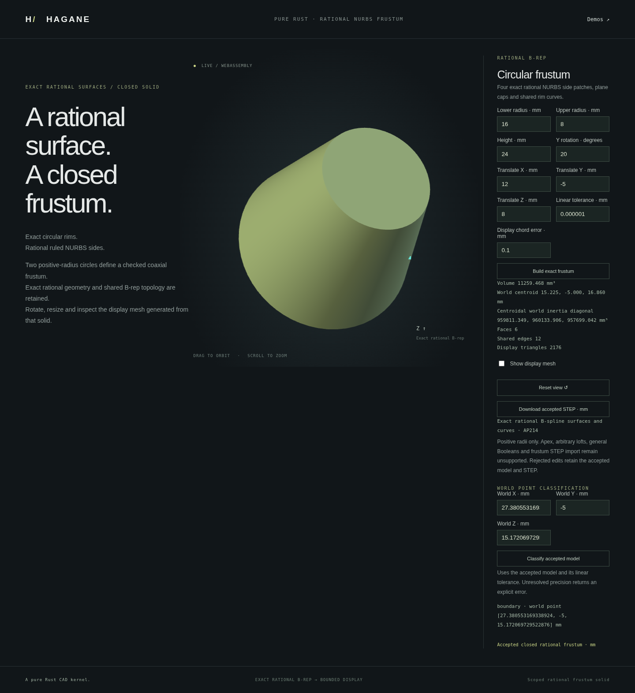

# Exact rational NURBS frustum loft



`NurbsFrustumSolid` is a closed, checked NURBS solid beyond the existing height
graphs: four rational ruled patches join two coaxial circular rims. The sides
have degrees `[2, 1]`; degree-2 rational quarter rims use weights
`[1, sqrt(0.5), 1]`. Four straight generators and two planar caps complete the
8-vertex, 12-edge, 6-face B-rep. Cap pcurves retain the same rational circle
parameter as the primary curves; side pcurves use affine UV coordinates. No
circle-angle approximation or fitted mesh replaces those boundaries.

```sh
cargo run --example nurbs_frustum
./scripts/build-web.sh
python3 -m http.server 8000 --directory web
# Open /nurbs-frustum.html.
```

```rust
use hagane::*;
# fn example() -> Result<()> {
let policy = GeometryTolerance::default();
let part = NurbsFrustumSolid::new(Frame3::IDENTITY, [16., 8.], 24., policy)?;
let volume = part.volume(policy)?;
let display = part.tessellate(0.1, policy)?;
let step = part.export_step_mm(policy)?;
let location = part.classify_point(Point3::new(0., 0., 12.), policy)?;
# Ok(()) }
```

The default lower radius 16 mm, upper radius 8 mm, height 24 mm has volume
11259.468070465819 mm³ and centroid at local Z=9.428571428571429 mm. Equal
radii produce a cylinder in the same rational representation. Increasing or
decreasing radius and rigid frames are supported; a zero-radius apex is not.

## Actual-shape certificate and queries

The typed constructor and `from_brep` validate the complete canonical retained
shape: original vertices, curve/surface degrees, knots, control points, weights,
primary edge endpoints, all wires/pcurves and face orientations. Every typed
volume, centroid, inertia, bounds, display and STEP query validates the actual
B-rep before using its supported analytic family. `from_brep` checks the supplied
body against the declared canonical parameters; it does not rebuild and replace
it, fit a surface, renumber arbitrary topology or recognize a general loft.
Modified control nets, weights, boundaries or incidences are explicitly refused.

Volume is `π H (r0² + r0 r1 + r1²) / 3`. Polynomial cross-section moments give
centroid and uniform-density centroidal inertia, with normalized products to
avoid intermediate overflow. The tensor is rotated into world axes. Bounds use
actual endpoint-circle axis envelopes, not a mesh or a control-hull guess.
Coordinates and weights use `f64`; unresolved physical/frame precision and
unrepresentable requested properties return errors.

This is a dedicated typed supported domain. Raw generic `Solid` validation,
mass and tessellation do not thereby gain general NURBS support. Use the typed
methods above. The `solid()` accessor exposes the retained B-rep for inspection.

## Mesh-free point classification

`classify_point(world_point, policy)` checks the retained body first and returns
`PointLocation::{Inside, Outside, Boundary}`. Rotational symmetry reduces exact
Euclidean distance to the finite meridian side segment and the two finite cap
disks. The tolerance band includes circular rims: independent radial/axial bands
would misclassify diagonal points beyond a rim, so they are not used.

The complete physical body scale supplies the relative tolerance. Frame and query
coordinate precision must remain resolved against the absolute tolerance;
unresolved distances at the band threshold return `Unsupported` rather than a
guessed classification. No display mesh, inertia evaluation or STEP export is
needed. The generic `Solid` point-query scope remains unchanged.

```sh
cargo run --example nurbs_frustum_classification
```

The browser query uses the last accepted model and world XYZ coordinates. Invalid
draft dimensions and rejected queries preserve the accepted model, camera and
STEP. The native/WASM helper takes the nine model/display numbers used above,
followed by three world coordinates. All twelve must be finite; the display chord
value is transport metadata and does not trigger tessellation.

## Display and STEP

Display samples the actual retained curves and surfaces. All four patches share
one dyadic grid and a canonical edge-sample cache; caps use the same rational
rim samples. Bernstein bounds certify patch-cell chord error, including the
mixed U/V term when radii differ. A separate rational residual bound controls
cap boundary chords. Boundary substitutions reserve their physical mismatch;
shared coordinates are copied exactly rather than proximity-welded. Shading
vertices may be duplicated at cap creases, while geometric mesh edges close.
Requests exceeding the bounded grid/work/precision budget fail explicitly.

The STEP writer emits actual rational spline curves/surfaces, same-parameter
pcurves, `LINE` generators, `PLANE` caps and a closed AP214 solid in mm. The
existing all-NURBS writer paths and public analytic import/export scopes remain
unchanged. The dedicated [STEP reader](nurbs-frustum-step-import.md) now accepts
strict unplaced canonical mm frusta while retaining their actual geometry.
The separate [translated importer](nurbs-frustum-translated-step-import.md) also
accepts identity-axis translations. A separate
[cardinal importer](nurbs-frustum-cardinal-step-import.md) reads 24 signed
coordinate bases. Arbitrary-angle frustum STEP import, general STEP
recognition, arbitrary-profile
lofts, apex degeneracies, holes, twists, skew lofts, fillets and Booleans on these
frusta remain unsupported.

## Verification and sources

Tests compare volume, centroid and inertia against independent polynomial
integrals, including the cylindrical special case. Dense curve/surface and
pcurve samples check the actual circular/radius-linear geometry. Tessellation
checks original-support geometry, normals, opposed welded edges, chord error
including mixed-parameter cells, and volume convergence. Corrupted public B-reps,
invalid dimensions, tiny/large/posed inputs, and insufficient display budgets
exercise conditional refusal. Native/WASM and browser checks compare actual
geometry and STEP records, edit dimensions, orbit/zoom, and preserve the last
accepted shape and export when an input fails.

Rational conics and ruled surfaces use the published NURBS references in
[references](references.md). Original implementation is MIT OR Apache-2.0; no
OCCT source or new dependency was used.
