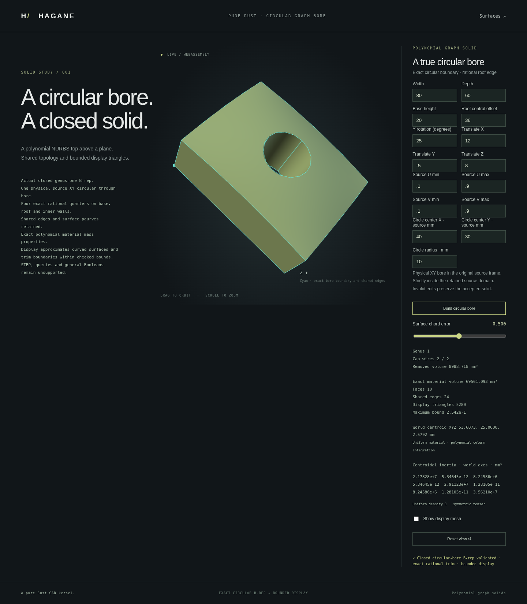

# Circular through bores in graph stock



`NurbsGraphSolid::through_xy_circle(center, radius, tolerance)` constructs a
dedicated `NurbsGraphCircularHoledSolid`. It removes one source-XY circular
column through the full height of rectangular graph stock. This is a scoped
curved B-rep operation, not a general Boolean implementation.

## Geometry and supported domain

The source is the existing checked quadratic graph
`h = H + 4b u(1-u)v(1-v)`, optionally restricted to a source UV rectangle and
rigidly placed. The circle center and radius use source physical XY coordinates
in millimetres. The axis follows the source Z direction after placement.
The positive radius and all four clearances from the retained rectangle must
exceed `4 * tolerance + source_arithmetic_budget`. Contact, near contact,
outside circles, unresolved dimensions and nonfinite inputs are rejected.

The result retains 16 vertices, 24 shared edges and 10 faces. The unchanged
source cap surfaces each gain an inner clockwise circular wire; four inward
ruled NURBS walls join the bottom and roof circles. Each circular wire has
four degree-two rational UV quarters. The roof quarters are degree-eight
rational 3D curves composed from the actual source surface. Bottom curves
retain the same rational basis and weights with zero local Z. Inner wall
surfaces have degrees `[8, 1]`, retaining each curve weight in both height rows.
Shared edges use one parameter and two oppositely oriented face uses.

Canonical typed validation checks every control point, knot, weight, pcurve,
reference and orientation before supplementary edge/surface identity checks.
Mutable public B-rep data cannot silently change the operation's geometry.
The constructor reserves one quarter of its precision budget for source and
placement arithmetic and three quarters for rational composition. These are
binary64 engineering guards, not interval certificates.

## Mass properties

Volume, centroid and full centroidal inertia are computed in the local frame
over the source rectangle minus the exact circular disk. Positive quadrature
weights are used separately for both regions; compensated subtraction and
remaining-moment guards reject unresolved cancellation. Four-point Gaussian
rectangle quadrature and four squared-radius Gaussian nodes with sixteen
angular samples integrate the required column polynomials through total
degree twelve in real arithmetic. Coordinate scaling, world centroid placement
and inertia rotation are checked for finite, resolved results.

`removed_volume(tolerance)` directly integrates the positive disk moment.
Subtracting two rounded total volumes can lose the effect of a small resolved
hole; this API avoids that cancellation rather than reporting a zero cut.

An independent removed-volume formula is

```text
π r² [h(c) + (r² / 8) Δh(c) + (r⁴ / 192) Δ²h]
Δ²h = 32 b / (width² depth²)
```

Independent tests use closed disk monomial moments for volume, centroid and
inertia, including off-center flat holes, signed roof coefficients, source
trims, rigid placement and extreme scales.

## Display and demo

```rust
let tol = hagane::Tolerance::default();
let source = hagane::NurbsGraphSolid::new([80., 60., 20.], 30., tol)?;
let part = source.through_xy_circle([40., 30.], 12., tol)?;
let mass = part.mass_properties(tol)?;
let display = part.tessellate_bounded(0.5, 65536, tol)?;
```

```sh
cargo run --example nurbs_graph_circular_hole
scripts/build-web.sh
python3 -m http.server 8000 --directory web
```

Open `graph-circular-hole.html`. The numeric CLI/WASM payload uses the same
16-value source, placement, trim and physical-circle format as the
[roof path example](nurbs-graph-rational-roof-circle.md). Invalid edits preserve
the accepted browser part. The display samples actual shared B-rep boundaries
and caps/walls; it never performs mesh CSG.

Cap sampling uses radial annular strips, including each rectangle-corner ray.
The actual quarter-curve partitions have a checked maximum parameter interval;
radial refinement controls roof interpolation error. Cap and wall boundary
positions share logical nodes, while face normals remain separate at creases.

Circular trim chords approximate the exact boundary. Cap triangles can cover
small slivers inside the analytic disk within the declared trim allowance;
the mesh is not an exact circular-domain representation. Bounds include trim
deviation, surface curvature and arithmetic allowances. The B-rep retains the
rational circle throughout. Triangle-budget and precision failures are explicit
errors; requested errors are never silently relaxed.

The capture uses an 80 × 60 × 20 mm source, bulge 36, UV trim `[0.1, 0.9]²`,
25-degree Y rotation and translation `(12, -5, 8)` mm. The source-XY center
is `(40, 30)` mm and radius 10 mm. At requested display error 0.5 mm, the
5,280-triangle mesh reports a maximum bound of approximately 0.2542 mm.
The displayed removed volume is 8,988.718 mm³ and material volume 69,561.093 mm³.

## Limitations

The operation supports one strictly contained circular through bore in this
rectangular graph family. Overlapping tools, blind circular cuts on the graph
roof, side intersections, arbitrary curve/surface Booleans, shape repair and
general rational trimmed-solid operations remain unsupported. Generic `Solid`
validation, volume, classification and STEP export do not accept this new trim
type; use the dedicated checked APIs for the implemented operations. STEP
interchange and editable operation-document integration remain subsequent work.

The implementation is original Rust under MIT OR Apache-2.0. It adds no
dependency; its mathematical provenance and existing dependency licenses are
recorded in [references](references.md).

## Verification

All 751 native tests pass, together with `cargo fmt --all -- --check`,
`cargo clippy --all-targets --locked -- -D warnings`, the WebAssembly build,
the full native/WASM parity suite and the full browser regression suite.
The focused circular-bore browser checks also pass and produced the screenshot
above from the actual implementation.
