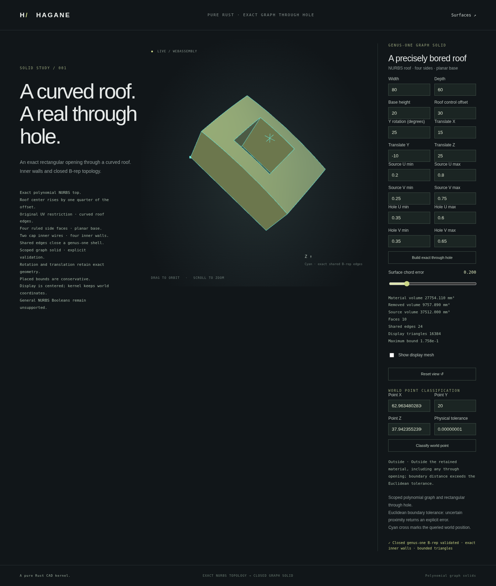

# Point classification in scoped NURBS graph solids



`NurbsGraphSolid::classify_point` and
`NurbsGraphHoledSolid::classify_point` classify world-space points as
`PointLocation::{Inside, Outside, Boundary}`. These queries validate the actual
shared B-rep before any shortcut. They support source-UV restriction, rigid
placement and the retained single rectangular through opening.

```rust
use hagane::*;
let tolerance = Tolerance::default();
let source = NurbsGraphSolid::new([80.0, 60.0, 20.0], 30.0, tolerance)?;
let part = NurbsGraphHoledSolid::new(
    &source, [[0.35, 0.65], [0.3, 0.7]], tolerance,
)?;
assert_eq!(part.classify_point(
    Point3::new(8.0, 30.0, 10.0), GeometryTolerance::default(),
)?, PointLocation::Inside);
assert_eq!(part.classify_point(
    Point3::new(40.0, 30.0, 10.0), GeometryTolerance::default(),
)?, PointLocation::Outside);
# Ok::<(), hagane::Error>(())
```

## Euclidean boundary band

Boundary means proximity to actual retained faces, including their edges and
corners, in Euclidean distance. A vertical roof-height gap is not a distance
to a sloping roof. A point above the opening has no roof or bottom face directly
under it; only the retained rims and cavity walls contribute.

The algorithm extracts positive-weight rational Bezier patches from the actual
faces. Control-hull bounding boxes give lower bounds on distance; evaluations
on retained patches give upper bounds. Adaptive subdivision separates a point
from the boundary band or finds a surface point inside the band. Caps exclude
the opening before distance queries. Display triangles never determine the
result.

Only after proving separation from every retained face does the canonical
graph's analytic material predicate decide Inside or Outside. Rigid placement
is inverted for that predicate; topology and geometry must still match the
validated construction.

The boundary budget combines absolute length and relative local shape scale.
World translation and query distance do not enlarge the boundary band.
Floating-point allowances are tracked separately. This is a bounded engineering
calculation with checked binary64 arithmetic, not formal interval arithmetic.
Nonfinite input, corrupted topology, insufficient world precision, unresolved
subdivision or an exhausted resource budget returns an explicit error.
Subdivision is limited to 48 levels, 16,384 visited candidate patches and
65,536 generated patches. Tangent-plane iterations only propose actual surface
points for upper bounds; convergence is not treated as a closest-point proof.

## Run the demonstration

```sh
cargo run --locked --example nurbs_graph_classify
bash scripts/build-web.sh
python3 -m http.server 8000 --directory web
```

Open `graph-hole.html` or `graph-solid.html` in the served directory. Query
coordinates are world coordinates; the marker shows the queried point. The
query has its own length tolerance, independent of display tessellation error.
Rejected queries preserve the accepted model and report their reason.

## Scope

This is a scoped NURBS graph-solid query. It does not enable generic NURBS
solid classification, arbitrary rational shells, general surface inversion,
surface intersections or Boolean operations. Points on an unresolved tolerance
threshold may return an error instead of a guessed classification.
