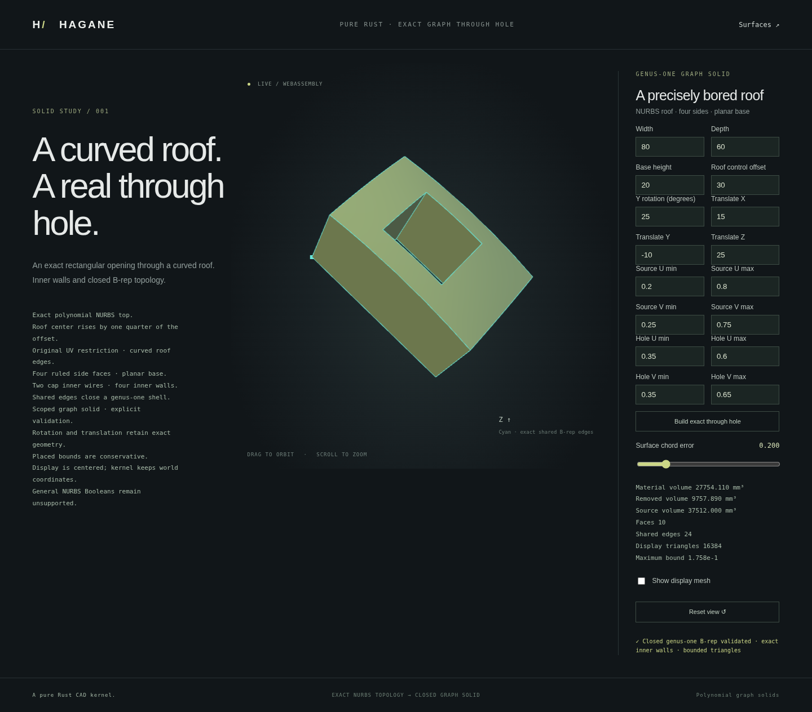

# Rectangular through openings in closed NURBS graph solids



`NurbsGraphHoledSolid` removes one strictly interior source-UV rectangle from
a canonical graph solid. Its roof and base retain clockwise inner wires;
four additional ruled NURBS walls connect their exact curved rims. The
result has sixteen shared vertices, twenty-four shared edges and ten faces.
It is a closed genus-one B-rep, not a mesh Boolean or a display-only opening.
The two caps are annular faces, so the relevant Euler count is
`V - E + sum(2 - wire_count) = 0`, rather than treating every face as a disk.

```rust
use hagane::{NurbsGraphSolid, NurbsGraphHoledSolid, Tolerance};

let tol = Tolerance::default();
let source = NurbsGraphSolid::new([80.0, 60.0, 20.0], 30.0, tol)?;
let part = NurbsGraphHoledSolid::new(
    &source, [[0.35, 0.65], [0.3, 0.7]], tol,
)?;
part.validate(tol)?;
let display = part.tessellate_bounded(0.2, 65_536, tol)?;
# Ok::<(), hagane::Error>(())
```

The source can already be restricted and rigidly placed. Hole parameters
remain in its original UV domain. Each side of the opening must have a
resolved physical separation from the outer walls, with separate guards for
parameter arithmetic. Touching, outside, inverted or unresolved holes fail
explicitly. Only one rectangular opening is supported by this API; general
tools, intersecting openings and arbitrary rational Booleans remain unsupported.

Exact material volume equals the source integral minus the hole integral.
The implementation sums four disjoint positive material-strip integrals with
compensated accumulation, avoiding cancellation when the opening removes
almost all the stock. Material plus removed volume must conserve the source
volume within a checked arithmetic allowance. Bounds are explicitly a
conservative source enclosure, including when an opening removes its extrema.

The retained geometry uses refined exact NURBS caps and walls whose bases
match the rim curves. Shared references and opposing effective edge uses
close every boundary. Hole-wall normals face the void. Canonical validation
rejects public geometry or reference modifications before volume, bounds or
display can return a result. Generic `Solid` NURBS operations remain unsupported.

Display uses a common tensor grid containing every opening boundary. Cells
inside the opening are excluded before vertex emission. Roof, base and walls
share topological nodes and identical positions while keeping separate face
normals. Explicit knot-side partials handle the refinement's structural C0
knots; this canonical polynomial source remains geometrically smooth.
The roof and all eight ruled walls have conservative interpolation bounds,
with an engineering world arithmetic allowance rather than interval certification.

For subdivision level `N`, the total budget is `32*N*N` cells. Each cell emits
two triangles; `max_cells` accepts 32 through 65,536. Unresolved UV subdivisions,
insufficient precision or an exceeded budget return explicit errors.

After the normal WASM build, open `graph-hole.html` to edit dimensions, roof,
retained rectangle, placement and the through opening. Rejected edits preserve
the accepted model. Run `cargo run --example nurbs_graph_hole` for the shared
JSON demo, or `cargo run --example nurbs_graph_hole_obj > graph-hole.obj` for
an actual bounded display mesh with inward cavity normals.

Native and WASM tests check analytic volume, thin remaining walls, cap material
exclusion, every edge and pcurve, genus-one topology, inward normals, all-face
triangle bounds, closed shared-node meshes, corruption and contact rejection.
