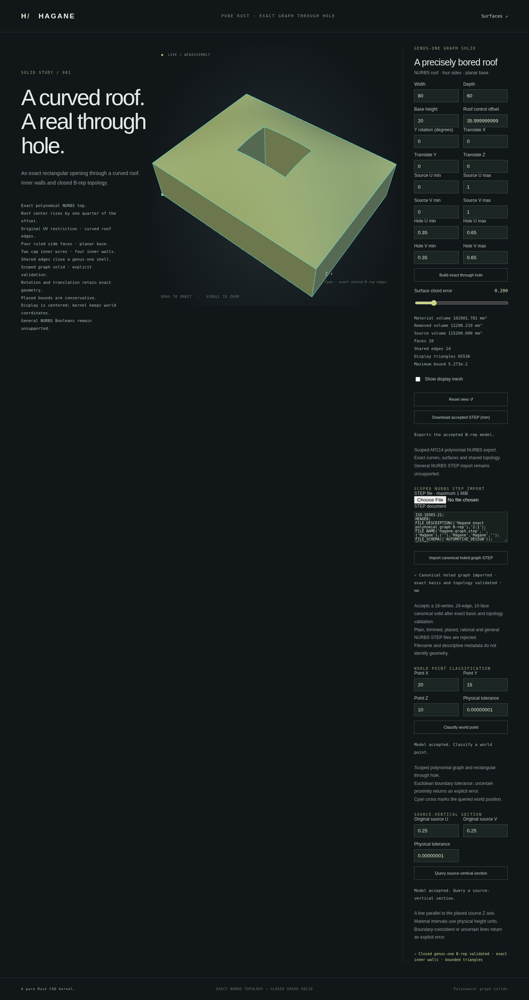

# Strict STEP import of graph solids with one rectangular through opening



`import_step_nurbs_graph_holed_mm` reads one unplaced, full-source-domain
polynomial graph solid with a single strictly interior rectangular through
opening. It retains sixteen shared vertices, twenty-four edges and ten NURBS
faces, including two annular caps and four inward cavity walls. The original
plain [graph importer](nurbs-graph-step-import.md) keeps its six-face API and
continues to reject holed input.

```rust
use hagane::*;
let tolerance = Tolerance::default();
let source = NurbsGraphSolid::new([80.0, 60.0, 20.0], 30.0, tolerance)?;
let original = NurbsGraphHoledSolid::new(
    &source, [[0.35, 0.65], [0.35, 0.65]], tolerance,
)?;
let step = original.export_step_mm(tolerance)?;
let imported = import_step_nurbs_graph_holed_mm(&step, tolerance)?;
imported.validate(tolerance)?;
assert_eq!(imported.export_step_mm(tolerance)?, step);
# Ok::<(), hagane::Error>(())
```

## Geometry certificate, not a recipe

The reader decodes actual control nets, knot multiplicities, shared references,
inner and outer wires and both retained UV uses of each edge. Hole limits come
from the inner wires' parameter curves. No filename or product metadata supplies
the construction parameters. The parsed geometry remains the returned B-rep.

Refinement removes the original single-patch roof's centre control from its
stored representation. For a degree-two spline, the control coefficients of
`2u(1-u)` follow its blossom: `s + t - 2st`, with successive inner knot values
`s` and `t`. The strongest tensor coefficient supplies a parameter candidate.
A fixed search tests at most 130 binary64 candidates per eligible cap,
including the flat case and 129 nearby coefficients. An exact XY control-net
prefilter rejects inconsistent footprints before this search. Every accepted candidate must reproduce
**all** parsed curve/surface controls, degrees, knots, weights, pcurves,
orientations and shared topology exactly after identity reindexing.

An [exact surface-only candidate prefilter](nurbs-graph-holed-step-import-performance.md)
now rejects mismatching roof bases before full B-rep construction. A matching
roof still requires reindexing and complete validation of the actual parsed
geometry and topology; import admission conditions are unchanged.

This is bounded representation recognition, not a general knot-removal solver
or a promise to recover the original user's parameter bits. It never accepts a
nearby surface or changes coordinates to fit a candidate. If coefficient
recovery cannot find a complete exact certificate within its fixed search,
import returns an explicit error. Some otherwise valid equivalent spline
representations are outside this supported subset.

## Scope and units

Both source axes use the full `[0, 1]` domain, positive world X/Y/Z directions
and source origin zero. SI mm/metre coordinates are converted to mm; source UV
and knots are not scaled. Placement, source restriction, multiple openings,
non-unit rational weights, arbitrary trims and general NURBS shells remain
unsupported. The existing bounded Part 21 parser limits and no-snapping
validation policy apply. Rejected browser loads preserve the accepted model.

The implementation is independent original MIT OR Apache-2.0 Rust. The
polynomial blossom identity and B-spline control representation are public
mathematics; STEP entity definitions and optional external-reader licenses are
recorded in [references](references.md) and [graph STEP export](nurbs-graph-step.md).
No new dependency or copied/translated OCCT source is used.

## Run and verify

```sh
cargo run --quiet --locked --example nurbs_graph_step_holed_roundtrip > holed-graph.step
cargo run --quiet --locked --example nurbs_graph_holed_step_import -- holed-graph.step 0.2
bash scripts/build-web.sh
python3 -m http.server 8000 --directory web
```

Open `graph-hole.html`, paste STEP text or select a file, and import it.
Native tests check exact re-export, closed oriented topology, volume and opening
classification, signed/flat/tiny coefficients, SI conversion, shuffled identities,
cyclic wires and reversed face-bound ordering. Invalid geometry, pcurves,
references and unsupported placement/restriction are rejected. WASM compares
native JSON and exact STEP re-export; browser tests exercise real file/text
loads, invalid UTF-8, bounded input and preservation after failed loads.
