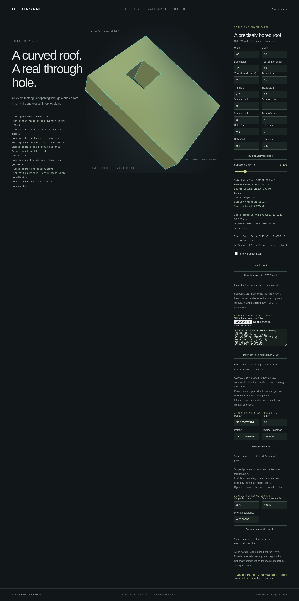

# Centroidal inertia for the scoped NURBS graph family



`NurbsGraphSolid::inertia_properties(tolerance)` and
`NurbsGraphHoledSolid::inertia_properties(tolerance)` compute a symmetric
3×3 inertia tensor about the uniform-density centroid, expressed in world
axes. `ImportedNurbsGraph` provides the same method. It operates on checked
retained polynomial geometry, without display-mesh integration.

Convex polygon and single-opening graph parts now expose the same checked
property type through [polygon centroidal inertia](nurbs-graph-polygon-inertia.md).

```rust
use hagane::*;
let tolerance = Tolerance::default();
let source = NurbsGraphSolid::new([80.0, 60.0, 20.0], 30.0, tolerance)?;
let part = NurbsGraphHoledSolid::new(
    &source, [[0.2, 0.4], [0.3, 0.6]], tolerance,
)?;
let properties = part.inertia_properties(tolerance)?;
println!("Centroid: {:?}; inertia: {:?}", properties.centroid, properties.inertia);
# Ok::<(), hagane::Error>(())
```

## Units and reference

Volume is in mm³ and centroid coordinates in world mm. The tensor is the
geometric integral at unit density, in **mm⁵**. Multiply by a uniform material
density in kg/mm³ to obtain mass moments in kg·mm². No material or density
value is inferred. Rows and columns follow world X, Y, Z; off-diagonal entries
use the inertia convention `Ixy = -integral((x-cx)(y-cy) dV)`.

The reference is the centroid, not the world origin. Translation preserves the
tensor; rigid rotation maps it as `R I Rᵀ`. The centroid can be in a through
opening and still be the correct physical reference. Principal moments/axes,
mixed density, arbitrary rational shells and generic `Solid` inertia remain
unsupported.

## Polynomial moments and stable material integration

Source roof height is `h(u,v) = H + 4b u(1-u)v(1-v)`. With local centroid `c`,
the central column moments are integrated directly. The vertical diagonal
moment uses the positive expression

```text
integral_0^h (z-cz)² dz = h * ((h/2-cz)² + h²/12).
```

Cross moments use column means: for example
`integral_0^h (x-cx)(z-cz) dz = h*(x-cx)*(h/2-cz)`.
The covariance moments give inertia via `I = trace(C) identity - C`.
Tensor four-point Gauss–Legendre integration is mathematically exact for
polynomials up to degree seven per axis; the highest roof term here is `h³`,
of degree six per axis. Floating-point evaluation remains subject to explicit
engineering conditioning checks, rather than interval-certified arithmetic.

Restrictions use retained source UV. Openings use four disjoint positive
material strips, avoiding subtraction of near-equal full/tool tensors. Central
moments are evaluated locally and rotated once, avoiding subtraction of large
translated world moments. Nonfinite, overflowed, underflowed or unresolved
results return errors instead of fabricated tensors.

## Run and inspect

```sh
cargo run --quiet --locked --example nurbs_graph_inertia
bash scripts/build-web.sh
```

The graph browser pages show the world-axis diagonal moments about the centroid;
native/WASM JSON contains the complete symmetric matrix with explicit axes,
reference and units. If the tensor cannot be represented numerically, the JSON
records an explicit unavailable result and reason while retaining an otherwise
valid model. Invalid modeling edits preserve accepted properties.

Independent tests compare flat-box moments and off-centre openings using the
parallel-axis theorem, combine split solids' centroidal tensors, and check
rigid rotation/translation, typed import dispatch and corruption rejection.

The independent MIT OR Apache-2.0 implementation follows elementary column
integration, the parallel-axis theorem and tensor frame transformation. It
adds no dependencies and copies or translates no OCCT source; see
[references](references.md).
