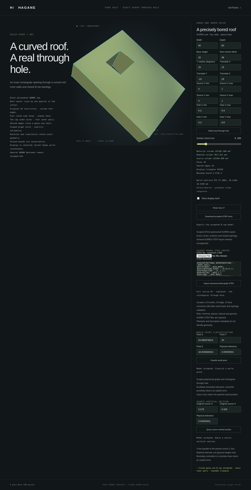

# Uniform-density mass properties for the scoped NURBS graph family



`NurbsGraphSolid::mass_properties(tolerance)` and
`NurbsGraphHoledSolid::mass_properties(tolerance)` return a checked volume in
mm³ and a uniform-density centroid in world mm. `ImportedNurbsGraph` exposes
the same method. These values come from the exact retained graph construction,
not the display mesh. The actual B-rep certificate is checked before evaluation.

```rust
use hagane::*;
let tolerance = Tolerance::default();
let source = NurbsGraphSolid::new([80.0, 60.0, 20.0], 30.0, tolerance)?;
let part = NurbsGraphHoledSolid::new(
    &source, [[0.2, 0.4], [0.3, 0.6]], tolerance,
)?;
let properties = part.mass_properties(tolerance)?;
println!("Volume: {} mm³; centroid: {:?}", properties.volume, properties.centroid);
# Ok::<(), hagane::Error>(())
```

## Polynomial column integration

For original source UV, the roof height is
`h(u,v) = H + 4b u(1-u)v(1-v)`. Each material column extends from zero to
this roof. Its volume density is `h`; first-moment densities are `L*u*h`,
`W*v*h` and `h²/2`. All are low-degree polynomials. Tensor three-point Gauss–Legendre quadrature
integrates these polynomials exactly in real arithmetic (degree at most four
per axis), so it is not an approximate mesh integration. Positive sums and
normalization keep intermediate height squares and translated world moments
out of the calculation.
Floating-point evaluation uses engineering guards; this is not an interval
arithmetic certificate or a promise of exact rational output.

The full symmetric source has centroid X=`L/2`, Y=`W/2` and

```text
Z = (H² + 2Hb/9 + 4b²/225) / (2(H + b/9)).
```

Source restrictions integrate the retained UV rectangle. A rectangular opening
integrates four disjoint positive material strips, avoiding subtraction of a
nearly equal whole and removed volume. Rigid placement transforms the local
centroid once and leaves volume unchanged. Negative and zero roof offsets are
supported within the same existing validity domain.

The centroid need not lie in the material: a symmetric through opening can
contain the part's centroid. Point classification and mass properties answer
different questions and retain their respective geometry checks.

## Scope and failure behavior

Only the certified polynomial graph families are supported. This does not add
mass properties for arbitrary rational or trimmed NURBS shells, generic `Solid`
or mixed-density materials. Inertia tensors and surface area remain future work.
Corrupted public B-reps and nonfinite/unresolved numerical results return errors.

The graph browser pages display the world centroid of the accepted body. STEP
imports, source trims, openings and placements retain this information. Invalid
model edits keep the previous accepted properties. Native and WASM display JSON
share `mass_properties` with explicit uniform-density and unit metadata.

```sh
cargo run --quiet --locked --example nurbs_graph_mass_properties
bash scripts/build-web.sh
```

The column moment identities and polynomial integration are public calculus;
this independent MIT OR Apache-2.0 implementation adds no dependencies and
copies or translates no OCCT code. See [references](references.md).
