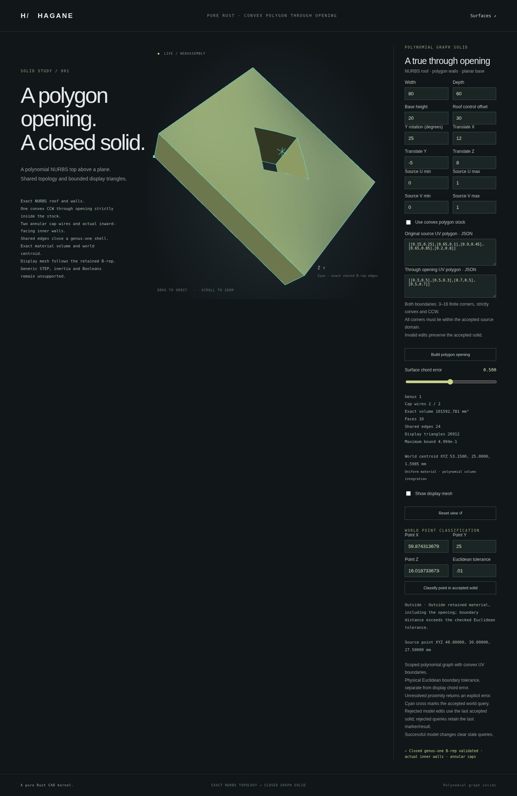

# Point classification for polygon graph solids



The typed `NurbsGraphPolygonSolid` and `NurbsGraphPolygonHoledSolid` wrappers
provide `classify_point(world_point, GeometryTolerance)`. They return
`PointLocation::Inside`, `Outside` or `Boundary`, or an explicit error when
precision or work limits cannot resolve the query. The generic `Solid` API
continues to reject unsupported arbitrary NURBS bodies.

```rust
use hagane::*;
let construction = Tolerance::default();
let source = NurbsGraphSolid::new([80., 60., 20.], 30., construction)?;
let body = source.through_uv_polygon(
    vec![[0.3, 0.5], [0.5, 0.3], [0.7, 0.5], [0.5, 0.7]], construction)?;
let tolerance = GeometryTolerance::new(1e-5, 1e-10, 0.)?;
assert_eq!(body.classify_point(Point3::new(40., 30., 10.), tolerance)?,
           PointLocation::Outside); // The through opening contains this point.
assert_eq!(body.classify_point(Point3::new(10., 10., 10.), tolerance)?,
           PointLocation::Inside);
Ok::<(), hagane::Error>(())
```

## Distance and material

The boundary band uses Euclidean distance to the actual retained faces, rather
than independent coordinate tolerances. Positive rational Bernstein control
hulls give conservative distance lower bounds. Actual retained surface points
give upper-bound witnesses; tangent-plane iteration supplies candidates but
its convergence is never assumed to prove a closest point.

Caps are restricted to the convex polygon material region, excluding the
opening. A point near an excluded part of the original roof or base cannot
become `Boundary` merely because that untrimmed surface is nearby. Outer and
inner ruled walls retain finite domains, so their line extensions do not
create false boundaries. After excluding the boundary band, checked source
height and oriented polygon membership determine inside or outside.

Before subdivision, physical supporting-line distances can exclude all faces:
a point beyond an outer support line, or farther than the boundary band from
every opening support line on its inward side, is `Outside`. This proof uses
the convex XY footprint, independently of height, with four source/world
arithmetic allowances added to the band. Canonical B-rep validation and the
global precision gate still run first. Near-wall and corner-band queries use
the retained-face Euclidean search; support lines never report `Boundary`.

Absolute tolerance uses source length units. Relative tolerance uses the
local source enclosure; world translation does not enlarge the geometric
band. Separate source/world arithmetic allowances, subdivision limits (48 levels,
16,384 visited cells and 65,536 queued work items) and
finite-value checks reject unresolved cases. These are engineering guards,
not interval-arithmetic certification. Public B-rep geometry and topology
are validated before every query.

## Browser workflow and limits

The existing `graph-polygon.html` and `graph-polygon-hole.html` demos accept
world-space query points and show classification through the shared Rust/WASM
kernel. Queries use the last accepted model. Failed model edits and failed
queries (including blank coordinates or tolerance) preserve the accepted
geometry, result and marker; successful model changes clear stale
query results.

This API supports the documented polynomial roof family, convex stock and at
most one strictly contained convex polygon opening, including retained UV
limits and rigid placement. It does not add general NURBS classification,
multiple openings, arbitrary curved Boolean operations or STEP import.

```sh
cargo run --example nurbs_graph_polygon_classification -- 0
cargo run --example nurbs_graph_polygon_classification -- 1
scripts/build-web.sh
python3 -m http.server 8000 --directory web
```

Mode 0 queries the default convex stock; mode 1 queries the default opening.
An optional second argument supplies the complete numeric model/query payload
as JSON. The browser offers named fields instead.

The recorded browser example queries the removed roof position over the opening
and correctly reports `Outside` with a 0.01 mm band; its marker is not
interpreted as material. At this same placed point, a 1e-8 mm request now
also reports `Outside` using the guarded footprint exclusion. Very small
bands can be rejected even for otherwise well-formed queries. Browser tests
require a fresh successful result, preventing preserved old labels from
masquerading as success.
Final native validation passed 641 tests, formatting and strict Clippy.
The WASM build and full native/WASM regression checks also passed.

The complete browser regression passed. A focused follow-up verified 14 fresh
successful queries, blank/invalid-input result and marker preservation, and
the actual Outside capture on the same final WASM binary.

[STEP export](nurbs-graph-polygon-step.md) now writes actual polygon graph
B-reps with retained rational weights. [Strict plain-polygon import](nurbs-graph-polygon-step-import.md)
now accepts the unplaced full-source-UV profile; polygon-opening, placed and
trimmed imports remain unsupported.

The guarded footprint follow-up passed 654 native tests, formatting and strict
Clippy. Independent checks cover a rigidly placed removed roof at 1e-8 mm,
wall/corner Euclidean bands, mutation rejection and unresolved world precision.
The final WASM build, full native/WASM regression and full browser regression
passed, including a fresh successful placed removed-roof query at 1e-8 mm.
