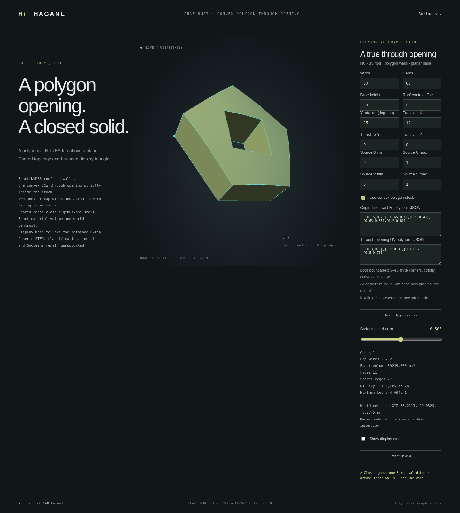

# Convex polygon through openings in graph solids



`NurbsGraphPolygonHoledSolid` retains a closed genus-one B-rep for a
polynomial graph roof with one convex polygon opening. This is a scoped
exact geometry operation; the display mesh is generated afterward from its faces.

```rust
use hagane::*;
let tolerance = Tolerance::default();
let source = NurbsGraphSolid::new([80., 60., 20.], 30., tolerance)?;
let part = source.through_uv_polygon(
    vec![[0.3, 0.5], [0.5, 0.3], [0.7, 0.5], [0.5, 0.7]], tolerance)?;
part.validate(tolerance)?;
let volume = part.volume()?;
Ok::<(), hagane::Error>(())
```

The outer stock may also be a `NurbsGraphPolygonSolid`; call its
`through_uv_polygon` method with original source-UV coordinates. Each wire
has 3–16 strictly convex CCW corners. The opening must lie strictly inside
all outer half-planes, with physical clearance greater than four linear
tolerances plus the source arithmetic allowance. Retained source UV limits
and rigid placement are preserved. Coordinates and dimensions use the same
units as the source; volumes use their cube.

## Geometry and checks

Each cap retains an outer wire and an oppositely traversed inner wire.
Canonical lifted NURBS boundary curves, UV pcurves and shared vertices are
retained; cavity walls face into the opening. For a total of `n` corners,
the B-rep has `2n` vertices, `3n` edges and `n+2` faces. Every effective
edge has two opposed face uses; the wire-adjusted Euler characteristic is zero.
Private certificates reject modifications to actual public geometry/topology.

The planar UV material region is decomposed using the existing ISC-licensed
`earcutr` dependency. Bounded repairs restore only uniquely oriented triangular
gaps and flip only strictly convex internal diagonals that improve physical
triangle altitude. They never move input vertices. Exact orientation predicates,
edge incidence, crossings, T-junctions, connectivity and boundary directions
check the resulting decomposition. Unresolved or ambiguous cases return errors.
This decomposition supports integration and display; it performs no 3D mesh CSG.

Positive five-point Gauss/Duffy quadrature integrates volume and first moments
on the material triangles. Normalized compensated sums avoid subtracting nearly
equal stock/tool volumes or accumulating translated world moments. Roof height
and height squared are polynomial, so this quadrature is algebraically exact
in real arithmetic for this family.

Display evaluates retained B-rep faces with shared logical nodes and crease
normals. The count is `4*n*N*N`, limited to 65,536 triangles. The conservative
engineering bound is `14*abs(b)/N²` plus floating-point and near-unit-weight
allowances. This is not interval-arithmetic certification. Insufficient budgets
and unresolved precision return explicit errors.

## Demo and scope

```sh
cargo run --example nurbs_graph_polygon_hole
scripts/build-web.sh
python3 -m http.server 8000 --directory web
```

Open `graph-polygon-hole.html`. Edit the stock, opening, roof, retained UV
limits and placement; rotate and zoom the accepted solid. Rejected edits
preserve the previous accepted model. Native and WASM share the same Rust
implementation and checked bounded numeric transport.

Tests check independent analytic moments, thin material frames, full cap
triangle exclusion from the opening, closed oriented mesh incidence, inward
cavity normals, actual surface approximation, corruption and rejected inputs.
Contact, CW/nonconvex wires, multiple openings, arbitrary curved Boolean tools,
polygon-hole STEP interchange, inertia and splitting holed
stock remain unsupported. Existing affine UV precision guards also apply;
near-axis directions and unresolved arithmetic are rejected rather than snapped.

The captured placed pentagonal-stock demo above has 11 faces and 27 shared
edges, with 30,276 display triangles. Its volume is 39,249.800 mm³ (rounded
for display). Final validation passed 629 native tests, strict Clippy, formatting,
the WASM build and native/WASM regression checks.

[Typed point classification](nurbs-graph-polygon-classification.md) now checks
world points against actual retained faces, including polygon openings.
