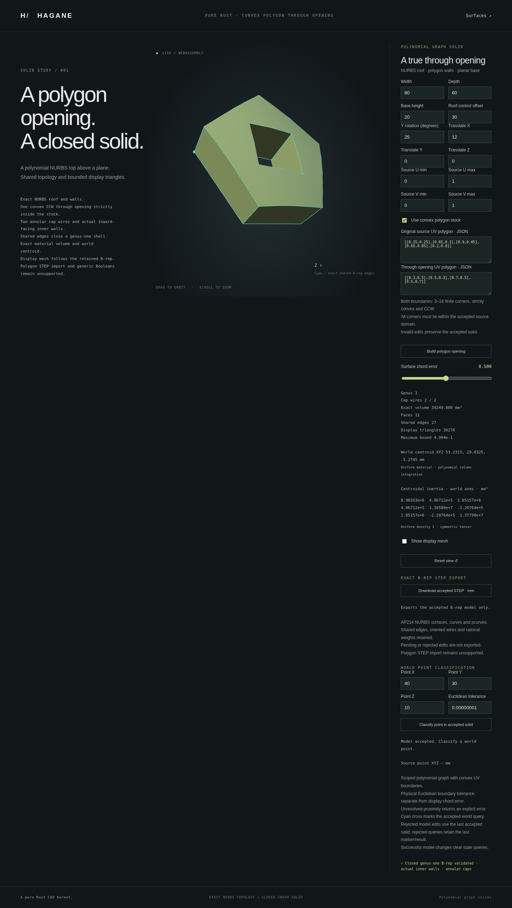

# Centroidal inertia for polygon graph parts



The checked `NurbsGraphPolygonSolid` and `NurbsGraphPolygonHoledSolid` wrappers
provide `inertia_properties(Tolerance)`, returning the existing
`NurbsGraphInertiaProperties`: volume, world centroid and symmetric 3×3
centroidal inertia tensor in world axes. The operation uses retained polynomial
geometry and positive material triangles, never display mesh integration.

```rust
use hagane::*;
let tolerance = Tolerance::default();
let source = NurbsGraphSolid::new([80., 60., 20.], 30., tolerance)?;
let part = source.through_uv_polygon(
    vec![[0.3, 0.5], [0.5, 0.3], [0.7, 0.5], [0.5, 0.7]], tolerance)?;
let properties = part.inertia_properties(tolerance)?;
println!("{:?}", properties.inertia);
Ok::<(), hagane::Error>(())
```

The tensor assumes unit uniform density and has units **mm⁵** when model
lengths are mm. Multiply by density in kg/mm³ to obtain kg·mm². The reference
is the centroid, and off-diagonal entries follow
`Ixy = -integral((x-cx)(y-cy) dV)`. Translation preserves the tensor; rotation
maps it by `R I Rᵀ`. A centroid inside the opening is a valid reference.

For `h(u,v) = H + 4b u(1-u)v(1-v)`, centered vertical column moments use
`h*((h/2-cz)^2+h^2/12)`. A triangle's Duffy map has Jacobian proportional to
`1-r`; its column moments require polynomials up to degree 13 in either
integration coordinate. Seven-point tensor Gauss–Legendre quadrature integrates
these polynomials exactly in real arithmetic. Floating-point evaluations use
scaled coordinates, compensated sums and explicit precision guards. This is
not interval-arithmetic certification or arbitrary rational-surface integration.

The opening is handled by integrating checked positive material triangles,
rather than subtracting nearly equal stock and hole tensors. The local centroid
is reconstructed in the source frame; large world translations are not
subtracted from world-origin moments. Actual canonical B-rep validation runs
before computing the properties. Nonfinite, overflowing, underflowing or
unresolved moments return explicit errors.

The polygon and polygon-opening demos expose the shared native/WASM result.
Their report serializer represents an optional inertia failure by null inertia
and a separate explicit error. A typed large-scale part with a suitable explicit
construction tolerance verifies the actual overflow result alongside valid
mass properties and display geometry. The public numeric demos use a fixed
construction tolerance: very large dimensions are rejected by the existing
curve-identity precision guard before inertia evaluation. They do not claim
to display these oversized parts. Failed shape edits preserve the accepted part.

This extends the scoped polynomial graph family. Multiple openings, generic
`Solid` inertia, principal-axis extraction and variable density remain
unsupported. See [graph inertia conventions](nurbs-graph-inertia.md),
[polygon parts](nurbs-graph-polygon.md) and
[polygon openings](nurbs-graph-polygon-hole.md).

Native validation passed 665 tests, formatting and strict Clippy. Independent
oracles cover flat simplex covariance, an off-center opening via analytical
parallel-axis moments, curved partition conservation, rigid tensor rotation,
length-to-the-fifth scaling, mutation rejection and representability limits.
The WASM build and complete native/WASM regression passed. A separate Green's
theorem polynomial boundary integral checks all tensor components, including
signed roofs, trimmed domains, placement and opening material.

The captured actual browser part is a curved pentagonal stock with a diamond
opening, rotated 25 degrees about Y and translated 12 mm along X. It retains
11 B-rep faces, 27 shared edges and volume 39,249.800 mm³ (rounded for display).
The displayed tensor is about its world centroid, not the world origin.
The full browser regression passed, including analytical flat tensors, rigid
rotation, rejected-edit preservation, point queries and actual STEP downloads.
Near-zero tensor entries use a full-tensor scale for floating-point comparison.
