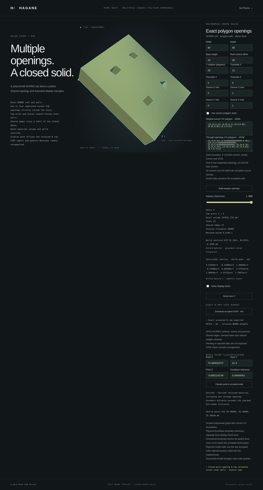

# Point classification for multiple polygon openings



`NurbsGraphPolygonMultiHoledSolid::classify_point(world_point,
GeometryTolerance)` returns `PointLocation::Inside`, `Outside` or `Boundary`.
Precision or work limits produce explicit errors. The API extends the checked
polygon graph query to the existing **1–4-opening, 64-total-corner** family;
model admission conditions remain unchanged.

```rust
use hagane::*;
let construction = Tolerance::default();
let source = NurbsGraphSolid::new([80., 60., 20.], 30., construction)?;
let part = source.through_uv_polygons(vec![
    vec![[0.2, 0.5], [0.3, 0.4], [0.4, 0.5], [0.3, 0.6]],
    vec![[0.6, 0.5], [0.7, 0.4], [0.8, 0.5], [0.7, 0.6]],
], construction)?;
let band = GeometryTolerance::new(1e-5, 1e-10, 0.)?;
assert_eq!(part.classify_point(Point3::new(24., 30., 10.), band)?,
           PointLocation::Outside);
assert_eq!(part.classify_point(Point3::new(40., 30., 10.), band)?,
           PointLocation::Inside);
Ok::<(), hagane::Error>(())
```

## Retained boundary and material

The tolerance band measures Euclidean distance to the actual retained cap
material and finite outer/inner wall faces. Positive material UV triangles
exclude every opening from both caps. The original roof or base over a removed
region is not a retained face and cannot create a `Boundary` result. Finite
wall domains exclude their line extensions; internal decomposition edges do
not add solid boundary faces.

The common polygon query accepts a slice of opening boundaries. Positive
rational Bernstein control hulls provide conservative distance lower bounds;
actual retained surface points provide upper-bound witnesses. Tangent-plane
iteration proposes witnesses without assuming that convergence proves a
closest point. After excluding the boundary band, checked source height and
polygon membership determine material membership outside all openings.
Source UV restriction, signed roof offsets and rigid placement are retained.

Before subdivision, a point sufficiently beyond an outer physical supporting
line is `Outside`. A point sufficiently deep inside **any** convex opening
is also `Outside`, independently of its height, including over the removed
roof or base. Every supporting-line clearance must exceed the geometric band
plus four source/world arithmetic allowances for this opening exclusion.
Canonical validation and the global precision gate run first. Near walls,
vertices and rims, the retained-face Euclidean search resolves the band;
supporting lines do not report `Boundary`.

Absolute tolerance uses source length units. Relative tolerance uses the local
source enclosure; world translation does not enlarge the geometric band.
Source/world arithmetic guards and finite-value checks remain unchanged, as
do the limits of 48 subdivision levels, 16,384 visited cells and 65,536 work
items. Unresolved bands, overflow and exhausted work return explicit errors.
These floating arithmetic guards are engineering checks, not interval
certificates. Every query validates the retained geometry and shared topology.

## Native, WASM and browser workflow

```sh
cargo run --locked --example nurbs_graph_polygon_multi_hole_classification
scripts/build-web.sh
python3 -m http.server 8000 --directory web
```

The native CLI accepts one optional complete numeric JSON payload. Append
world X, Y, Z and a positive absolute linear tolerance to the existing
[multi-opening model payload](nurbs-graph-polygon-multi-hole.md). At most 151
finite values are accepted (26–151 for a complete transport). The shared Rust
entry point is `nurbs_graph_polygon_multi_hole_point_demo_json`; its JSON
report includes location, world/source coordinates, linear tolerance and genus.
The query constructs the checked model without
display meshing, so a display-resource failure does not itself prevent a
well-resolved point query. Malformed counts, truncation, trailing values,
nonfinite inputs and unresolved geometry remain errors.

The WASM transport uses `hagane_graph_polygon_multi_hole_point_begin`,
`hagane_graph_polygon_multi_hole_point_push` and
`hagane_graph_polygon_multi_hole_point_finish`, followed by the existing
output-buffer functions. Native and WASM share the same Rust query. The demo
uses an absolute tolerance with relative tolerance zero.

Open `http://localhost:8000/graph-polygon-multi-hole.html` and enter a world
point and linear tolerance. The default query is `(40, 30, 10)` with a
`1e-8` mm band. Queries use the last accepted model. Failed model edits and
failed queries, including blank fields, preserve the accepted geometry,
previous result and marker. Accepting a new model clears stale query results.
A successful fresh query updates the result and world marker.

[STEP download](nurbs-graph-polygon-multi-hole-step.md) uses that same accepted
model and preserves the query result. Pending form edits do not replace its
export source. Query failures remain separate from modeling and STEP status.

## Scope

This adds point queries to the existing scoped polynomial graph family.
Generic `Solid` classification still rejects unsupported arbitrary NURBS
bodies. Multiple-opening STEP import, general rational-shell queries and
general curved Boolean operations remain unsupported. The complete modeling
conditions and property/display limits are documented in
[multiple polygon openings](nurbs-graph-polygon-multi-hole.md).

## Verification

Native validation passed 701 tests, formatting and strict Clippy. The WASM
build, complete WASM regression, focused browser regression and full browser
regression passed.
Tests cover each opening's
removed base/roof and interior, material between openings, finite Euclidean
wall/corner bands, signed/trimmed/rigidly placed stock, relative scaling,
64 total corners, model mutation and invalid-query recovery. The actual
capture shows a fresh `Outside` query at the removed roof over the fourth
opening of a posed genus-four part, using a 1e-8 mm tolerance, with the
accepted STEP export retained.
