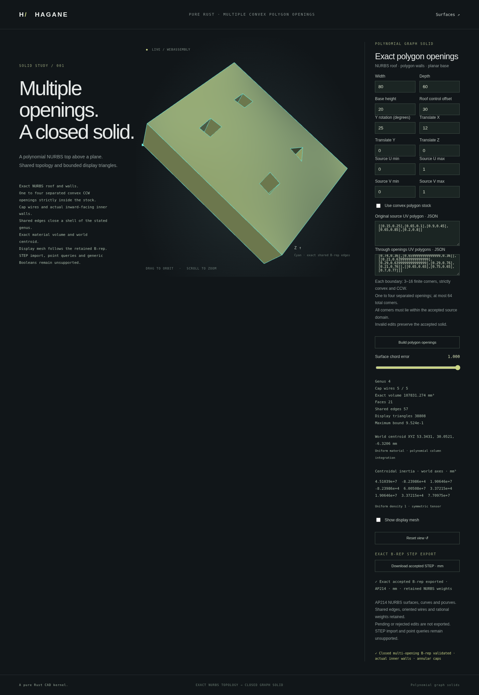

# STEP export for multiple polygon openings



`NurbsGraphPolygonMultiHoledSolid::export_step_mm(tolerance)` exports the
validated retained B-rep as ISO 10303-21 / AP214 `AUTOMOTIVE_DESIGN` data,
with millimeter length units. It constructs no display mesh and performs no
geometry fitting.

```rust
use hagane::*;
let tolerance = Tolerance::default();
let source = NurbsGraphSolid::new([80., 60., 20.], 30., tolerance)?;
let part = source.through_uv_polygons(vec![
    vec![[0.2, 0.5], [0.3, 0.4], [0.4, 0.5], [0.3, 0.6]],
    vec![[0.6, 0.5], [0.7, 0.4], [0.8, 0.5], [0.7, 0.6]],
], tolerance)?;
std::fs::write("multiple-openings.step", part.export_step_mm(tolerance)?)?;
Ok::<(), Box<dyn std::error::Error>>(())
```

## Retained geometry and topology

The existing writer serializes actual NURBS degrees, knots, control points
and positive weights. Nonunit weights use standard complex rational B-spline
curve/surface records. Near-unit binary64 weights from diagonal UV lifts are
retained as round-trip decimal values. Unit-weight geometry uses the existing
simple B-spline records. U-major surface control and weight rows preserve the
retained parameterization, source UV restriction and rigid placement.

Each shared `EDGE_CURVE` has a `SURFACE_CURVE` with both incident face
`PCURVE` uses. The finite affine UV lines preserve the global edge parameters.
Opposed coedges, face orientations and a `CLOSED_SHELL` retain the closed
manifold. For `g` openings, both caps export their outer wire and all `g`
reversed inner wires; cavity walls retain their inward orientation. The
result contains `2n` vertices, `3n` edges and `n+2` faces for `n` total corners.
There are `2g` inner `FACE_BOUND` records across the two caps.

Canonical validation runs before serialization and rejects public B-rep
mutation, including changed weights, cap loops, pcurves and topology.
The modeling conditions are unchanged: **1–4** strictly convex CCW openings,
3–16 corners per boundary, at most **64 total corners** including the stock,
strict containment, resolved supporting-axis separation between openings,
and the existing source-UV and world-coordinate precision guards.
Contact, overlap, nesting and unresolved material decomposition remain errors.
See [multiple polygon openings](nurbs-graph-polygon-multi-hole.md).

The existing writer budgets remain 4,096 vertices/edges, 512 faces,
65,536 spline controls, 100,000 entities and 32 MiB of text. Export does not
request the display's 65,536-triangle budget. A valid model may therefore
export even when its requested display error would exceed that mesh budget.

## Native, WASM and browser workflow

```sh
cargo run --locked --example nurbs_graph_polygon_multi_hole_step
scripts/build-web.sh
python3 -m http.server 8000 --directory web
```

The native example accepts one optional JSON numeric payload, using the same
model transport as the [multi-opening demo](nurbs-graph-polygon-multi-hole.md).
Its JSON result contains STEP text, `units: "mm"`,
`schema: "AUTOMOTIVE_DESIGN"`, genus and the retained boundary polygons.
The transport's display-error value must still be finite and positive;
export does not tessellate or use it as an approximation tolerance.

The shared Rust entry point is `nurbs_graph_polygon_multi_hole_step_demo_json`.
WASM exposes `hagane_graph_polygon_multi_hole_step_begin`,
`hagane_graph_polygon_multi_hole_step_push` and
`hagane_graph_polygon_multi_hole_step_finish`, with the existing output-buffer
functions. The checked transport rejects malformed counts, more than 147
values, nonfinite inputs, truncation and trailing data.

Open `http://localhost:8000/graph-polygon-multi-hole.html` and choose
**Download accepted STEP · mm**. The download uses the last successfully
accepted model. Pending or rejected edits preserve that model and its export
source. Export failures preserve the accepted part; accepting a new part
clears stale export status. The file is `hagane-nurbs-graph-multi-opening.step`.

## Verification and limitations

The regressions check genus-two and genus-four documents, all cap bounds,
both pcurves per shared edge, actual rational weights, trimmed and rigidly
placed stock, the 64-corner boundary, invalid tolerances and public mutations.
Model-only export checks cover valid geometry whose display request exceeds
the mesh budget. Native/WASM checks compare STEP bytes for identical numeric
inputs and verify transport rejection and recovery. Browser checks exercise
actual downloads and preservation of the accepted export model after edits.

This adds export for the existing typed family. [Point classification](nurbs-graph-polygon-multi-hole-classification.md)
now queries the accepted multi-opening model and preserves STEP download
state. STEP import remains unsupported. No export-import round
trip, general rational-shell interchange or general curved Boolean operation
is claimed. The existing polygon STEP oracle and its reader limitations are
documented [separately](nurbs-graph-polygon-step.md); a requested external-reader
mesh deflection is not a certified maximum or exact B-rep mass measurement.

Native validation passed **689 tests**, formatting and strict Clippy. The WASM
build, complete WASM regression, focused browser download regression and full
browser regression passed.
The actual capture shows
a placed four-opening part with genus 4, 21 faces and 57 shared edges, followed
by a successful STEP download. Its 38,808 display triangles have a maximum
engineering bound of approximately 0.9524 mm under the requested 1 mm error.
