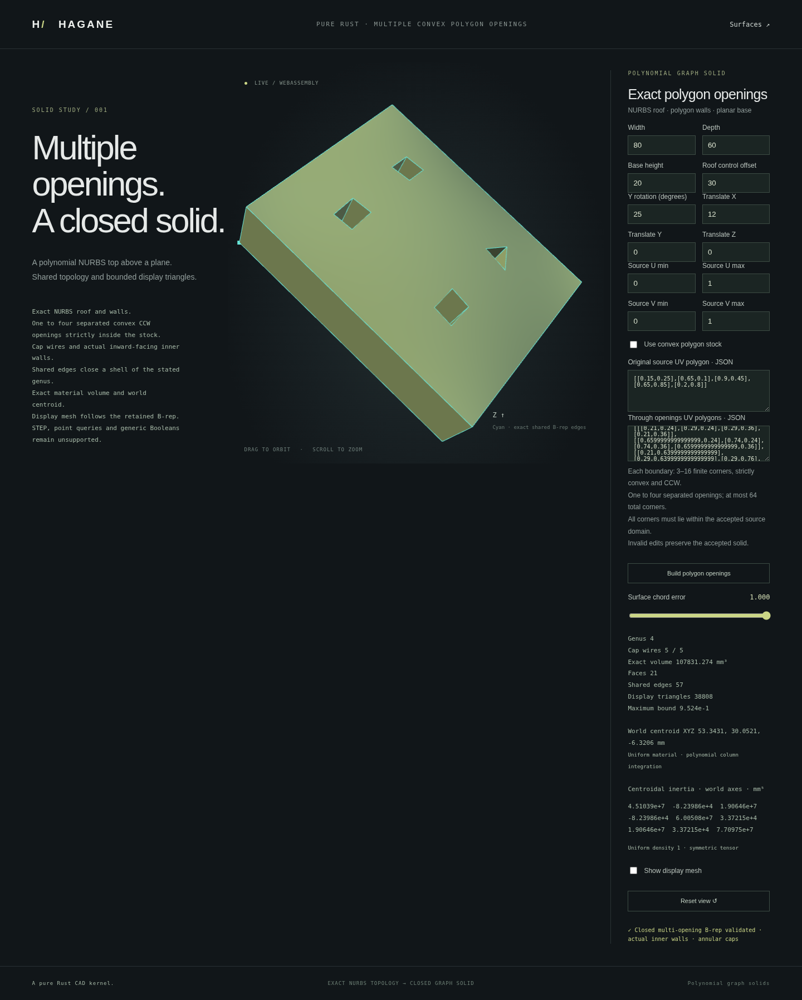

# Multiple convex polygon through openings



`NurbsGraphPolygonMultiHoledSolid` retains a closed polynomial NURBS graph
part with **1–4** strictly convex CCW polygon openings. Each boundary has
3–16 corners, with at most **64 total corners**, including the outer stock.
This extends the scoped source-vertical operation; it is not a general curved
Boolean algorithm or a mesh Boolean.

```rust
use hagane::*;
let tolerance = Tolerance::default();
let source = NurbsGraphSolid::new([80., 60., 20.], 30., tolerance)?;
let part = source.through_uv_polygons(vec![
    vec![[0.2, 0.5], [0.3, 0.4], [0.4, 0.5], [0.3, 0.6]],
    vec![[0.6, 0.5], [0.7, 0.4], [0.8, 0.5], [0.7, 0.6]],
], tolerance)?;
let mass = part.mass_properties(tolerance)?;
let inertia = part.inertia_properties(tolerance)?;
let display = part.tessellate_bounded(0.5, 65_536, tolerance)?;
println!("{} mm3; {:?}; {} triangles", mass.volume, inertia.inertia,
         display.mesh.triangles.len());
Ok::<(), hagane::Error>(())
```

`NurbsGraphPolygonSolid::through_uv_polygons` accepts the same opening list
for a convex polygon stock. `NurbsGraphPolygonMultiHoledSolid::new(&stock,
openings, tolerance)` is the explicit constructor. Read-only accessors expose
the source, outer polygon, opening list, B-rep, conservative bounds and genus.
Source UV trim and rigid placement are retained.

## Geometry, topology and admission checks

Every opening must lie strictly inside all physical outer supporting planes.
For every opening pair, a supporting edge from either polygon must separate
the entire other polygon by more than `4*construction_tolerance + source
arithmetic_allowance`. This conservative resolved-axis condition is stricter
than merely detecting disjoint interiors. Contact, unresolved near contact,
overlap, nesting, duplicate openings, outside/CW/nonconvex boundaries and
nonfinite coordinates are rejected. Existing affine source-UV conditioning
and world-placement precision guards remain in force.

The two caps retain the original source surfaces and parameter domains, each
with one outer wire and one reversed inner wire per opening. Every opening has
actual inward-facing NURBS wall faces. With `n` total corners and `g` openings,
the B-rep has `2n` vertices, `3n` shared edges and `n+2` faces. Every effective
edge is used twice with opposite orientation. Accounting for the caps' inner
wires gives Euler characteristic `2-2g`. Full canonical control points,
weights, knots, parameter curves, references and orientations are validated;
even sub-tolerance public mutations are rejected.

The material decomposition has `T = n+2g-2` positive UV triangles. It checks
all boundary directions, opposed interior-edge uses, connectedness, Euler
characteristic, crossings, T-junctions, contained unrelated vertices and
physical triangle altitudes. If the planar triangulator skips an aligned
input corner, an exact collinear edge split restores that existing vertex.
Bounded positive-gap restoration and internal diagonal flips preserve input
geometry. No input is nudged, and no Steiner geometry is created. Unresolved
decompositions return explicit errors.

## Properties and display

Positive material-triangle integration computes volume, uniform-density
centroid and centroidal world inertia, avoiding large stock-minus-hole
subtraction in the kernel. Gauss5 integrates the mass moments and Gauss7 the
centered inertia moments in real arithmetic; scaled binary64 arithmetic and
compensated sums retain explicit representability guards. Inertia has units
mm⁵ for lengths in mm. See [polygon inertia](nurbs-graph-polygon-inertia.md).

Display triangles evaluate the actual retained B-rep faces, with shared nodes
and separate face normals at creases. A common subdivision count `N` requires
`2*(T+n)*N² = 4*(n+g-1)*N²` triangles. The existing engineering curvature and
roundoff bound, including retained near-unit weights, must fit the requested
chord error. The display limit is 65,536 triangles; an unresolved request is
rejected rather than silently coarsened. Four curved rectangular openings at
roof offset 30 mm may require a larger explicitly requested error than the
two-opening default; 1 mm fits the demonstrated four-opening case.

## Run the demo

```sh
cargo run --locked --example nurbs_graph_polygon_multi_hole
scripts/build-web.sh
python3 -m http.server 8000 --directory web
```

Open `http://localhost:8000/graph-polygon-multi-hole.html`. Edit 1–4 opening
arrays, stock, source UV limits and placement, then rotate or zoom the accepted
part. Failed edits preserve the accepted geometry and property values.
Native and WASM use the same kernel and checked bounded numeric transport.

The native example also accepts one complete numeric payload as a JSON array:
the existing 13 source-model values, outer count (0 for the source rectangle
or 3–16), opening count (1–4), explicit outer UV pairs if applicable, then each
opening's corner count and UV pairs. Including an implicit rectangle, total
corners remain limited to 64; transport accepts at most 147 finite values.
Fractional counts, truncation, trailing data and overflow are rejected.

The default curved part has two diamond openings, genus 2, 14 faces, 36 shared
edges and volume 106,968.0384 mm³. With the roof offset set to zero, volume is
92,160 mm³, matching the independent flat analytic value. Bounds remain a
conservative source control-hull enclosure.

This typed family now provides [exact STEP export](nurbs-graph-polygon-multi-hole-step.md),
including all cap loops and actual rational weights. The browser downloads
the accepted model; native/WASM export does not require display meshing.
[Point classification](nurbs-graph-polygon-multi-hole-classification.md) now
checks the accepted multi-opening material and retained boundary faces. STEP
import remains unsupported for this family. More than four openings, concave stock/openings, contact
repair and general curved Booleans remain unsupported. Fixed-tolerance numeric
demos continue to reject oversized geometry before moment calculation.

Native validation passed 680 tests, formatting and strict Clippy. Tests cover
exact aligned four-opening inputs, separating-axis clearance, count limits,
sub-tolerance mutations, signed roofs, trim, rigid placement, thin frames,
independent mass/inertia oracles and conforming mesh topology. The captured
actual four-opening part has genus 4, 21 faces and 57 shared edges, with 38,808
display triangles and a maximum engineering error bound of approximately
0.9524 mm under the explicitly requested 1 mm chord error. Its displayed
volume is 107,831.274 mm³ (rounded).
The WASM build and full native/WASM regression passed, including independent
Green's theorem mass and inertia, all retained pcurves, cap-hole exclusion,
closed oriented mesh nodes, count/transport errors and recovery. The focused
browser demo regression also passed.
The final full browser regression passed, including the refreshed actual
capture, rejected-edit preservation, orbit/zoom and responsive layout.
