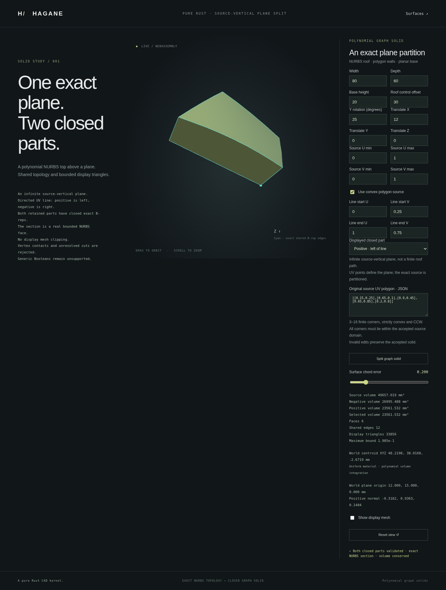

# Source-vertical oblique graph partitions



`split_uv_line(start, end, tolerance)` partitions a certified polynomial graph
solid, or a convex polygon graph solid, into two independently closed B-reps.
The directed UV line defines an **infinite source-vertical plane**, not a finite
roof query or a display-only cut. Source restrictions and rigid placement are
preserved. Meshes are generated afterward from the retained faces.

```rust
use hagane::*;
let tol = Tolerance::default();
let source = NurbsGraphSolid::new([80., 60., 20.], 30., tol)?;
let split = source.split_uv_line([0., 0.25], [1., 0.75], tol)?;
split.validate(tol)?;
let negative_volume = split.negative.volume()?;
let positive_volume = split.positive.volume()?;
let view = split.negative.tessellate_bounded(0.2, 65_536, tol)?;
# Ok::<(), hagane::Error>(())
```

The same method on `NurbsGraphPolygonSolid` partitions its actual retained
convex polygon, including results of earlier cuts. It does not cut a rectangular
through-opening solid or arbitrary NURBS shell.

## Geometry and side convention

For source dimensions L and W, the physical line tangent is proportional to
`[L*(end.u-start.u), W*(end.v-start.v), 0]`. The positive plane normal points
to its left in source XY; the negative part is on its right. Reversing the line
exchanges the sides. The returned `plane` retains the corresponding world
origin and orthonormal directions after rigid placement.

Each polygon/line crossing is computed once and used by both child polygons.
Exact lifted edges are constructed in a canonical lexicographic UV direction;
reversal changes only control, weight and knot array order. The two cut-wall
surfaces therefore retain bit-identical control points and weights under U
reversal, with opposite outward normals. The finite `section: NurbsFace`
retains the actual negative-side cut surface, a closed four-edge profile and
its pcurves. It is an open face, not an additional solid.

Both child wrappers validate actual controls, knots, weights, shared vertices,
coedges and pcurves. `NurbsGraphPolygonSplit::validate` additionally rebuilds
the private source/line certificate and rejects even sub-tolerance changes to
the public children, section or plane. Positive polygon integration verifies
combined volume against the original retained stock within an explicit
`8192*f64::EPSILON*source_volume` arithmetic guard, without mesh integration.
Independent tests also verify analytic polynomial moments and centroid
conservation.

## Explicit supported conditions

- Both sides must contain resolved material. Outside, tangent, coincident and
  vertex-contact cuts are errors; there is no unchanged-body success.
- Physical line length must exceed `4*tolerance.linear + source_allowance`.
  Every original polygon vertex must be farther from the plane than this
  margin plus the line arithmetic guard.
- Each nonzero UV direction component must exceed
  `128*f64::EPSILON*max(abs(start), abs(end), 1)` on its axis. Exactly zero
  components support source-axis cuts; almost-zero components are not snapped.
- The line arithmetic guard is
  `4096*f64::EPSILON*8*max(abs(L*start.u), abs(W*start.v),
  abs(L*end.u), abs(W*end.v))` and must be below a quarter of the tolerance.
  A further world-coordinate plane residual/allowance check enforces that
  same quarter-tolerance budget. Remote ill-conditioned origins are rejected.
- Both output polygons must have 3–16 corners and meet the existing physical
  edge/corner clearances. A valid 16-corner stock can still be rejected when
  one output would need 17 corners.
- Original closed-domain pcurve and affine composition conditions from
  [polygon graph solids](nurbs-graph-polygon.md) remain in force. UV boundary
  roundoff, unresolved dimensions, overflow and underflow remain errors.

Line endpoints may lie outside the stock; they define the infinite plane.
They must be finite and satisfy the numeric conditioning checks above.
The guards are engineering binary64 checks, not interval certification.
General plane/shell intersections, non-source-vertical cuts, concave or holed
stocks and curved Boolean tools remain unsupported.

## Display and demos

```sh
cargo run --example nurbs_graph_polygon_split
scripts/build-web.sh
python3 -m http.server 8000 --directory web
```

Open `graph-plane-split.html`. Edit the directed line, source parameters,
restriction and placement; optionally enable a convex UV polygon. Select the
negative or positive closed part and inspect the exact section boundary,
both volumes and the chosen part's centroid. Rejected edits preserve the
accepted part. Safe bounded numeric WASM transport shares the native Rust API.

Conforming display uses closed convex interpolation with exact UV endpoints.
This corrects sampling arithmetic without modifying any B-rep vertex, pcurve
or control point. Shared mesh nodes remain bit-identical across cap/wall seams,
with separate crease normals and conservative error bounds. Only the selected
part is tessellated; its display budget can fail independently of the other
part's valid geometry. The source and both child B-reps remain exact geometry.

This milestone adds a useful plane partition, not general union, intersection,
difference, polygon graph STEP interchange or arbitrary-shell repair.
