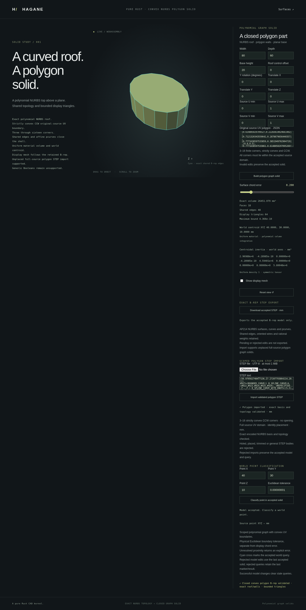

# Strict STEP import of convex polygon graph solids



`import_step_nurbs_graph_polygon_mm(text, tolerance)` returns a checked
`NurbsGraphPolygonSolid` for one strictly convex CCW **3–16-corner** polygon
in an unplaced, full-source-UV polynomial graph. The new typed entry point
reads AP214 geometry; the generic importer and existing plain/rectangular-hole
and automatic graph import APIs keep their previous scopes.

```rust
use hagane::*;
let tolerance = Tolerance::default();
let source = NurbsGraphSolid::new([80., 60., 20.], 30., tolerance)?;
let original = NurbsGraphPolygonSolid::new(&source, vec![
    [0.9, 0.45], [0.65, 0.85], [0.2, 0.8], [0.15, 0.25], [0.65, 0.1],
], tolerance)?;
let imported = import_step_nurbs_graph_polygon_mm(
    &original.export_step_mm(tolerance)?, tolerance)?;
imported.validate(tolerance)?;
let display = imported.tessellate_bounded(0.2, 65_536, tolerance)?;
let location = imported.classify_point(
    Point3::new(40., 30., 10.), GeometryTolerance::new(1e-5, 1e-10, 0.)?)?;
assert_eq!(location, PointLocation::Inside);
let canonical = imported.export_step_mm(tolerance)?;
let again = import_step_nurbs_graph_polygon_mm(&canonical, tolerance)?;
assert_eq!(again.export_step_mm(tolerance)?, canonical);
Ok::<(), hagane::Error>(())
```

## Actual geometry and affine representation

The reader retains the parsed 3D vertex coordinates, spline degrees, knots,
control points and positive weights, including near-unit rational weights on
lifted polygon edges and walls. Standard complex rational curve/surface
records are decoded only in the new opt-in parser profile. Weights are neither
normalized nor rounded to one. Unknown or incomplete component sets, duplicate
components and nonpositive weights are rejected.

For every affine pcurve, the reader separately retains the raw STEP line
origin, `DIRECTION` ratios and `VECTOR` magnitude. The recognizer compares all
three numeric fields exactly with the writer's decomposition of a canonical
affine pcurve. Only after that forward comparison succeeds does it restore
the corresponding canonical `PCurve::Affine` representative.

This is an exact serialized-preimage check. It is not approximate direction
normalization, and it does not claim that multiplying the decoded ratios by
the magnitude recovers the original binary64 delta exactly. That product is
only an internal decoding placeholder and cannot establish acceptance.
A restored representative must still pass complete retained geometry,
pcurve, orientation and shared-topology validation. The imported 3D spline
geometry remains the actual parsed geometry.

The source roof coefficient is recovered through a bounded neighboring-value
search. As in the existing strict graph importers, the accepted coefficient
can differ from the original user's input recipe while reproducing the actual
encoded control net exactly. A surface candidate alone is insufficient: all
curves, surfaces, references, raw affine representations and closed topology
must match the complete canonical certificate. Unresolved recovery returns
an explicit error; this is not a general rational-surface reconstruction tool.

## Identity, units and limits

The polygon follows the parsed top cap's forward coedge cycle and rotates to
the lexicographically least UV corner. Entity identifiers, record order and
cyclic wire starting positions do not identify the shape. Actual geometry is
reindexed to canonical identities. The first re-export may reorder records
and polygon starting indices; subsequent canonical import/re-export is stable.
Arbitrary reversed geometry/parameter bases remain outside this profile.

Both source axes retain the full `[0,1]` domain, positive world X/Y/Z axes and
source origin zero. Millimeter documents use the actual recorded coordinates.
The shared SI metre conversion path scales 3D coordinates into millimeters;
acceptance still requires an exact canonical coefficient/control match after
conversion. UV coordinates, knots and raw affine fields are not length-scaled.
The caller's tolerance is in millimeters and file uncertainty does not enlarge it.

The existing finite Part 21 limits remain: **1 MiB** input, 32,768 entities,
131,072 values, 4,096 values per list and 16 nesting levels. The polygon profile
bounds vertices to 6–32, edges to 9–48 and faces to 5–18, with one outer bound
per face. Counts bound work; they do not substitute for geometry recognition.
Every edge must have two distinct attached face pcurves and opposed effective
uses. Duplicate uses, unrepresented geometry and dangling references fail.

Holes, source UV restriction, translation/rotation, arbitrary rational graph
roofs, general NURBS shells, assemblies and other application protocols remain
unsupported. [Polygon and opening export](nurbs-graph-polygon-step.md) retains
its wider export scope. Exportability does not imply admission to this importer.

## Native, WASM and accepted browser workflow

```sh
cargo run --quiet --locked --example nurbs_graph_polygon_step_import -- polygon.step 0.2
scripts/build-web.sh
python3 -m http.server 8000 --directory web
```

The CLI accepts `PATH [chord_error]`, with a default 0.2 mm display request and
bounded file reading. `nurbs_graph_polygon_step_import_demo_json` displays and
reports the actual checked imported B-rep, rather than rebuilding a rectangular
source display. Display precision and mesh resource limits remain explicit.

WASM exposes `hagane_graph_polygon_step_import_begin`,
`hagane_graph_polygon_step_import_push_byte` and
`hagane_graph_polygon_step_import_finish(error)`, with the existing output
buffer functions. The byte transport rejects values above 255, input above
1 MiB and invalid UTF-8. It remains separate from numeric polygon STEP export.

Open `http://localhost:8000/graph-polygon.html`, then paste STEP text or choose
a file and import it. A successful import installs the checked polygon as the
accepted part for display, world-point queries and STEP download, and clears
stale query markers/results. Rejected input or an unresolved display request
preserves the accepted body, query result and marker. Failed later queries or
STEP exports also preserve the accepted part. Pending form edits are not its
export source.

This milestone adds strict plain-polygon import with accepted-model inspection,
queries and canonical re-export. It does not broaden the existing generic or
automatic graph import dispatchers, add polygon-hole import or claim general
NURBS interchange. The implementation uses original Rust and the existing
[STEP/mathematical references](references.md), with no new dependency or license.

Final native validation passed **721 tests**, formatting and strict Clippy.
The release WASM build, complete WASM regression, focused browser import
regression and full browser regression passed. The
actual capture shows a flat, unplaced full-UV 16-corner polygon with UV radius
0.3 about `(0.5,0.5)`, source dimensions `80×60×20` mm, 18 faces, 48 shared
edges and 64 display triangles. Its volume is 26,451.079 mm³ (rounded), and
the checked centroidal inertia tensor is displayed. The fresh successful
import has cleared the previous point-query result.
