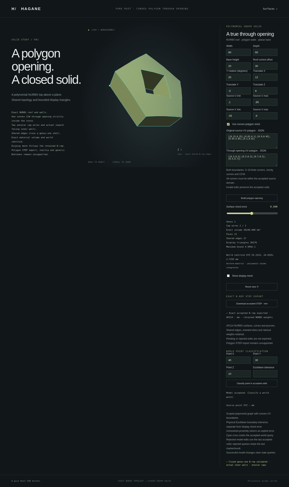

# STEP export for polygon graph solids



`NurbsGraphPolygonSolid::export_step_mm(tolerance)` and
`NurbsGraphPolygonHoledSolid::export_step_mm(tolerance)` write the actual
validated closed B-rep as ISO 10303-21 / AP214 `AUTOMOTIVE_DESIGN` data.
Lengths are interpreted as millimeters; no display mesh is exported.

```rust
use hagane::*;
let tolerance = Tolerance::default();
let source = NurbsGraphSolid::new([80., 60., 20.], 30., tolerance)?;
let body = source.through_uv_polygon(
    vec![[0.3, 0.5], [0.5, 0.3], [0.7, 0.5], [0.5, 0.7]], tolerance)?;
let step = body.export_step_mm(tolerance)?;
std::fs::write("polygon-opening.step", step)?;
Ok::<(), Box<dyn std::error::Error>>(())
```

## Retained representation

The writer serializes actual NURBS degrees, knots, control points and positive
weights. Unit-weight geometry keeps the existing simple B-spline entity path.
Nonunit geometry uses standard complex rational B-spline curve/surface entities.
Near-unit binary64 weights from diagonal parameter lifts are retained exactly
as round-trip decimal values; they are not normalized or rounded to one.
U-major control and weight rows preserve the original surface parameterization.

Shared `EDGE_CURVE` and `SURFACE_CURVE` records retain both face `PCURVE` uses.
Finite affine UV lines preserve global edge parameters. Opposite coedge uses,
face orientations, outer/inner bounds and a `CLOSED_SHELL` encode the solid.
Hole caps retain two wires; cavity-wall orientation is preserved. Original
source UV restrictions and rigid placement remain in the exported geometry.
Geometry is validated before serialization, including private certificates
that reject public B-rep mutation.

Limits remain 4,096 vertices/edges, 512 faces, 65,536 control points, 100,000
entities and 32 MiB of text. Unsupported pcurves and unresolved input geometry
return explicit errors. These limits do not broaden the modeling domain beyond
3–16-corner convex stock and one strictly contained convex opening.

## Native and browser workflow

```sh
cargo run --example nurbs_graph_polygon_step -- 0
cargo run --example nurbs_graph_polygon_step -- 1
scripts/build-web.sh
python3 -m http.server 8000 --directory web
```

Mode 0 exports default polygon stock; mode 1 exports the default opening.
An optional second argument supplies the numeric model payload as JSON.
The `graph-polygon.html` and `graph-polygon-hole.html` pages download STEP
from their last accepted model. Failed shape edits and point queries preserve
that model and its export source; regeneration clears stale export status.
Native and WASM share checked bounded numeric transports and the same writer.

## Verification and limitations

Independent Part 21 semantic tests reconstruct the recorded spline basis and
compare degrees, control points, knots and actual weights exactly with the
retained B-rep. Dense rational evaluations, U/V row ordering, every pcurve,
face-bound kinds and oriented shared incidence are checked, including signed
roofs, trimmed/placed stock and differing polygon corner counts.

This milestone adds export. Hagane's scoped NURBS STEP importer continues to
reject polygon and polygon-opening families outside its supported plain/
rectangular-hole subset. No general NURBS import or export-import round trip
is claimed. Multiple openings and general curved Boolean tools remain unsupported.

The optional external reader check uses the existing `occt-import-js` 0.0.23
installation, solely as a test oracle (LGPL-2.1 wrapper and bundled OCCT
exception terms; see [licenses](step-export.md)). It is not a Hagane dependency.

```sh
node scripts/validate-nurbs-polygon-step-external.mjs /tmp/hagane-step-validator/node_modules/occt-import-js
```

Five documents were read in mm and metres at a requested 0.0001 mm deflection.
All 2,802,304 imported triangles were assigned to their expected B-rep face
and checked, including exact-coordinate oriented mesh closure, finite walls,
material/void rays and independent polynomial volume integration. Reconstructed
STEP control nets and dense rational basis checks verify the encoded geometry.
Imported mesh volume remains approximate evidence.

The external reader exceeded its requested display deflection in four metre-mode
cases. For example, a pentagon roof sample deviated 0.000278040 mm, exceeding the
previous request-plus-roundoff allowance of 0.000274857 mm. Actual-triangle
checks therefore use an independent Hessian bound `H*maxEdgeUV²/6` plus explicit
float32/UV and source allowances. They do not assume requested reader deflection
is a certified maximum. These measured reader limitations are reported by the
script; they are not hidden by rounding weights or enlarging the request.

Final native validation passed 646 tests, formatting and strict Clippy.
The WASM build and complete native/WASM regression passed, including STEP byte
parity for matching numeric input fixtures and invalid transport recovery.
[Precise JSON parsing](json-float-roundtrip.md) now preserves finite serialized
binary64 model values, including the original trigonometric native/WASM STEP
fixtures. STEP output retains the actual values given to the writer.

The full browser regression and actual download checks passed. The captured
trimmed, placed pentagon-plus-diamond part has 11 faces and 27 shared edges;
the downloaded file comes from its accepted exact B-rep.
