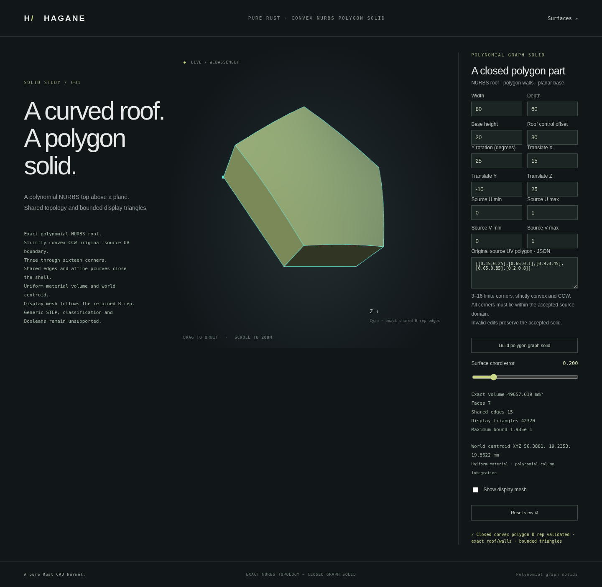

# Closed convex polygon graph solids



`NurbsGraphPolygonSolid` restricts an existing polynomial graph solid to a
strictly convex counterclockwise polygon in its original source UV coordinates.
It constructs a closed B-rep before display: two polygon-trimmed NURBS caps,
exact lifted boundary curves, vertical edges and ruled NURBS side walls.
No mesh Boolean, fitted roof or display-only cut is used.

```rust
use hagane::*;
let tol = Tolerance::default();
let source = NurbsGraphSolid::new([80., 60., 20.], 30., tol)?;
let part = NurbsGraphPolygonSolid::new(
    &source,
    vec![[0.1, 0.2], [0.8, 0.1], [0.9, 0.7], [0.3, 0.9]],
    tol,
)?;
part.validate(tol)?;
let mass = part.mass_properties(tol)?;
let display = part.tessellate_bounded(0.1, 65_536, tol)?;
# Ok::<(), hagane::Error>(())
```

## Supported geometry and validation

The source roof is `h(u,v) = H + 4*b*u*(1-u)*v*(1-v)`. Source rectangle
restriction and rigid placement are retained; polygon coordinates stay in the
original UV frame. The polygon has 3 through 16 corners, lies entirely within
the retained source domain, and has no openings. Clockwise, nonconvex,
duplicate, collinear, nonfinite and out-of-domain inputs are rejected.
Physical edge lengths and nonincident corner-to-edge-line clearances must
exceed `4*tolerance.linear + source_arithmetic_allowance`. Unresolved small
features fail explicitly; no snapping or automatic polygon repair occurs.
Affine pcurve evaluations must also remain inside the closed retained surface
domain in binary64. A corner exactly on a source limit can be conservatively
rejected if `start + (end-start)` rounds outside that limit (for example,
`0.3 + (0.9-0.3)` exceeds `0.9`). Such inputs return a domain error rather than
snapping the UV coordinate or returning a mismatched boundary. Interior
polygons avoid this particular boundary-roundoff limitation.
Each nonzero UV direction component must exceed
`128*f64::EPSILON*max(abs(domain endpoints), domain span)` on that axis for
stable affine spline composition. A numerically almost-horizontal or almost-vertical
edge can therefore be rejected even when its physical length is resolved.
Exact horizontal/vertical edges are supported; the kernel does not silently
round a small nonzero component to zero.

For n corners the body has 2n vertices, 3n shared edges and n+2 faces. Every
edge has exactly two opposite effective oriented face uses, with same-parameter
surface pcurves. Caps retain original UV coordinates; ruled walls use their
own edge parameter and height fraction. Lifted diagonal roof boundaries are
degree-four NURBS curves. Binary64 algebra can produce weights extremely close
to one; actual weights are retained in curves and walls rather than rounded.

Validation rebuilds the canonical certificate and compares actual controls,
knots, weights, vertices, references, pcurves and orientations exactly. Even
sub-tolerance public geometry edits invalidate the wrapper. Additional
edge/surface and endpoint checks enforce the engineering tolerance. Generic
`Solid` operations do not implicitly accept this new NURBS family.
`bounds()` returns the conservative source enclosure, not a tight polygon box.

## Mass and display

Volume and uniform-density world centroid integrate positive polygon fan
triangles directly from the polynomial roof, without mesh integration or
source-minus-cut cancellation. A Duffy square-to-triangle map and tensor
five-point Gauss quadrature integrate the required degree-eight height-square
moments exactly in real arithmetic. Normalized compensated sums avoid forming
large physical squared heights or translated world moments. Underflow,
overflow and unresolved intermediate scales remain errors.

Display samples actual retained B-rep faces. A common fan/wall subdivision
shares logical boundary nodes and bit-identical positions, while preserving
separate normals at face creases. The count is `4*n*N*N` triangles, with a
maximum budget of 65,536. Conservative bounds use `14*abs(b)/N²` plus the
source floating-point allowance, including retained near-unit weight
perturbations. Error bounds and precision guards are engineering checks,
not interval-arithmetic certification. Insufficient budgets return errors.

## Native and browser demo

```sh
cargo run --example nurbs_graph_polygon
scripts/build-web.sh
python3 -m http.server 8000 --directory web
```

Open `graph-polygon.html` in the browser. Edit the source dimensions, roof
offset, source UV limits, placement and CCW polygon. Rotation and zoom inspect
the accepted actual solid; rejected edits preserve it. Native and WASM use
the same Rust JSON entry point and safe bounded numeric transport.

This stage does not add concave polygons, polygon openings, arbitrary curved
Boolean tools, polygon graph STEP interchange, classification or inertia.
The separate [source-vertical oblique partition API](nurbs-graph-polygon-split.md)
now uses these boundaries to return two closed parts and a finite cut face.
General NURBS Boolean operations remain incomplete.
