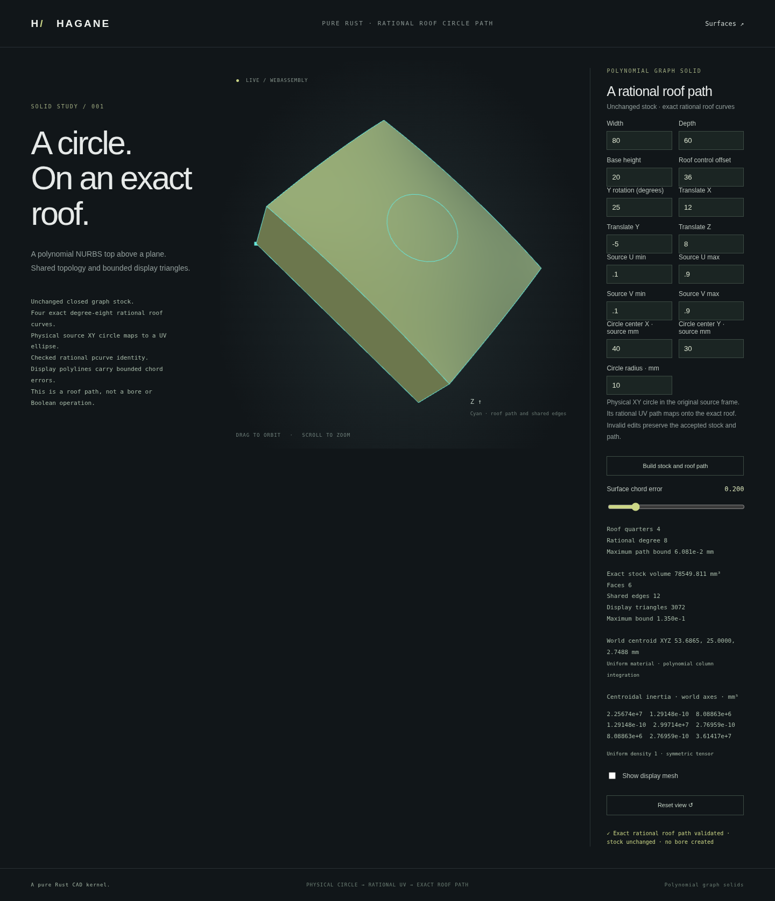

# Rational roof circle paths



Hagane can compose a rational UV curve with a rational NURBS surface and retain
the UV curve as a checked `PCurve::Nurbs`. The browser example displays four
composed quarters on the actual graph-stock roof. The stock remains a closed,
unchanged B-rep solid: this example creates a path, not a circular hole.

## Supported geometry

`NurbsSurface::parameter_curve_nurbs(&curve, tolerance)` accepts a single
clamped rational Bezier surface patch and a single clamped rational Bezier UV
curve. UV control points have zero Z and lie inside the surface domain; their
positive weights keep the curve in this control hull. For surface degrees
`p, q` and curve degree `d`, the output degree is `d * (p + q)`, limited to 16.
The output retains the curve's parameter interval. Multiple knot spans and
curves whose controls leave the patch are explicitly rejected.

The implementation substitutes homogeneous UV Bernstein polynomials into the
surface's tensor-product Bernstein basis. It uses the actual input weights
and produces actual output weights, without normalizing them to one. This is
exact real algebra implemented in binary64; conservative conditioning and
representability checks reject unresolved arithmetic. These engineering
checks are not interval certificates.

`PCurve::nurbs(curve)` checks planar UV controls, and `try_evaluate(t)` reports
nonfinite and out-of-domain input. The existing infallible `evaluate` remains
a compatibility convenience and returns NaN UV values on rational evaluation
errors. Analytic trim analysis, area calculations and operations that do not
support this new boundary type return explicit unsupported errors. This does
not enable general rational trimmed-face validation or STEP interchange.

## Native and browser example

```sh
cargo run --example nurbs_graph_rational_roof_circle
scripts/build-web.sh
python3 -m http.server 8000 --directory web
```

Open `graph-rational-roof-circle.html`. The numeric API and optional CLI JSON
argument contain exactly 16 finite values:

```text
[width, depth, height, bulge, display_error, angle,
 tx, ty, tz, u0, u1, v0, v1, center_x, center_y, radius]
```

```rust
let report = hagane::nurbs_graph_rational_roof_circle_demo_json(&[
    80., 60., 20., 30., 0.5, 0.,
    0., 0., 0., 0., 1., 0., 1., 40., 30., 12.,
])?;
```

Lengths use millimetres, the placement angle uses radians, and the center is
in the source's physical XY frame. A physical circle therefore uses UV radii
`radius / width` and `radius / depth`. Four degree-two rational UV quarters
compose into degree-eight roof curves, with shared cardinal endpoints and
the same parameter in the UV and world curves. The resulting denominator is
the UV quarter denominator raised to the fourth power on the unit-weight
quadratic graph patch. The composed weights vary even though the source roof
weights are one.

The radius and all four source-trim clearances must be resolved. Positive and
negative graph bulges, supported rectangular trims and rigid placements use
the existing checked graph constructor. Curve polylines use bounded NURBS
tessellation; they are display approximations of retained rational curves.
The stock mesh comes directly from the retained B-rep. Invalid inputs and
display-budget failures return errors and retain the accepted browser model.

The capture uses an 80 × 60 × 20 mm source with bulge 36, UV trim
`[0.1, 0.9]²`, a 25-degree Y rotation and translation `(12, -5, 8)` mm.
The source-XY circle is centered at `(40, 30)` mm with radius 10 mm.
At requested display error 0.2 mm, the path bound is approximately 0.06081 mm.
The unchanged stock has six faces, twelve shared edges and 3,072 display
triangles; its displayed volume is 78,549.811 mm³.

## Verification and remaining work

Tests compare composition against independently evaluated rational tensor
bases and the analytic graph and circle equations, including nonunit weights,
nonunit parameter domains, placement, small and large scales, raw-weight
scaling and rejected unsupported or ill-conditioned inputs. Native/WASM
parity and browser checks exercise the same retained curves.

At this milestone, all 735 native tests, formatting, strict all-target Clippy,
the WASM build, the complete WASM execution suite and the complete browser
regression suite passed. The new page also passed a focused browser run.

Closed circular-bore topology, circular cap trims, bounded display and mass
properties are implemented separately in the [circular graph bore](nurbs-graph-circular-hole.md).
The path demo still leaves its stock unchanged. General curved Boolean operations, rational
trimmed-solid classification and rational-pcurve STEP import/export remain
unsupported.

The implementation is original Rust under MIT OR Apache-2.0 and adds no
dependency. Mathematical provenance is recorded in [references](references.md).
