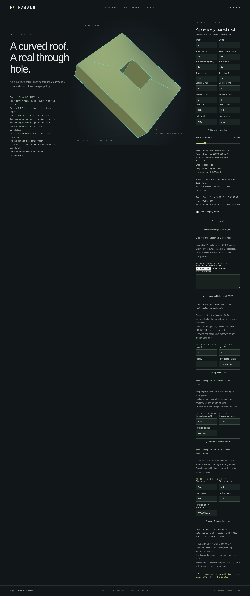

# Exact affine-UV roof sections



`NurbsGraphSolid::roof_section(start, end, tolerance)` and the corresponding
holed-solid method intersect the material roof with the finite vertical curtain
above an affine path in original source UV. The common `ImportedNurbsGraph`
API provides the same method. Results contain zero, one or two exact degree-four
polynomial NURBS curves, each with its retained affine roof pcurve and face index.

This extends roof intersection queries beyond isocurves. It does **not** create
a closed planar section, split a solid or implement a general curved Boolean.
No mesh is used to determine intersections or material intervals.

```rust
use hagane::*;
let tolerance = Tolerance::default();
let source = NurbsGraphSolid::new([80.0, 60.0, 20.0], 30.0, tolerance)?;
let part = NurbsGraphHoledSolid::new(
    &source, [[0.35, 0.65], [0.35, 0.65]], tolerance,
)?;
let query_tolerance = GeometryTolerance::new(1e-6, 1e-10, 0.0)?;
let section = part.roof_section([0.1, 0.2], [0.9, 0.8], query_tolerance)?;
section.validate(query_tolerance)?;
assert_eq!(section.spans.len(), 2);
for span in &section.spans {
    let [a, b] = span.parameter_range;
    let t = a + (b - a) / 2.0;
    let point = span.curve.evaluate(t)?;
    let uv = span.pcurve.evaluate(t);
    println!("Global t={t}; world point={point:?}; source UV={uv:?}");
}
# Ok::<(), hagane::Error>(())
```

## Exact geometry and shared parameters

The retained roof is `h(u,v) = H + 4b*u(1-u)*v(1-v)`. Substituting an affine
UV path gives a degree-four polynomial in path parameter `t`. Bernstein
polynomial products construct its five control points algebraically, not by
fitting samples. X and Y are the affine path elevated to degree four; all
weights are one. Rigid placement transforms those actual curve controls.

For a span `[a,b]`, the knot vector has five copies each of `a` and `b`.
The curve therefore retains the original path parameter, even after a hole
removes the middle of the path. Its pcurve is always
`UV(t) = start + (end-start)*t`. Reversing the path reverses geometric traversal
and corresponding global intervals. `face` is the actual retained roof index 1.
The refined holed cap retains this same original UV system.

A private certificate keeps the source body and original endpoints. `validate`
checks the actual source and every public span's degree, controls, weights,
knots, UV mapping, interval and face identity against the exact construction.
Changing public result metadata or substituting another curve is rejected.

## Supported domain and contacts

Both endpoints must lie within the retained outer source rectangle. Full and
restricted UV domains, signed/flat roofs, rigid placement and one rectangular
opening are supported. Paths wholly inside the opening return no material
roof curves. A transverse crossing returns two retained spans; starting inside
an opening can return one. Out-of-domain or nonfinite endpoints are rejected.

Collapsed/sub-tolerance paths, unresolved short material/void intervals,
inner-corner crossings/tangencies and near-hole endpoints return explicit
errors. Paths coincident with outer walls are unsupported. Constant-axis paths
coincident or too close to an inner wall are conservatively rejected, including
some paths whose finite extent misses that wall. No tolerance-based snapping,
fuzzy interval merging or fabricated success is used. Arithmetic conditioning
and UV parameter resolution are checked separately from physical length.
Relative length budgets use the identity local control enclosure; placement
roundoff remains a separate absolute precision prerequisite. A large relative
budget does not bypass validation of a far-translated source at the requested
absolute tolerance.

This is a finite source-UV roof query and returns curves only. The separate
[source-vertical oblique partition API](nurbs-graph-polygon-split.md) now returns
closed parts and a finite cut face for rectangular/convex graph stock.
Arbitrary rational shells, general world-plane intersections and holed-stock
oblique splitting remain unsupported.

## Native, WASM and browser

```sh
cargo run --quiet --locked --example nurbs_graph_roof_section
bash scripts/build-web.sh
```

Both graph browser pages offer an affine-UV roof query. Display polylines are
bounded tessellations of the returned exact curves; the JSON keeps the actual
basis, controls, knots, pcurve and original parameter ranges. Invalid queries
preserve accepted geometry, point classification and earlier section displays.

Independent tests densely compare every span with actual retained roof
surface evaluations, check global/reversed parameters and aperture exclusion,
and exercise placed/restricted signed roofs, contacts and certificate corruption.
Native and WASM use the same kernel and compare complete query reports.

The Bernstein product rule and polynomial pullback are public mathematics.
This independent MIT OR Apache-2.0 code adds no dependency and copies or
translates no OCCT source; see [references](references.md).
