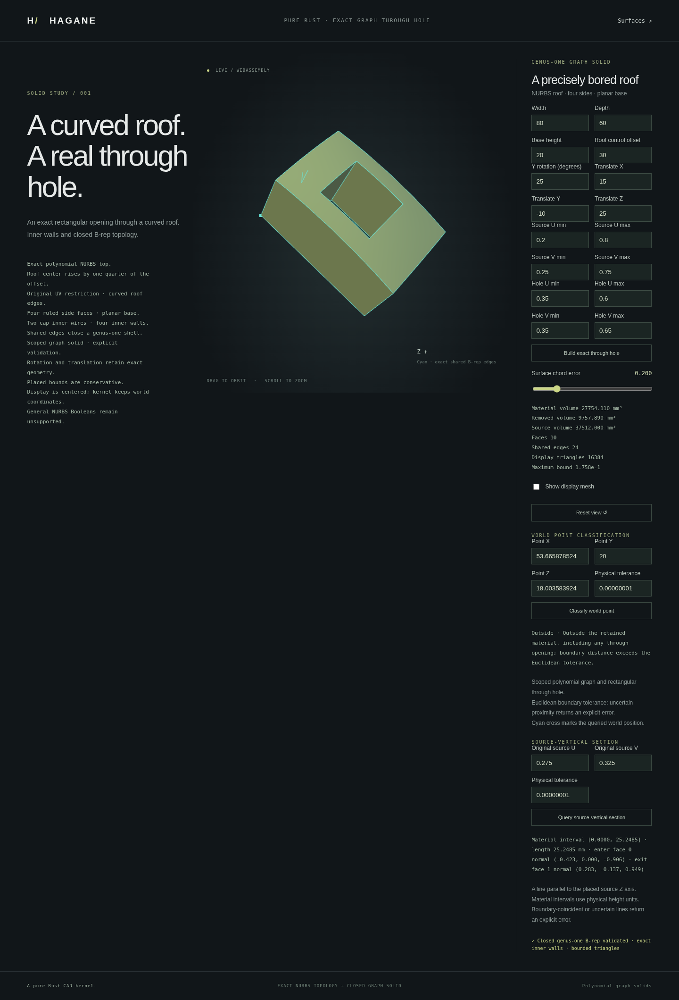

# Source-vertical sections of scoped NURBS graph solids



`NurbsGraphSolid::vertical_section` and
`NurbsGraphHoledSolid::vertical_section` intersect the retained material with
the infinite line at a specified original-source UV coordinate, parallel to
the source height axis. Restriction preserves source UV coordinates, and rigid
placement rotates and translates the line and its crossing events.

```rust
use hagane::*;
let source = NurbsGraphSolid::new(
    [80.0, 60.0, 20.0], 30.0, Tolerance::default(),
)?;
let part = NurbsGraphHoledSolid::new(
    &source, [[0.35, 0.65], [0.3, 0.7]], Tolerance::default(),
)?;
let material = part.vertical_section([0.1, 0.5], GeometryTolerance::default())?;
assert_eq!(material.intervals.len(), 1);
let opening = part.vertical_section([0.5, 0.5], GeometryTolerance::default())?;
assert!(opening.intervals.is_empty());
# Ok::<(), hagane::Error>(())
```

## Geometry and parameters

The result's world-space origin is the source's height-zero point at the
requested UV coordinate. Its direction is the placed unit positive height
axis. Each interval uses physical source height as its line parameter:
`point(t) = origin + direction * t`. A material line returns one interval
`[0, roof_height]`, two crossing events and one exact `Curve::Line` segment.
The segment's own parameter domain is `[0, 1]`, as for existing line curves;
it is distinct from the section's physical-height interval.

Events retain the actual cap face index, world-space point, outward normal and
entry/exit sense. Roof values are checked against the retained rational face;
normals use its actual partial derivatives. Empty source-exterior and opening
lines return no material intervals, crossing events or segments.

## Checked contact and scope

Every query validates the actual shared B-rep before returning a result.
Lines coincident with, or within the checked tolerance band of, an outer or
inner vertical wall return an explicit error. Horizontal distance to rectangle
segments includes Euclidean corner distance, rather than independent coordinate
snapping. Absolute and relative tolerance use local shape scale; world offset
and query distance affect precision checks separately.

Nonfinite coordinates, unresolvable world geometry, cap disagreement and
unresolved contact return errors. This is an independent analytic query for the
canonical graph-solid family. It does not implement arbitrary line directions,
general NURBS surface intersection or Boolean operations. Numerical checks use
binary64 engineering guards, not formal interval arithmetic.

## Run the demonstration

```sh
cargo run --locked --example nurbs_graph_section
bash scripts/build-web.sh
python3 -m http.server 8000 --directory web
```

Open `graph-solid.html` or `graph-hole.html` in the served directory. Enter
original-source U and V values in the source-vertical section controls. The
browser displays material length and actual crossing points and overlays the
retained line segment. Display chord error and section contact tolerance are
separate controls. Rejected queries preserve the accepted model.
