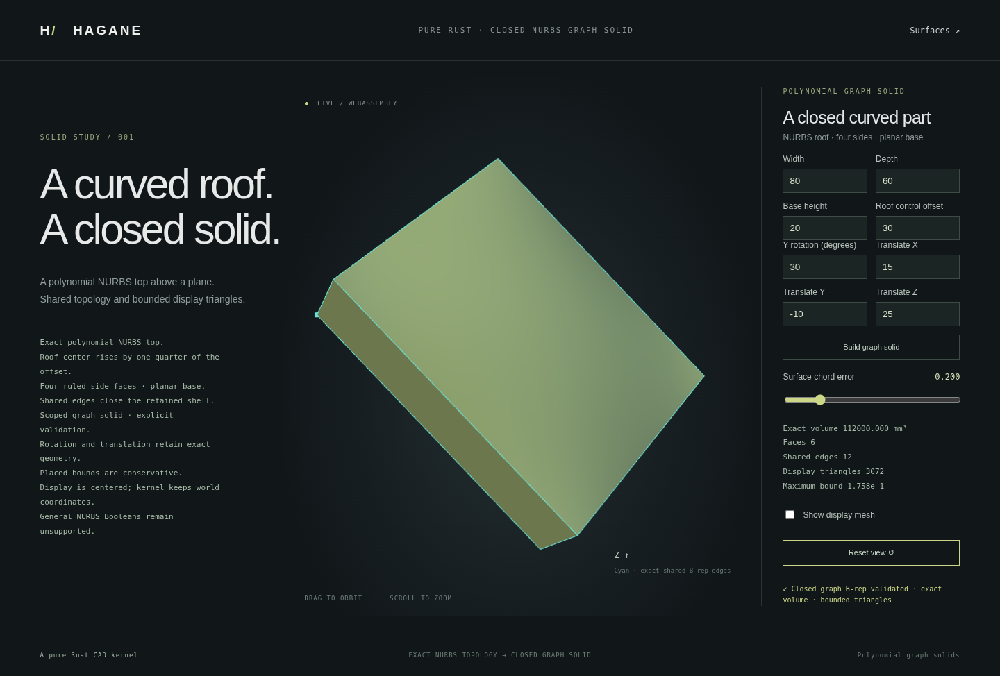

# Closed polynomial NURBS graph solids



This first closed NURBS solid domain has a planar base, four planar walls,
and an exact biquadratic polynomial roof. Every supporting surface and shared
edge is retained as NURBS geometry in the existing B-rep entities. It is an
independent implementation; no OCCT code or new dependency is used.

For positive dimensions `L`, `W`, `H` and roof control offset `b`, the roof is

```text
x = L u
y = W v
z = H + 4 b u(1-u) v(1-v),   0 <= u,v <= 1
volume = L W (H + b/9)
maximum z = H + max(b,0)/4
```

The center control point has height `H+b`; the actual roof center has height
`H+b/4`. The boundary height stays `H`, so the roof shares straight exact
edges with its walls. The conservative construction domain requires `H+b`
to remain resolved above the base, including for a negative bulge. Dimensions,
arithmetic conditioning and resource limits are checked explicitly.

The scoped `NurbsGraphSolid` API certifies its canonical construction. Its
retained `Solid` has eight vertices, twelve shared edges and six oriented
faces, with affine surface pcurves and opposite effective edge uses. This
does not enable arbitrary rational solids in generic `Solid` operations.
General sewing, Booleans, fillets and STEP interchange for
these NURBS solids remain unsupported.

[Rigid placement](nurbs-graph-placement.md) now translates and rotates this
scoped shape while preserving its exact geometry and oriented connections.

Display evaluates the retained surfaces on a common dyadic grid. Topological
node identities connect neighboring faces while their normals stay separate
at sharp joins. The graph Hessian supplies a conservative interpolation bound;
an engineering floating-point allowance is included. This is not formal
interval certification. Display triangles are never the solid's modeling
representation or its exact volume calculation.

Build the normal WASM target with `bash scripts/build-web.sh`, then start
`python3 -m http.server 8080 --directory web` and open `graph-solid.html`.
The demo edits dimensions, control bulge and chord error, and supports orbit,
zoom and mesh display. Rejected edits preserve the accepted model.

```rust
use hagane::{NurbsGraphSolid, Tolerance};

let tol = Tolerance::default();
let part = NurbsGraphSolid::new([80.0, 60.0, 20.0], 30.0, tol)?;
part.validate(tol)?;
let exact_volume = part.volume()?;
let display = part.tessellate_bounded(0.2, 65_536, tol)?;
# Ok::<(), hagane::Error>(())
```

`max_cells` is the total cell budget across all six faces, between 6 and
65,536. Every cell emits two triangles. Increasing accuracy beyond that
budget or below the coordinate allowance returns an explicit error. The
public retained B-rep can be inspected; modifying it invalidates the canonical
certificate unless it exactly matches the original construction. Volume,
bounds and display all revalidate before returning a result.

Run `cargo run --example nurbs_graph_solid` for the shared JSON demo or
`cargo run --example nurbs_graph_obj > graph.obj` for an actual display mesh
with separate face normals. Native tests independently check roof evaluation,
analytic volume and bounds, every shared edge's pcurves and opposing uses,
mesh closure and triangle interpolation bounds, signed bulges, tiny resolved
dimensions, corrupted geometry, invalid inputs and resource rejection.
