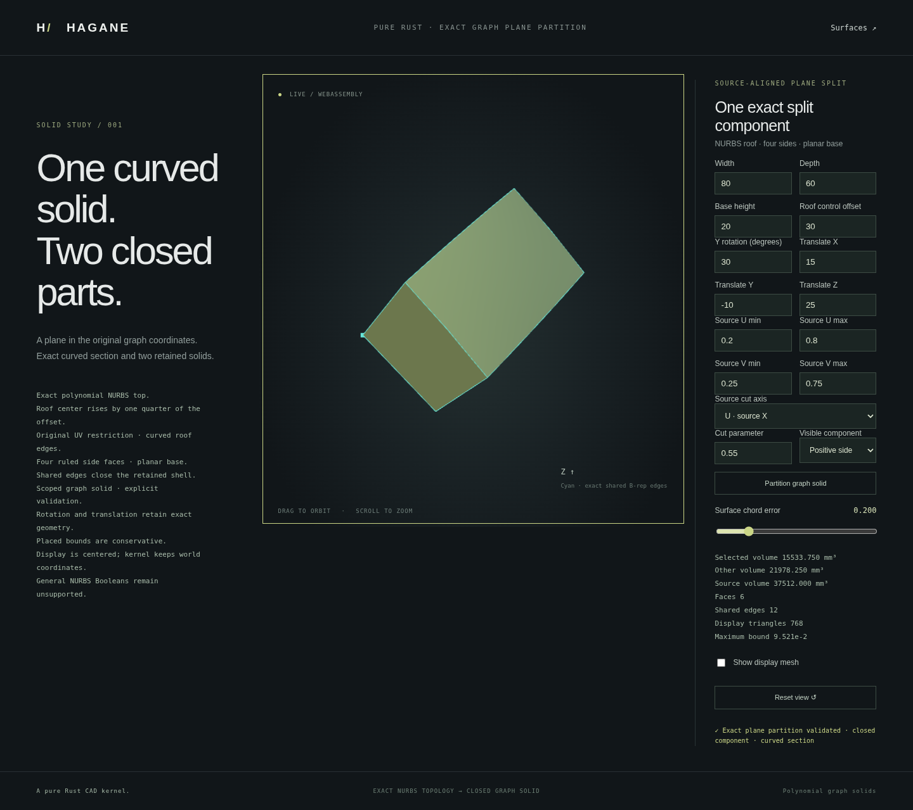

# Source-axis plane partition of closed NURBS graph solids



`NurbsGraphSolid::split_uv` partitions material into two closed solids using
a plane at an interior source U or V coordinate. The plane follows the solid's
rigid placement. This API supports only the graph family's source axes;
it does not accept arbitrary planes or arbitrary rational solids.

```rust
use hagane::{NurbsGraphSolid, Tolerance};

let tol = Tolerance::default();
let source = NurbsGraphSolid::new([80.0, 60.0, 20.0], 30.0, tol)?;
let split = source.split_uv(0, 0.37, tol)?;
split.validate(tol)?;
let left_display = split.negative.tessellate_bounded(0.2, 65_536, tol)?;
let right_display = split.positive.tessellate_bounded(0.2, 65_536, tol)?;
# Ok::<(), hagane::Error>(())
```

Axis `0` means U, axis `1` means V. Negative material has smaller source
coordinates; positive material has larger coordinates. Both children retain
the original graph parameters and placement. Their exact analytic volumes
sum to the source volume within a checked floating-point allowance.

`NurbsGraphPlaneSplit` additionally retains an exact `NurbsFace` section and
the placed cutting plane. Its section is oriented along the plane normal,
which is the solid's placed positive X or positive Y direction. The section
is geometrically planar but uses a ruled NURBS parameterization, with an
exact quadratic upper edge inherited from the roof. It is neither a sampled
polygon section nor a mesh clipping result. The two children's cut faces
have opposite outward orientations and matching source geometry.

Validation checks both closed child certificates, their source domains,
volume conservation, exact retained section and placed cutting plane.
Every actual cut-face control point must also lie within the cutting plane's
physical allowance, including a reserved world arithmetic budget. Matching
the two faces alone does not establish their agreement with the plane.
Public section, body or plane modifications are rejected. Boundary contact,
outside parameters, unresolved physical widths and invalid axes return
explicit errors; an unchanged input is not returned as a successful split.

Open `graph-split.html` after the normal WASM build to edit the original graph,
retained rectangle, placement, split axis and coordinate. Select either
actual closed result and inspect its volume and the exact section boundary.
Run `cargo run --example nurbs_graph_split` for the shared JSON generator.

Native and WASM regressions check both axes, trimmed and rotated sources,
signed roof offsets, section geometry and pcurves, opposite face normals,
volume conservation, closed meshes and rejected contacts. This is a useful
curved-solid partition prerequisite, while general curved Booleans, arbitrary
section planes, tolerant sewing and NURBS STEP interchange remain incomplete.
