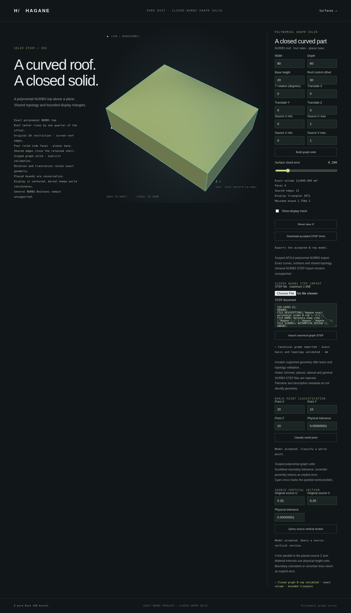

# Strict STEP import of full, unplaced NURBS graph solids



`import_step_nurbs_graph_mm` reads a bounded AP214 file into a
`NurbsGraphSolid`. Its initial supported domain is one full-source-UV,
unplaced polynomial graph solid with six NURBS faces, eight shared vertices
and twelve shared edges. The base starts at source origin zero; source axes
are positive world X/Y/Z and the UV domain is `[0, 1]` on both axes.
Positive, negative and zero roof control offsets are supported.

```rust
use hagane::*;
let tolerance = Tolerance::default();
let source = NurbsGraphSolid::new([80.0, 60.0, 20.0], 30.0, tolerance)?;
let step = source.export_step_mm(tolerance)?;
let imported = import_step_nurbs_graph_mm(&step, tolerance)?;
imported.validate(tolerance)?;
let display = imported.tessellate_bounded(0.2, 65_536, tolerance)?;
# Ok::<(), hagane::Error>(())
```

## No recipe or geometry substitution

The reader decodes actual `B_SPLINE_CURVE_WITH_KNOTS` and
`B_SPLINE_SURFACE_WITH_KNOTS` control nets and expanded knot multiplicities.
It follows shared `VERTEX_POINT`, `EDGE_CURVE`, oriented wire and face references,
and reads both affine `PCURVE` uses on each `SURFACE_CURVE`. Geometry is not
trusted from a filename, product name or stored construction recipe.

Dimensions and roof control offset are recovered from the full roof's control
net. The candidate's actual solid remains the parsed geometry and topology,
with reference indices mapped to canonical identities. Strict canonical
validation checks every retained basis, coordinate, UV map, orientation and
shared reference. There is no coordinate snapping, curve fitting, repair or
mesh reconstruction. Files outside this exact representation are rejected.
Entity identifiers and record ordering do not supply the shape's identity.

## Units, bounds and failures

Supported SI millimetre/metre units are converted to mm. UV coordinates and
knot parameters are not length-scaled. Caller tolerance remains in mm; file
uncertainty does not enlarge it. If conversion or parameter recovery cannot
reproduce the required canonical controls exactly, import returns an error.

The existing bounded Part 21 parser retains its input, entity and nesting
limits. A separate entity allowance supports this reader; the generic analytic
STEP reader continues to reject these spline solids. Invalid references,
inconsistent pcurves/orientation, malformed knots, nonfinite coordinates,
duplicate entities and unknown units return errors.

## Scope

Restricted, translated, rotated and holed graph solids can be exported through
the [graph STEP writer](nurbs-graph-step.md), but are not supported by this
initial importer. Non-unit rational weights, arbitrary parameter bases, general
NURBS shells, assemblies and other application protocols remain unsupported.
A rejected browser import preserves the accepted model.

## Run and verify

```sh
cargo run --quiet --locked --example nurbs_graph_step_roundtrip > full-graph.step
cargo run --quiet --locked --example nurbs_graph_step_import -- full-graph.step 0.2
bash scripts/build-web.sh
python3 -m http.server 8000 --directory web
```

Open `graph-solid.html` in the served directory. Paste the STEP text or select
a STEP file, then import it through the bounded Rust reader. Successful import
resets source limits to the full domain and placement to identity; dimensions
and roof control offset come from the verified geometry. Rejected input leaves
the accepted model and its queries available.

Native regression tests check exact controls/pcurves/re-export and display,
positive/negative/flat roofs, mm/metre conversion, entity renumbering and record
reordering. A separate test reverses shell face order and rotates every wire's
start before checking re-export and point classification. Corrupted geometry,
invalid references, unknown units, unsupported shapes and bounded-input errors
are tested. WASM compares full native display JSON and exercises invalid-byte
rejection and recovery. Browser import/export preserves accepted models on
failed loads.

The parser and recognition code are independent original MIT OR Apache-2.0
Rust, reusing Hagane's bounded Part 21 parser and public STEP entity definitions.
No new dependency or copied/translated OCCT source is used.
