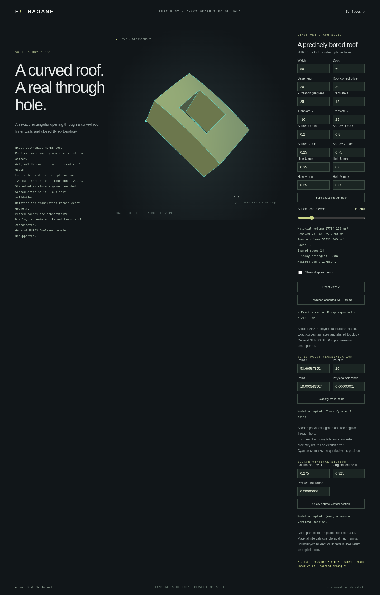

# Exact STEP export of scoped NURBS graph solids



`NurbsGraphSolid::export_step_mm` and
`NurbsGraphHoledSolid::export_step_mm` write one validated graph solid as an
AP214 ISO 10303-21 file. Restriction, rigid placement and one retained
rectangular through opening are supported. Units are explicitly millimetres;
native coordinates and the supplied linear tolerance are interpreted as mm.

```rust
use hagane::*;
let tolerance = Tolerance::default();
let source = NurbsGraphSolid::new([80.0, 60.0, 20.0], 30.0, tolerance)?;
let part = NurbsGraphHoledSolid::new(
    &source, [[0.35, 0.65], [0.3, 0.7]], tolerance,
)?;
std::fs::write("nurbs-part.step", part.export_step_mm(tolerance)?)?;
# Ok::<(), Box<dyn std::error::Error>>(())
```

## Retained geometry and topology

These canonical solids have unit-weight NURBS bases, so their exact polynomial
geometry is represented by `B_SPLINE_CURVE_WITH_KNOTS` and
`B_SPLINE_SURFACE_WITH_KNOTS`. The writer preserves actual control points,
degrees, distinct knot values and multiplicities. Source parameters are not
rescaled. Non-unit weights are explicitly rejected by this scoped writer;
there is no implicit loss of a rational denominator.

One `VERTEX_POINT` and one `EDGE_CURVE` are emitted for each shared topological
vertex and edge. Each edge references a `SURFACE_CURVE`, containing its actual
3D B-spline and both retained `PCURVE` uses. Affine UV maps are emitted as
parameter-space lines with their original direction magnitudes. Oriented
edge traversal, outer/inner face bounds and surface orientation remain
distinct. Roof/base inner wires survive as face holes, connected to the four
inward cavity walls. `CLOSED_SHELL` and `MANIFOLD_SOLID_BREP` represent the
validated solid; no display triangles appear in the file.

The writer validates the actual shared B-rep through its scoped canonical
wrapper before emitting any output. Deterministic native and WASM text uses
an empty header timestamp. Unsupported bases, corrupted topology and resource
limits return errors.
The scoped writer limits topology to 4,096 vertices, 4,096 edges and 512 faces,
the aggregate spline control count to 65,536, the entity count to 100,000 and
the exchange text to 32 MiB.

## Scope

This adds export for the graph-solid family. Existing generic
`export_step_mm(&Solid, ...)` remains restricted to its documented analytic
subset and rejects generic NURBS solids. General rational shells, arbitrary
NURBS trims, STEP import of restricted/placed/holed graphs, assemblies and rich product
metadata remain unsupported. This is a tested AP214 subset, not a claim of
general application-protocol conformance.

[Strict graph STEP import](nurbs-graph-step-import.md) now supports the full,
unplaced six-face subset of these files. Restricted, placed and holed graph
imports remain unsupported.

## Run and verify

```sh
cargo run --quiet --locked --example nurbs_graph_step_file > nurbs-part.step
bash scripts/build-web.sh
python3 -m http.server 8000 --directory web
```

The `graph-solid.html` and `graph-hole.html` pages download the accepted model.
Editing fields or rejecting a candidate does not silently export that candidate;
the button explicitly identifies the accepted model.

Native tests independently evaluate the serialized spline bases and check
reference resolution, oriented edge sharing and hole bounds. WASM regression
tests compare the full STEP text with native output. Optional external-reader
validation runs with an independently installed `occt-import-js` 0.0.23:

```sh
node scripts/validate-nurbs-step-external.mjs /tmp/hagane-step-validator/node_modules/occt-import-js
```

Four plain/holed, restricted/placed and positive/negative-offset documents are
read in mm and metre output units. Imported face counts, closed triangle
incidence, conservative enclosures, bounded approximate mesh volumes and
material/opening ray crossings are checked. The external reader returns
triangles; this does not claim its exact solid mass or a general validity proof.

## References and licenses

The writer is independent original MIT OR Apache-2.0 Rust code and adds no
dependency. Entity definitions follow the publicly described STEP geometry
and topology model in ISO 10303-42 and the Part 21 exchange encoding:

- STEP application protocols: <https://www.steptools.com/stds/step/>
- Published entity reference: <https://www.steptools.com/stds/stp_aim/html/>
- Existing analytic interchange and optional external-reader licensing:
  [STEP export](step-export.md).

No OCCT source is copied or translated. An optional external reader may be used
only for interoperability tests; it is not part of the Rust kernel or its WASM
binary. Its triangulated volume checks are approximate interoperability
evidence, separate from the kernel's analytic volume and serialized bases.
