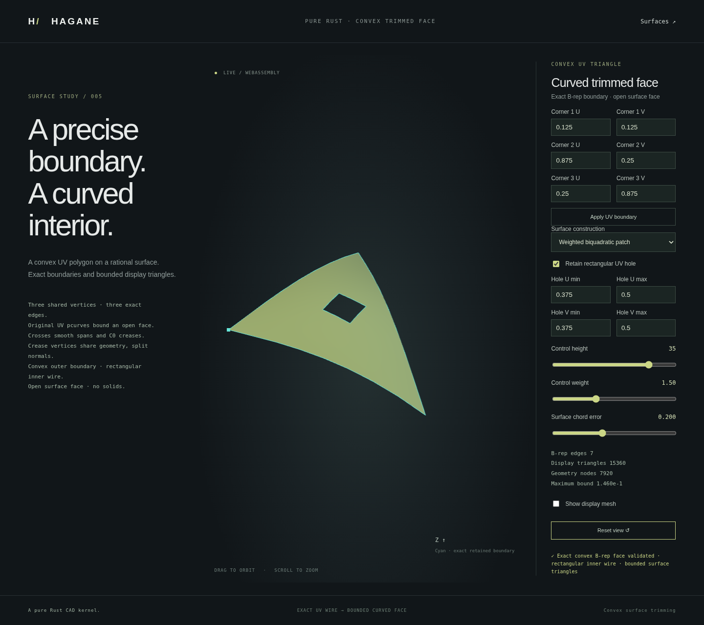

# Editable rational polygon face demo



`web/surface-polygon.html` edits a counterclockwise triangular UV boundary on an
actual retained NURBS polygon B-rep face. Controls select a weighted biquadratic
patch, the same patch with C1 U/V refinement, or a crossed C0 roof. Height, center
weight, chord error and all three UV corners are evaluated by the Rust kernel.
The WebGL display consumes the resulting bounded mesh and exact-edge-derived
boundary polylines; it performs no mesh Boolean or substitute CAD geometry.

```sh
./scripts/build-web.sh
python3 -m http.server 8000 --directory web
```

Open `surface-polygon.html` on the local server. Drag/arrow keys rotate, wheel
zooms, the mesh checkbox exposes triangles and reset restores the view. Invalid
edits show the actual kernel error while retaining the previous accepted mesh
and JSON. This page displays an open face, not a closed solid or volume operation.
The editor accepts three UV corners and one optional editable rectangular
opening. The native holed API supports 3–64 convex corners and up to 16 separated
rectangular holes. Concave/general trim loops remain unsupported. Display conditioning and work/triangle limits still apply.

The shared native example returns the same diagnostic JSON:

```sh
cargo run --example nurbs_polygon -- 35 1 0.5 2 0.125 0.125 0.875 0.25 0.25 0.875
```

Arguments are height, weight, error, mode (0 single, 1 C1, 2 C0), followed by six
corner coordinates. `hagane_generate_polygon` exposes those same ten arguments
through the existing WASM C ABI. Output includes original supporting geometry,
actual B-rep vertices/edges/pcurves, indexed display geometry, original UVs,
shared geometric nodes, explicit one-sided normal limits, per-triangle bounds
and boundary polylines. The renderer's centering affects only the display view.

Native/WASM tests compare complete JSON and independently evaluate original
fixture formulas and Cox–de Boor source bases. They verify triangle error bounds,
UV area, boundary curve/pcurve identity, C0 splitting and normal identities,
invalid inputs and recovery. Browser tests exercise all modes, editing,
rejected-edit preservation, recovery, orbit/zoom, responsive rendering and actual
WebGL output. The image above is captured from this implementation with
`node scripts/browser.mjs --capture-surface-polygon`.

See [Bezier polygon bounds](nurbs-polygon-bezier.md),
[C1 span bounds](nurbs-polygon-multispan.md) and
[C0 crease splitting](nurbs-polygon-crease.md) for supported conditions. Bounds
use engineering f64 reserves rather than formal interval certification. Sewing,
global regularity/injectivity, closed NURBS solids and NURBS STEP remain future
work. No new dependencies or OCCT source were added; original code is
MIT OR Apache-2.0.

[Rectangular inner wires](nurbs-polygon-holes.md) now expose the optional browser
opening through `hagane_generate_polygon_hole`; the final four arguments are
hole U min/max and V min/max. Native/WASM diagnostic JSON includes actual inner
wire pcurves, global references and hole material bounds.
