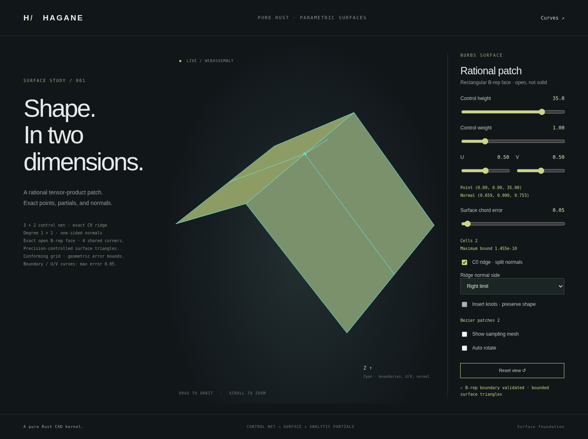

# Bounded NURBS faces with C0 creases

Bounded surface tessellation now supports C0 interior knot lines, including
piecewise rational planar ridges. Geometry remains continuous across a seam;
each side keeps its own analytic normal. The mesh records geometric connectivity
separately from the duplicated display vertices needed for crease shading.
This extends the existing rectangular open NURBS face and multi-span display,
without adding arbitrary trims, cross-face sewing or closed NURBS solids.

[Rectangular inner wires](nurbs-surface-hole.md) can now remove UV openings
while retaining the same crease-aware geometric nodes and one-sided normals.



## Geometric nodes and display vertices

`NurbsSurfaceMesh` adds three arrays, each with `mesh.positions.len()` entries:

| Field | Meaning |
| --- | --- |
| `vertex_uv` | Original surface parameter pair for each display vertex |
| `vertex_nodes` | Canonical UV-based geometric node ID for each display vertex |
| `normal_sides` | `[KnotSide;2]` limits used to evaluate that display normal |

At smooth/C1 grid points, neighboring cells use the same display vertex. At a
C0 seam, different side limits use different display vertices and normals, but
share the same geometric node and bit-identical position. At a crossing of U
and V creases, four side pairs can share one node. Triangle indices reference
display vertices; map them through `vertex_nodes` when inspecting geometric
edge connectivity. Internal grid edges then have two incidences and outer
edges have one, without T-junctions across knot spans.

Nodes are keyed by **UV, not XYZ**. Coincident positions at different parameters
remain distinct: a full circular surface's two parameter ends are not silently
welded. This does not perform periodic topology construction or general sewing.
Numerically equal signed-zero parameters are canonicalized to `+0.0` for
crease lookup, caches and `vertex_uv`; original `uv_ranges` retain their source
values. Mixed `-0.0/+0.0` knot spelling therefore cannot split one logical seam.

## One-sided normals

For a cell ending at an interior C0 knot, its upper endpoint uses the left
limit on that axis; a cell starting there uses the right limit. Smooth points,
nonknots and domain endpoints use the canonical right side key, with endpoint
evaluation retaining the existing inward-limit semantics. Both axes are handled
independently. Normals come from
`source.evaluate_with_partials(u,v,[side_u,side_v]).normal()`; they are never
averaged across a crease.

Each UV node's position is evaluated once with the original surface's continuous
position evaluator. Both normal-side display copies reuse that position, so
there is no numerical crack caused by independently evaluating left/right
positions. The Bernstein cell bounds, corner mismatch and conservative `f64`
guard remain unchanged. The bounds concern geometry, not shading-normal error;
side-specific normals do not change the bounded triangle approximation.

Ordinary `NurbsSurface::partials` and `normal` still reject a potentially C0
knot without explicit side selection. The new mesher resolves that ambiguity
from its owning cell. A smooth surface refined to nominal C0 multiplicity is
also accepted, retaining separate side keys even when its two normals agree.

A singular one-sided tangent plane is an explicit display error. Degenerate
triangles or inconsistent sampled orientation also fail; no invented normal or
partial mesh is returned. These local checks do not prove global regularity,
injectivity, nonfolding or manifoldness.

## Exact ridge demonstration

The fixture uses a degree-1-by-1, 3-by-2 rational control net. Its U rows are
`x=(-40,0,40)`, `z=(0,height,0)`, each with `y=(-30,30)`; the middle U row has
positive variable weight. U knots are `0,0,0.5,1,1`; V knots are `0,0,1,1`.
Changing the middle weight changes parameterization, while retaining the two
planar facets and their shared exact ridge.

At U=0.5, the analytic normal limits are normalized vectors
`(-height/40,0,1)` and `(height/40,0,1)`. The selected normal marker can show
one limit, while the mesh always retains both side normals. This is an actual
retained `NurbsFace` with exact rational surface, boundary curves, shared corner
vertices and same-parameter coedges, not a mesh Boolean or visual crease trick.

```sh
cargo run --locked --example nurbs_surface_crease
cargo run --locked --example nurbs_surface_crease -- 35 1 0.5 0.5 0.05 0
cargo run --locked --example nurbs_surface_crease -- 35 1 0.5 0.5 0.05 1
./scripts/build-web.sh
python3 -m http.server 8000 --directory web
```

The six arguments are height, weight, U, V, display error and selected U side
(0=left, 1=right). The WASM entry point is
`hagane_generate_surface_crease(height,weight,u,v,error,side)`. On **Surfaces**,
select **C0 ridge · split normals**, then choose **Left limit** or **Right limit**.
The source control count, degree, patch count and requested/achieved display
bounds are shown. The smooth single-span and optional C1 refinement paths remain
available when ridge mode is disabled.

Existing error, cell/depth/control-work and precision limits remain; successful
ridge display does not guarantee every fixture/error combination fits the demo's
budget. The old uniform `sample_grid` still rejects C0 knot lines and retains
its uncertified compatibility behavior.

## Verification and next work

Tests independently verify ridge normal formulas, weighted rational facet bounds,
four-way crease crossings, bit-identical duplicate positions, logical edge
incidence, nominal C0 smooth refinements, singular side rejection, distinct-UV
coincident geometry and mixed signed-zero seam connectivity. Existing C1 shared
vertex and geometric distance checks remain.

General trimmed faces, cross-face sharing, seam-aware sewing, periodic topology,
global regularity diagnostics, closed rational solids, intersections and STEP
remain future work. See [surface bounds](nurbs-surface-tessellation.md),
[patch extraction](nurbs-surface-extraction.md) and [references](references.md).
