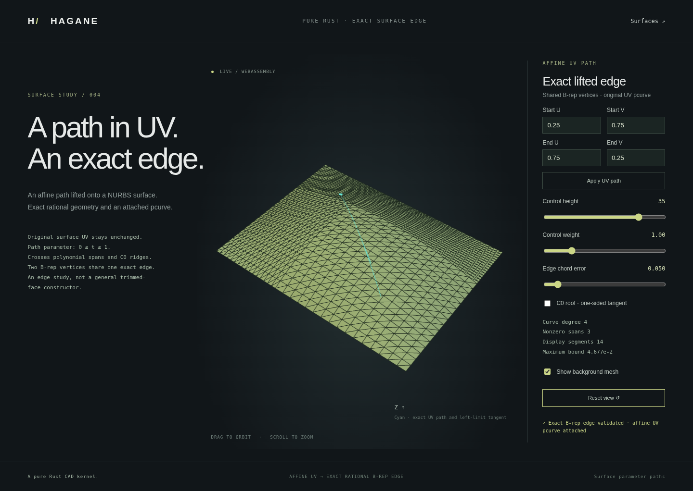

# Exact straight UV paths on rational surfaces

`NurbsSurface::parameter_curve(start,end)` constructs a rational 3D curve on
the surface's straight UV path. The curve parameter is T=0..1 and the exact
same-parameter map is `uv(T) = start + T*(end-start)`. This allows diagonal
paths, rather than only constant-U or constant-V sections.

`NurbsSurfaceEdge` retains that surface, one exact `Edge`, two endpoint `Vertex`
objects and an affine `PCurve`. The 3D curve, UV map and boundary references are
available independently of their display polyline. This is an open edge on a
supporting surface; it does not construct an arbitrary trimmed face or a solid.



## Mathematical construction

For a tensor rational surface `S(u,v)=X(u,v)/W(u,v)`, compose both homogeneous
coordinates with the affine UV path. On a Bezier rectangle, substituting affine
U and V in tensor Bernstein basis functions gives a univariate Bernstein curve
of degree at most `degree_u + degree_v`. Products of Bernstein polynomials use
their binomial coefficient identity. Positive surface weights and path points
inside the rectangle give positive resulting denominator coefficients.

The path is split at source knot crossings. Each segment retains its original
T range and is composed on its exact rational patch. The result preserves
piecewise curve geometry through knot boundaries; no curve fitting or sampled
point interpolation is used. Endpoint traversal can run in either direction.
Source and returned curve controls use checked `f64` arithmetic, not symbolic
or formally certified interval arithmetic.

## Supported domain and failure policy

Endpoints must be finite and inside the surface domain, and must define a
resolved nonzero UV segment. Surface parameters retain their own original units;
curve T is dimensionless. Positive-weight clamped surface axes remain required.
Constant axes contract to degree zero, so an isoparametric path only needs the
varying axis degree. The composed degree must fit the current curve API's
degree-16 limit. Higher
combined degrees return an explicit unsupported error rather than a fitted
lower-degree approximation.

Knot crossings must be numerically resolvable. Exactly simultaneous crossings
share one break; distinct but unresolved crossings fail rather than being merged
into a different path. Refinement, patch extraction, composition and output
controls have resource limits. Exhaustion or unusable numerical conditioning
returns an error, never a partial successful curve.

Each varying UV direction must exceed
`128*EPSILON*max(abs(domain_min),abs(domain_max),domain_span,MIN_POSITIVE)`.
Knot-crossing T separation must exceed `128*EPSILON`, except a true simultaneous
U/V crossing established with the exact orientation predicate. At most 4,096
pieces and 65,536 output controls are supported. Estimated composition work
`pieces*(p+1)*(q+1)*(p+q+2)` is limited to 16,000,000, alongside the full-source
Bezier extraction limits. Homogeneous underflow, nonfinite arithmetic and
unresolved shared endpoints also fail explicitly.

Boundary validation checks canonical rational geometry and affine UV identity,
endpoint references, vertex-to-curve agreement and source consistency under the
supplied physical-length tolerance. Ordinary derivatives at nominal C0 curve
knots require side selection. For one-sided chain-rule comparisons, the source
axis side follows the sign of the corresponding path component; reversal also
reverses this side choice.

The B-rep wrapper additionally checks UV arithmetic's physical effect against
the requested linear tolerance. A well-resolved UV direction alone does not
ensure same-parameter agreement when its origin is very large. The guard uses
a conservative global rational partial bound from degree, control diameter,
weight ratio and minimum positive knot span. Constant axes contribute no affine
direction rounding. This engineering guard can reject mathematically valid
but poorly conditioned paths; it is not a formal interval proof of evaluation.
For a varying axis it multiplies
`16*EPSILON*max(abs(start),abs(end),abs(delta),MIN_POSITIVE)` by
`2*axis_degree*control_bbox_diameter*(max_weight/min_weight)/min_positive_knot_span`.
The sum across axes must not exceed the supplied linear tolerance and must be
finite. Both construction and validation enforce it; actual affine endpoint
evaluations must also agree with the source and stored vertices.
It also reserves a source-coordinate/weight arithmetic allowance
`4096*EPSILON*max(world_control_scale,MIN_POSITIVE)*(max_weight/min_weight)*(p+q+2)`.
This covers the engineering numerical budget for source/composition evaluation
even when UV units are well resolved but world coordinates are very large.
Validation reserves both allowances from canonical-control matching: maximum
control-point deviation plus the total allowance must stay within the linear
tolerance. They cannot independently consume the complete tolerance. These
guards remain engineering policies rather than formal interval certification.

This does not perform point inversion, surface/curve intersection, general
trim-loop validation, closed NURBS solids or STEP interchange. The supporting
surface may have global folds or singularities; retaining an edge does not
certify surface regularity or injectivity.

## API and display

```rust
let curve = surface.parameter_curve([0.1, 0.2], [0.9, 0.8])?;
let edge = hagane::NurbsSurfaceEdge::new(
    surface, [0.1, 0.2], [0.9, 0.8], tolerance,
)?;
edge.validate(tolerance)?;
let polyline = edge.tessellate_bounded(0.05, 16_384, tolerance)?;
```

The polyline uses the existing rational curve chord-error bounds. They concern
the retained 3D rational curve, with engineering floating-point allowances;
they are not a separate formal bound on composition rounding relative to the
original surface evaluator. Source/curve comparisons independently check the
expected numerical agreement.

```sh
cargo run --locked --example nurbs_surface_edge
./scripts/build-web.sh
python3 -m http.server 8000 --directory web
```

Open `surface-edge.html`, choose start/end UVs and apply the path. Smooth
multi-span and C0 roof fixtures retain an actual rational background face and
the selected exact B-rep edge. The background uses its own bounded surface
display; the edge polyline has a separate requested error. Rejected paths
preserve the previous accepted display.

CLI/WASM arguments are height, weight, start U, start V, end U, end V, edge error
and fixture (0=smooth, 1=roof). The WASM export is
`hagane_generate_surface_edge(height,weight,u0,v0,u1,v1,error,crease)`.

Tests compare independent rational/polynomial evaluations, source chain-rule
derivatives, reversed paths, original nonunit domains, C0 crossings, shared
endpoints, pcurve identity, dirty topology, chord bounds and explicit invalid/
resource failures. Native/WASM and browser checks exercise actual path editing,
fixture switching, rejection and recovery.
