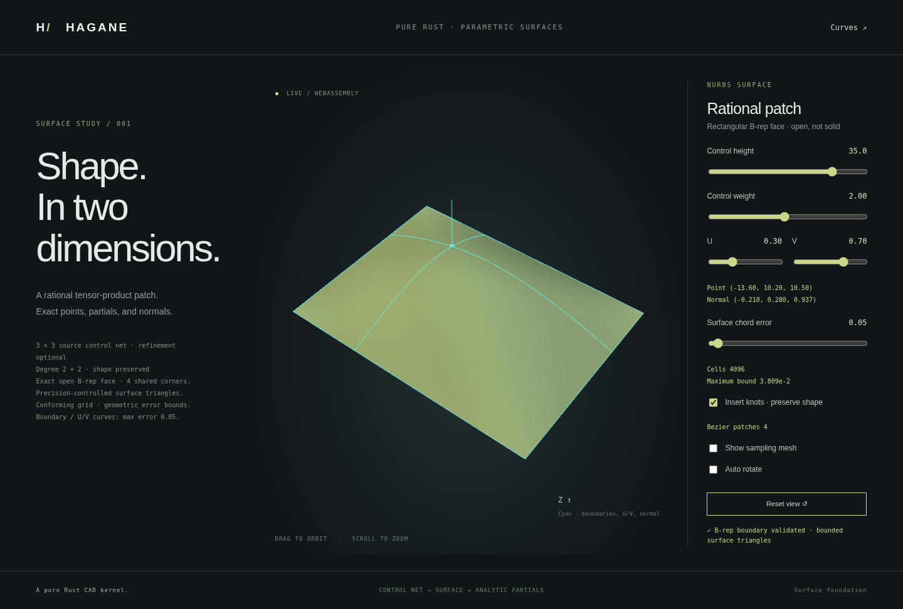

# Rational Bezier extraction and multi-span surface display

`NurbsSurface::bezier_patches()` now extracts exact rational Bezier patches
from a clamped positive-weight tensor-product surface, retaining each patch's
original parameter rectangle. Bounded surface display accepts C1 and
[C0 multi-span surfaces](nurbs-surface-crease.md), with one conforming geometric
grid across extracted patches and separate one-sided crease shading normals.



## Exact extraction

```rust
let refined = surface.insert_knot(0, 0.35, 1)?.insert_knot(1, 0.7, 1)?;
let patches = refined.bezier_patches()?;
let bounded = refined.tessellate_bounded(0.05, 16_384)?;
```

The example assumes degree at least two on both axes and the inserted parameters
inside their domains. It refines the rational representation without changing
the mathematical surface. Extraction raises each interior knot's multiplicity
to its axis degree, using the existing whole-net homogeneous insertion method.
All rows retain a common weight scale; row normalization cannot change relative
surface influence. Already-full multiplicities are skipped without cloning a
new refined surface for each knot.

Each `RationalBezierPatch` has `surface: NurbsSurface` and
`parameter_ranges: [[f64;2];2]`. Its surface has `degree+1` controls per axis and
endpoint-only clamped knots matching those ranges. Control coefficients and
positive weights define the exact mathematical restriction to that rectangle;
computed coefficients remain subject to `f64` rounding. Non-unit domains and
nonuniform interior knots retain their actual parameter values.

The patch wrapper's fields are public. A caller can replace `surface` or edit
`parameter_ranges`, making those duplicate domain descriptions disagree.
Extraction returns consistent data; arbitrary edited metadata is **not** a
validated patch object. Use the contained surface's checked domain/evaluation
APIs rather than assuming public metadata remains consistent after mutation.

C0 knot lines are extracted into separate valid patches. Their endpoint partials
select each patch's inward limit; use explicit corresponding sides when comparing
them with the original surface. Extraction does not sew patches or establish
surface regularity, injectivity or a closed manifold.

## Resource preflight

Before refining or allocating patch control nets, extraction checks:

- Final refined rectangular control grid: at most 65,536 controls.
- Number of resulting patches: at most 65,536.
- Cumulative estimated refinement work:
  `sum(updated_total_controls * insertion_times * (axis_degree + 1))`
  must not exceed 16,000,000.

All limits fail with explicit errors. The existing source degrees 1..16,
clamped axes, positive weights and finite parameter-domain contracts remain.
Degree-one or already-full-multiplicity axes do not perform unnecessary insertion.

## Multi-span bounded mesh and crease normals

The [Bernstein surface bounds](nurbs-surface-tessellation.md) are unchanged:
`maximum_norm(X-W*B coefficients)/minimum_weight`, plus the bilinear corner
twist divided by four, original-evaluator corner mismatch and a conservative
arithmetic allowance. Extraction is an additional floating-point operation
covered by the engineering numerical guard; this is not formal outward-rounded
interval arithmetic certification.

Each extracted patch starts as one cell. If any cell fails its requested bound,
**all** cells on the current level split into four. Every original U/V knot
interval uses the same dyadic level, giving a full tensor grid even when intervals
have different lengths. Shared original UV coordinates use one mesh vertex index.
Subdivision uses the actual rounded parameter-midpoint fraction, preserving
parameter/geometry correspondence at large parameter origins.

Positions and normals are evaluated from the **original source surface**, not
independently from adjacent extracted patches. At C1 seams this gives unambiguous
analytic first partials and avoids duplicated seam vertices or mismatched normals.
The face wrapper validates its retained boundary and applies face orientation.
This conformity applies within one rectangular face; adjacent separate faces
are not coordinated or stitched.

The original U-span count times V-span count is checked against `max_cells`
before extraction. The existing cell limit, eight dyadic levels, control-work
limit, precision guard and sampled normal/orientation errors still apply. A
multi-span source may exhaust those resources earlier than a single-span source.

Interior knots of multiplicity equal to degree are now supported with
[explicit one-sided display normals](nurbs-surface-crease.md). Smooth sources
represented with nominal C0 knots are accepted too. Ordinary source partials
and normals at those knots still require explicit sides; the mesher chooses
the owning cell's inward side. Degree-one multi-span sources are supported.

## Native and browser demo

```sh
cargo run --locked --example nurbs_surface_multispan
cargo run --locked --example nurbs_surface_multispan -- 35 1 0.5 0.5 0.05
./scripts/build-web.sh
python3 -m http.server 8000 --directory web
```

On **Surfaces**, select **Insert knots · preserve shape**. Rust changes the
source from a 3-by-3 net to a 4-by-4 net by inserting U=0.35 and V=0.7, then
retains that actual multi-span surface in `NurbsFace`. The page reports four
Bezier patches and renders the bounded mesh from the refined source. Selected
analytic points/normals and exact geometry are preserved while display cell
layout follows the new knot spans.

The new fixture is `nurbs_surface_multispan_demo_json` and the WASM entry point
is `hagane_generate_surface_multispan(height,weight,u,v,error)`. The earlier
`nurbs_surface_bounded` CLI/WASM path remains available for the single-span
fixture. The default refined fixture emits 4,096 cells and 8,192 triangles with
maximum bound approximately 0.01547656 for requested error 0.05. Its JSON includes
source control counts, patch ranges, original cell rectangles and cell bounds.
The older uniform `sample_grid`/`hagane_generate_surface` remain uncertified
compatibility paths.

The demo fixes its cell budget at 16,384; not every slider combination can meet
every requested error within that budget. For example, refined height 60, weight
4 and error 0.02 explicitly exceed it; error 0.1 succeeds for that fixture. The
core API independently allows up to 65,536 cells. A rejected browser candidate
keeps the previously accepted mesh visible and reports the error; increasing
the requested error allows recovery. It does not replace the previous result
with a partial mesh or silently relax the requested precision.

Tests cover nonuniform parameter tiling, exact patch/partial invariance, positive
weights, C0 one-sided extraction, degree 16, common weight scaling, tiny dimensions,
control/work preflight and degree-one no-op refinement. Dense independent
same-parameter and geometric triangle-distance checks verify rational
multi-span display, shared seams, original normals and resource errors.
[Crease tests](nurbs-surface-crease.md) separately verify C0 side and node metadata.

## Remaining work

Arbitrary trim loops, adaptive locally balanced grids,
cross-face shared boundaries, regularity diagnostics, sewing, closed NURBS solids,
intersections and STEP interchange remain future work. A conforming grid and
geometric distance bound do not establish global injectivity or manifoldness.
