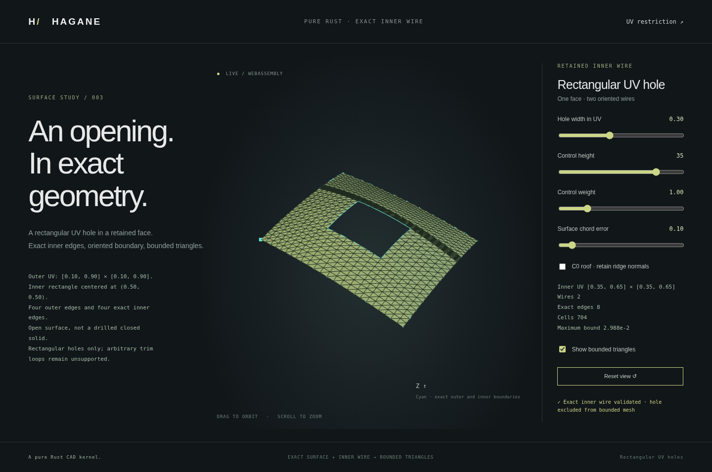

# Exact rectangular UV openings in NURBS faces

`NurbsHoledFace` retains a rational surface with one rectangular outer wire
and separated rectangular inner wires. Each boundary is an exact rational
isocurve, with shared corner vertices and affine same-parameter UV curves.
Outer traversal is counterclockwise in UV; inner traversal is clockwise.
Face orientation remains separate from this boundary convention.



This is an open trimmed B-rep face, not a solid or a cylindrical subtraction.
The existing exact solid box/bore workflow remains separate. Curved trim loops,
arbitrary polygons, intersecting holes, cross-face sewing, global injectivity,
closed NURBS solids and NURBS STEP interchange remain unsupported.

## Representation and construction

```rust
let face = hagane::NurbsHoledFace::new(
    surface,
    [[0.1, 0.9], [0.1, 0.9]],
    vec![[[0.35, 0.65], [0.35, 0.65]]],
    1,
    tolerance,
)?;
face.validate_boundary(tolerance)?;
let display = face.tessellate_bounded(0.1, 16_384, tolerance)?;
```

Construction restricts the source to the outer rectangle, then refines the
retained rational geometry at every hole coordinate using homogeneous knot
insertion. The hole wires exist in the retained `Face` before tessellation.
Edges retain rational control points, weights, original parameter domains and
pcurves; they are not display polylines. Like existing refinement, mathematical
shape preservation uses checked `f64` arithmetic with rounding.

The source and returned fields can be inspected independently of display.
Boundary validation checks canonical edge geometry, sharing, traversal and UV
maps against the retained surface and stored rectangle definitions. Modified
public topology must pass validation before display. This structural validation
does not certify global regularity or the absence of folded geometry.

## Supported inputs and numerical policy

Outer bounds must lie inside the source domain. Holes must be strictly inside
the outer rectangle, have positive finite widths and remain separated from
other holes. Touching or overlapping rectangles fail explicitly. Parameter
clearance is checked with a separate UV arithmetic allowance, since surface
parameter units need not equal physical length units. The supplied linear
tolerance is for three-dimensional boundary/vertex consistency.
On each axis the parameter allowance is
`128 * f64::EPSILON * max(abs(outer_min), abs(outer_max), outer_span, f64::MIN_POSITIVE)`.
Hole widths and outer clearance must exceed it. A pair must have separation
exceeding the allowance on at least one axis. This is an engineering numerical
policy, not a conversion from physical length tolerance or an interval proof.

Hole count, refined controls, insertion work and retained display grid are bounded.
Resource exhaustion returns an error, never a partial successful mesh. A small
remaining visible region does not bypass source refinement or extraction limits.
At most 16 holes, 65,536 refined controls and 16,000,000 cumulative estimated
hole-knot insertion work units are supported, in addition to the existing outer
restriction and bounded mesher limits. The mesher's `max_cells` budget counts
retained cells; source refinement and Bezier extraction still have their full
control/work limits.
An empty hole list is also valid and retains a single rectangular outer wire.

## Boundary-conforming display

The bounded tensor mesher uses the refined source so every hole coordinate is
a knot line. Its conforming grid therefore places each cell wholly inside or
outside the removed rectangles. Whole cells in hole interiors are excluded
before computing approximation bounds, subdividing or evaluating normals;
no triangle crosses an inner boundary. This is display generation from exact
retained trim wires, not a mesh Boolean used as the modeling representation.

The output retains original UV ranges, per-cell Bernstein geometric bounds,
analytic normals and UV geometric node IDs. Unused vertices are removed. C0
creases retain distinct one-sided shading normals while sharing positions and
logical geometric nodes. Mapping triangle vertices through `vertex_nodes`
reveals internal edges with two incidences and outer/inner boundary edges with
one. Different UV locations are not welded solely by coincident XYZ.

Bounds apply to the retained rational surface over the retained cells, with
the existing engineering floating-point guard rather than interval arithmetic
certification. Excluded regions are not claimed to be approximated. Full-source
precision/refinement checks still concern the retained source net, including
control points that influence removed regions. A singular tangent plane strictly
inside an opening does not fail display merely because the underlying untrimmed
surface is singular there. A singularity on a retained sampled point or boundary
still returns an error. Local normal checks do not establish global injectivity.

## Native and browser demo

```sh
cargo run --locked --example nurbs_surface_hole
./scripts/build-web.sh
python3 -m http.server 8000 --directory web
```

Open `surface-hole.html` to edit the width of a central square UV opening,
height, positive rational weight and display error. Smooth and C0 roof fixtures
use outer UV bounds 0.1..0.9 on both axes. The actual retained boundary is shown
alongside the bounded triangles. Rejected edits preserve the accepted display.

The **Singular center · excluded by hole** fixture now exercises
[material-only evaluation](nurbs-surface-material.md): its underlying surface has
an unusable tangent plane at UV=(0.5,0.5), strictly inside the removed opening.
Only the retained region is sampled for display; the source remains unchanged.

CLI/WASM arguments are height, weight, display error, UV hole width and fixture
(0=smooth, 1=roof). The export is
`hagane_generate_surface_hole(height,weight,error,hole_width,crease)`.

Tests check exact inner/outer pcurves and traversal, shared corners, native/WASM
geometry parity, hole-free parameter coverage, logical edge incidence, dense
rational error comparisons, reversed orientation and explicit invalid-input
and resource failures. Browser checks exercise editing, rejection and recovery.
