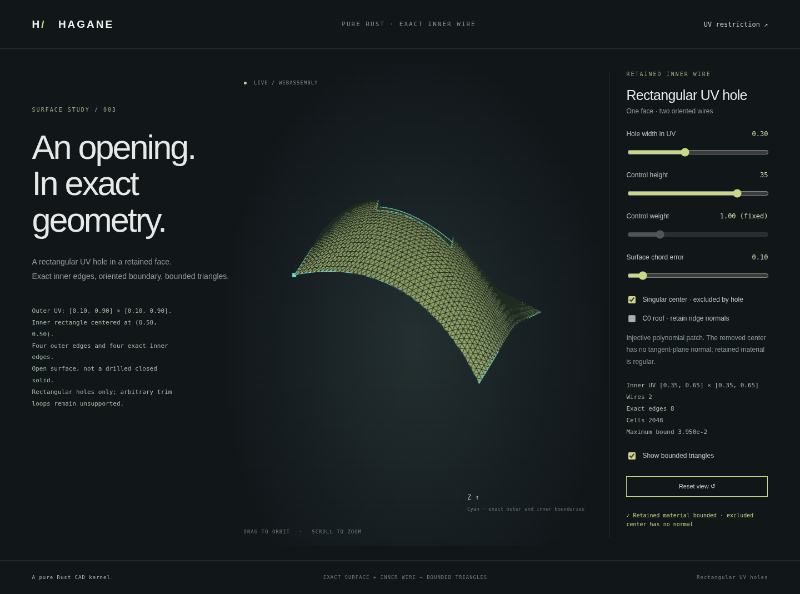

# Evaluate only the retained NURBS face domain

An exact trimmed face can exclude a singular point of its supporting surface.
Previously, holed-face display tessellated the complete source and removed hole
cells afterward. A singular tangent plane or excessive subdivision inside a
removed region could therefore reject otherwise usable retained face display.

The mesher now classifies exact knot-span rectangles against the retained inner
wires **before** evaluating bounds, subdividing or sampling normals. Excluded
cells do not produce positions, normals or triangles. The B-rep surface and
exact rational trim boundaries remain the modeling representation.



## Retained-cell budgets and guarantees

`NurbsHoledFace::tessellate_bounded(error,max_cells,tolerance)` counts retained
cells for its display budget. It uses the same global dyadic depth on all retained
span rectangles, preserving conformity and shared UV geometric nodes at seams.
Hole coordinates are full-multiplicity source knot lines, so every initial span
is entirely retained or removed. A straddling cell is an explicit topology error.
Original UV ranges, per-cell error bounds and C0 normal-side metadata remain.

Source restriction, homogeneous knot insertion and Bezier extraction still
have their full-net control/work limits. The engineering coordinate/weight
allowance also uses the complete retained source net; large controls or extreme
weight ratios in removed regions can still cause a precision failure. This is
not fully local conditioning analysis. Excluded points are not claimed to be
approximated or repaired. The standalone untrimmed surface mesher retains its
existing complete-domain behavior.

Retained sampled singularities, unusable triangles, unresolved display error
and exhausted retained-cell budgets still fail explicitly. These sampled checks
do not prove global regularity, injectivity or absence of unsampled singularities.
Bounds use the existing Bernstein inequalities plus a conservative `f64` guard,
not formal interval arithmetic certification. Nonrectangular trims, sewing,
closed NURBS solids and general curved Booleans remain unsupported.

## Reproducible singular-source fixture

The mathematical polynomial fixture uses a degree-2-by-3 NURBS representation
with unit weights, original UV domain 0..1, and formulas

```text
x = 80*u - 40
y = 120*((v-0.5)^3 + (u-0.5)^2*(v-0.5))
z = height * 4*u*(1-u) * 4*v*(1-v)
```

Control construction and refinement use `f64`. Y controls are algebraically
simplified to integer coefficients to avoid a spurious center derivative;
nonbinary Z coefficients such as 4/3 still have rounding error. The retained
rational controls define the implemented geometry, and comparisons with these
ideal formulas use explicit numerical allowances.

The derivative `dy/dv = 120*(3*(v-0.5)^2+(u-0.5)^2)` is positive away from
the center. Together with `dx/du=80`, it gives a usable tangent plane everywhere
except UV=(0.5,0.5), where `dv` is zero. The demo checks that the original
surface's center normal fails; it does not invent a replacement normal.
The retained outer rectangle is 0.1..0.9 on both axes, with a central square
opening. Its exact inner wire removes this point before display evaluation.

```sh
cargo run --locked --example nurbs_surface_singular_hole
./scripts/build-web.sh
python3 -m http.server 8000 --directory web
```

Open `surface-hole.html` and select **Singular center · excluded by hole**. Height,
opening width and display error remain editable; this polynomial fixture uses
unit weights. The CLI and WASM export
`hagane_generate_surface_singular_hole(height,error,hole_width)` take those three
arguments. Rejected edits preserve the last accepted display.

The JSON `source_center_normal_available` records an optional ordinary normal
query on the source. An ambiguous C0 side can also make it false; use
`singular_source` to identify this dedicated polynomial fixture. Failure of this
excluded-region diagnostic does not reject an otherwise valid retained display.

Native regressions verify removed-singularity success, retained/boundary
singularity failure, retained versus full-grid budgets, original UV coverage,
orientation and metadata. Independent rational/polynomial comparisons and
native/WASM parity check per-triangle bounds and analytic retained normals.
The browser exercises fixture switching, opening edits, rejection and recovery.
