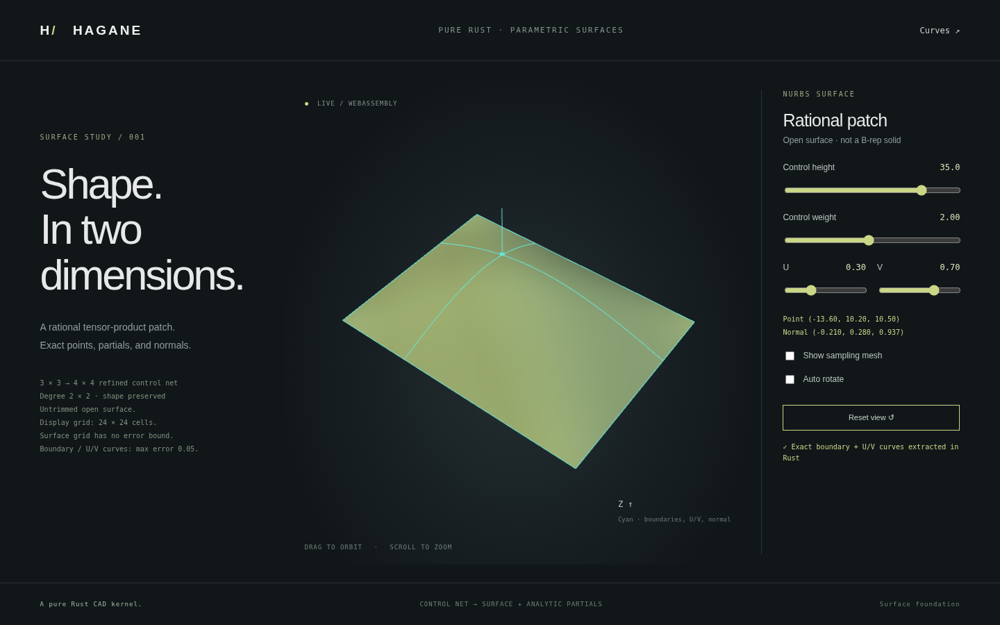

# NURBS surface refinement, isocurves and oriented boundaries

Standalone `NurbsSurface` objects now support shape-preserving knot insertion
on either tensor axis, exact isoparametric curves and the rectangular patch's
four oriented boundary curves. This supplies geometry and same-parameter UV
maps used by [rectangular open NURBS faces](nurbs-face.md). These geometry
methods alone do not create cross-face shared edges, arbitrary trimmed faces,
shells or solids.



## Surface refinement

`surface.insert_knot(axis, parameter, times)` returns a new surface. Axis 0 is
U; axis 1 is V. The original mathematical rational surface and its one-sided
first partials are preserved, subject to `f64` rounding. Degrees, the other
axis's knots and the original parameter domains remain unchanged.

The implementation lifts the entire rectangular control net to homogeneous
coordinates using one common weight scale, then applies knot insertion to
each control row along the chosen axis. Independent normalization of rows
would change their relative influence and generally change the surface, so
no row is independently normalized. Projection to Euclidean controls happens
only after all requested insertions.

The axis must be 0 or 1; the parameter must be finite and in the closed domain.
Zero insertions return an unchanged clone after those checks. Positive endpoint
insertion is unsupported, and interior multiplicity cannot exceed the degree.
The final rectangular control count is checked before allocation and cannot
exceed 65,536. Estimated work, `final_count * times * (degree + 1)`, is limited
to 16,000,000. Numerical-range and resource failures are explicit errors.

## Exact isoparametric curves

`surface.isocurve(axis, parameter)` fixes the named axis:

| Fixed axis | Fixed coordinate | Returned curve parameter |
| --- | --- | --- |
| 0 | U | V |
| 1 | V | U |

Homogeneous de Boor evaluation contracts each row on the fixed axis, retaining
the resulting positive rational weights. The returned `NurbsCurve` uses the
varying axis's original degree, knots and parameter domain. It is an exact
rational section of the mathematical surface, not a sampled polyline. Its
analytic derivative agrees with the corresponding surface partial, including
explicit one-sided limits at C0 knots on the varying axis. The fixed parameter
uses the right-hand span at an interior knot; positional continuity is preserved
by the existing multiplicity contract.

```rust
// For an existing validated NurbsSurface:
let refined = surface.insert_knot(0, 0.35, 1)?.insert_knot(1, 0.7, 1)?;
let fixed_u = refined.isocurve(0, 0.4)?; // variable parameter is V
let display = fixed_u.tessellate_bounded(0.05, 16_384)?;
let boundary = refined.boundary_edges()?;
```

The example assumes the stated parameters lie inside the surface's domains;
there is no restriction to 0..1 in the core API. Coordinates and display error
use the caller's consistent length unit; U and V may use unrelated parameter
units. Curve display uses the [bounded curve tessellator](nurbs-refinement.md),
including its conservative numerical guards and explicit resource failures.

## Rectangular boundary and UV orientation

`boundary_edges()` returns `[bottom, right, top, left]` in the parameter domain.
Each `NurbsBoundaryEdge` contains an exact `curve`, an affine `pcurve` and a
separate `forward` traversal flag. Curve parameters remain increasing; traversal
flags are `[true, true, false, false]`, giving a counterclockwise outer loop in
UV. The top and left curves are traversed backward without changing their knot
domains or their same-parameter UV maps.

For every original curve parameter `t`, the geometric identity is

`surface.evaluate(pcurve.evaluate(t)) == curve.evaluate(t)`

up to numerical rounding. The affine map preserves actual U/V parameter values
rather than rescaling each edge to 0..1. Endpoints connect in traversal order.
This orientation describes the rectangular UV loop; it does not prove global
surface regularity, non-self-intersection or injectivity. The returned data is
not a topological `Edge` shared between B-rep faces and does not certify that
adjacent independently created patches can be sewn.

## Browser and native demonstration

```sh
cargo run --locked --example nurbs_surface
cargo run --locked --example nurbs_surface -- 35 2 0.3 0.7
./scripts/build-web.sh
python3 -m http.server 8000 --directory web
```

The **Surfaces** page shows the existing untrimmed patch plus its four oriented
boundaries and the two sections through the selected U/V coordinates. Rust
refines the original 3-by-3 net to 4-by-4 without changing the surface, extracts
the sections and boundaries, and computes their bounded display polylines.
The JSON includes their original knots, weights, controls, parameters, affine
UV maps, traversal direction and per-segment bounds. The selected point and
normal remain analytic kernel evaluations.

The compatibility 24-by-24 `sample_grid` remains uniform display sampling with
**no certified surface chord-error bound**. Bounded section curves do not
establish bounded approximation of the entire surface. The browser now uses [bounded surface triangles](nurbs-surface-tessellation.md)
on the original single-span or optional refined C1 multi-span retained face, independently of its section
curves. The compatibility grid and section bounds alone do not certify surface
triangles or a closed solid.

Tests cover surface/partial invariance on both axes, degree 16, weight scaling
by 1e200, dimensions of 1e-100, C0 limits, non-unit domains, independent rational
bilinear point/derivative formulas, isocurve-to-surface identities, oriented
boundary closure and explicit input/resource rejection. Native/WASM/browser
checks exercise the same section and boundary demo.

## Remaining work

[Exact Bezier patch extraction](nurbs-surface-extraction.md) now retains original
parameter rectangles and supports C1 multi-span bounded display.
[C0 crease display](nurbs-surface-crease.md) now adds explicit one-sided normals
and shared UV geometric node metadata. Cross-face shared NURBS B-rep edges, general surface trims, bounded arbitrary trimmed surface
meshing, patch sewing, intersections and wider STEP interchange remain future
work. Periodic axes and higher/mixed derivatives are also unsupported. Published
mathematical provenance is recorded in [references](references.md); no OCCT
source or third-party NURBS implementation is copied or linked.
