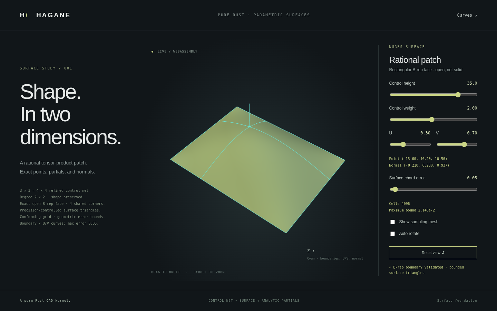

# Bounded display of rational spline surfaces

`NurbsSurface::tessellate_bounded(error, max_cells)` now produces a conforming
triangle mesh with a per-cell surface approximation bound for **positive-weight
rational Bezier patches and multi-span surfaces**. `NurbsFace::tessellate_bounded(error,
max_cells, tolerance)` first validates the retained rectangular B-rep boundary
and applies face orientation to the result. [Exact patch extraction](nurbs-surface-extraction.md) extends this to nonuniform
multi-span sources. [C0 knot lines](nurbs-surface-crease.md) retain separate
one-sided normals. Arbitrary trims, cross-face stitching and
generic NURBS solid tessellation remain unsupported.



## API and output

For an existing validated surface or rectangular open face:

```rust
let bounded = surface.tessellate_bounded(0.05, 16_384)?;
let face_display = face.tessellate_bounded(0.05, 16_384, tolerance)?;
```

`NurbsSurfaceMesh` contains:

| Field | Meaning |
| --- | --- |
| `mesh` | Shared-vertex positions, analytic normals, triangles and face IDs |
| `uv_ranges` | One original U/V parameter rectangle per cell |
| `error_bounds` | One bound per cell, shared by its two triangles |
| `vertex_uv` | Original parameter pair for each display vertex |
| `vertex_nodes` | UV-based shared geometric node for each display vertex |
| `normal_sides` | Explicit source partial limits for each display normal |

Triangle entries `2*i` and `2*i+1` correspond to cell `i`. The parameter
rectangle is `[[u_start,u_end],[v_start,v_end]]`. Its diagonal joins the lower-left
and upper-right corners. All patches share the same dyadic level; geometric nodes are evaluated from the
original source at their stored UV coordinates. Smooth neighbors share display
indices; C0 neighbors share geometric node IDs with separate normal-side display
vertices. `vertex_uv`, `vertex_nodes` and `normal_sides` preserve that distinction.
The face wrapper reverses triangle winding and normals for negative orientation.

The chord error and control coordinates use the caller's consistent length
unit. U/V domains retain their original units and need not be 0..1. Positions
remain evaluations of exact rational geometry; the mesh is a display approximation.

## Mathematical error bound

On each cell, let `H=(X,W)` be the homogeneous tensor Bernstein patch and
`S=X/W` its Euclidean surface. Let `C00,C10,C11,C01` be its four corners,
`B` their bilinear interpolant, and `T` their piecewise-affine two-triangle
interpolant at the same normalized local parameters.

The numerator of `S-B` is `D=X-W*B`. Expressing it in tensor Bernstein degree
`(p+1,q+1)` gives coefficients

`D[k,l] = sum(a,b=0..1) fu(k,a) * fv(l,b)`
`         * (X[k-a,l-b] - W[k-a,l-b] * C[a,b])`,

with out-of-range indices omitted,
`fu(k,0)=(p+1-k)/(p+1)`, `fu(k,1)=k/(p+1)`, and analogous V factors.
Bernstein coefficients form a convex combination. Positive weights give
`W >= minimum_control_weight`, so

`|S-B| <= maximum_coefficient_norm(D) / minimum_control_weight`.

The bilinear-to-two-triangle difference is bounded by

`|B-T| <= |C00-C10+C11-C01| / 4`.

Their sum bounds the distance between the surface and the corresponding
triangle interpolation point throughout the parameter cell. This establishes
a geometric distance bound in **both directions**: every surface point has a
nearby triangle point, and every point of either triangle has a corresponding
surface parameter. This does not require or certify global injectivity.

The emitted mesh corners use the original evaluator, while subdivision corners
come from local homogeneous projection. Their maximum mismatch `delta` is added
to the bound; triangle interpolation uses convex corner weights, so `delta`
also bounds the resulting interpolation mismatch.

## Floating-point guard

The Bernstein inequality above is mathematical. The implementation uses `f64`,
not outward-rounded interval arithmetic or a formal arithmetic proof. Its
additional conservative engineering allowance is

`4096 * f64::EPSILON * max(source_world_coordinate_scale, f64::MIN_POSITIVE)`
`* (maximum_weight / minimum_weight) * (p + q + 2)`.

The whole source net uses one common local origin and homogeneous weight scale.
The allowance covers refinement and coefficient arithmetic separately from
corner mismatch. If it is nonfinite or consumes at least a quarter of the
requested error, tessellation returns an explicit precision error. Nonfinite
coefficients, denominators, bounds and endpoint mismatches also fail explicitly.
Very large placement coordinates, extreme weight ratios or tiny requested errors
may therefore be refused rather than rendered with an unsupported accuracy claim.

Subdivision uses the actual representable midpoint and its fraction
`(middle-start)/(end-start)`. Geometry follows the recorded original parameter
ranges even when a large parameter origin prevents representing the arithmetic
half. Unsplittable intervals are rejected if more refinement is required.

## Conformity, resources and regularity

Every cell on a level splits into four children. Refinement stops only when
all cell bounds satisfy the requested error. This uniform-level policy avoids
T-junctions within the patch; it may generate more cells than local adaptive
refinement. There is no cross-face grid coordination.

- Exact Bezier extraction handles C1 and C0 multi-span axes. C0 display
  normals use explicit side limits; ordinary partial/normal APIs retain their
  side requirements. Existing degrees 1..16 and positive clamped weights remain required.
- Source knot-span product is checked against `max_cells` before extraction;
  extraction has its own control/patch/cumulative-work preflight.
- The error must be finite and positive; `max_cells` is 1..65,536.
- At most eight subdivision levels are allowed: up to 256-by-256 cells per
  original span rectangle, subject to the total cell limit.
- Before allocating a level, `new_cell_count*(p+1)*(q+1)` must not exceed
  16,000,000 estimated control work units.
- Exhausted resources or unrepresentable parameter midpoints return an error,
  never a partial mesh claiming the requested bound.
- Mesh corners require usable analytic normals. Degenerate triangles and
  disagreement with sampled analytic orientation are explicit errors.

These sampled normal/orientation checks are **not** a global regularity,
nonfolding or manifold certificate. A singular patch may pass structural face
validation and fail display. General trim loops and
sewing adjacent rational faces remain future work.

## Native and browser demo

```sh
cargo run --locked --example nurbs_surface_bounded
cargo run --locked --example nurbs_surface_bounded -- 35 1 0.5 0.5 0.05
./scripts/build-web.sh
python3 -m http.server 8000 --directory web
```

The **Surfaces** browser page uses
`hagane_generate_surface_bounded(height,weight,u,v,chord_error)`. The display
error control spans 0.02..1 in the fixture's length units. It reports requested
error, achieved maximum cell bound and cell count. The default native fixture
produces 1,024 cells and 2,048 triangles, with maximum bound approximately
0.0339312 for a requested error of 0.05. Geometry, bounds, original cell ranges,
selected analytic point/normal and section curves come from Rust/WASM.

The browser fixture's 16,384-cell budget can reject demanding control/error
combinations. Its refined height 60, weight 4, error 0.02 case fails explicitly;
error 0.1 recovers. The previous accepted mesh remains visible after rejection.
See [multi-span display](nurbs-surface-extraction.md) for this resource example.

`sample_grid`, the older `nurbs_surface` CLI and `hagane_generate_surface`
remain uniform-grid compatibility paths with **no whole-surface chord-error
bound**. Bounded tessellation uses the original retained source face. The optional
[refined multi-span fixture](nurbs-surface-extraction.md) now exercises four
actual source spans through the same API.

Tests independently check dense same-parameter surface-to-triangle differences
and point-to-triangle distances, rational quarter cylinders, nonuniform weights,
bilinear warps, shared-grid topology, degree 16, tiny dimensions, common large
weight scaling and rounded large-origin parameter domains. Invalid, singular,
multi-span, precision and resource cases fail explicitly. Face tests check
orientation reversal and rejection of dirty boundary references; native/WASM
and browser tests exercise the actual bounded demo.
