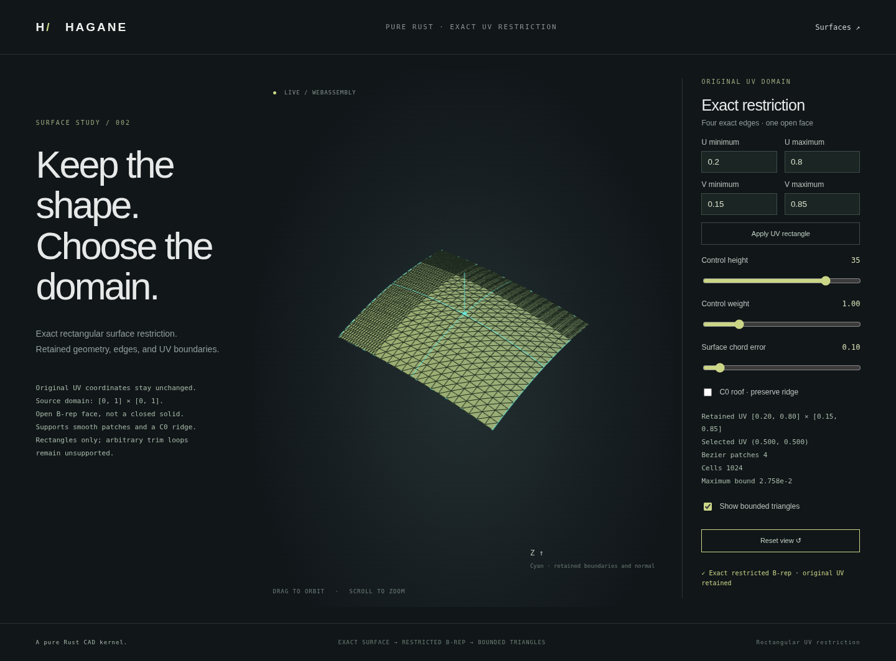

# Exact rectangular NURBS surface restriction

`NurbsSurface::restricted([[u_min,u_max],[v_min,v_max]])` retains the exact
rational surface over a selected parameter rectangle. `NurbsFace::trimmed`
constructs its four exact isocurve edges, shared corner vertices, oriented wire
and affine same-parameter pcurves. The result is an open B-rep face, not a solid.



## Supported domain

Both ranges must be finite, strictly ordered and contained in the existing
surface domain. Parameters keep their original values and units; restriction
does not normalize them to 0..1. The source is unchanged. Full-domain restriction
is valid; repeated restriction is relative to the current retained domain.
Degrees, positive rational weights and existing interior knot lines are retained.

This is an exact rectangular restriction represented by a new clamped surface,
not arbitrary trim-loop storage on the original surface. A separate
[`NurbsHoledFace`](nurbs-surface-hole.md) supports rectangular inner wires.
Curved/nonrectangular trims, periodic identification, cross-face sewing, closed NURBS
solids, intersections and NURBS STEP interchange remain unsupported.

## Construction and display

```rust
let restricted = surface.restricted([[0.2, 0.8], [0.15, 0.85]])?;
let original_face = hagane::NurbsFace::new(surface, 1, tolerance)?;
let trimmed_face = original_face.trimmed([[0.2, 0.8], [0.15, 0.85]], tolerance)?;
trimmed_face.validate_boundary(tolerance)?;
let display = trimmed_face.tessellate_bounded(0.1, 16_384, tolerance)?;
```

Restriction raises the cut-knot multiplicities by homogeneous knot insertion,
selects the retained tensor control rows/columns and clamps the new endpoints.
This preserves the mathematical rational surface without fitting or resampling.
As with existing refinement, its `f64` control arithmetic has rounding error;
this is not symbolic arithmetic or formal interval certification.

The face wrapper validates the source before restriction and regenerates checked
canonical boundaries, retaining face orientation. The restricted surface can
be evaluated and displayed independently of the source. Boundary edges lie on
the new retained domain and remain rational curves, rather than display lines.

At a cut exactly on a C0 knot line, the new domain endpoint uses its retained
inward derivative limit. Creases inside the retained rectangle preserve distinct
one-sided normals and shared UV geometric nodes. The existing bounded mesher
uses the restricted exact geometry and its per-cell Bernstein bounds, corner
mismatch and engineering arithmetic guard. These bounds apply to the retained
surface; they are not a separate formal bound on restriction rounding relative
to the original floating-point evaluator. Sampled normal checks do not certify
global injectivity or regularity.

Invalid ranges, unsupported resource demands and numerical failures return
explicit errors. Refinement is preflighted before allocation: at most 65,536
controls and 16,000,000 cumulative estimated insertion work units. These limits
apply to the intermediate refined net, so a small final rectangle can still be
rejected when the source is already at the control limit. Structural boundary
validation and display success remain
different checks: singular tangent planes can fail display after valid boundary
construction. See [bounded display](nurbs-surface-tessellation.md).

## Native and browser demonstration

```sh
cargo run --locked --example nurbs_surface_trim
./scripts/build-web.sh
python3 -m http.server 8000 --directory web
```

Open `surface-trim.html`. The demo changes the four UV bounds, retained geometry,
selected point and display precision using the same Rust/WASM kernel. It can
also restrict the piecewise rational roof fixture, including a cut at its C0
ridge. Rejected inputs leave the previous accepted display available.
The browser's selected UV point is the rectangle midpoint; the CLI/WASM API
can select any point inside the retained domain.
The smooth source includes shape-preserving knots at U=0.35 and V=0.7, so the
default rectangle retains four nonuniform source spans.

The CLI arguments are height, weight, selected U, selected V, display error,
U minimum, U maximum, V minimum, V maximum and fixture (0=smooth, 1=roof).
The WASM export uses the same order:
`hagane_generate_surface_trim(height,weight,u,v,error,u_min,u_max,v_min,v_max,crease)`.
The default ranges are U=0.2..0.8 and V=0.15..0.85.

Tests compare retained evaluations and derivatives against independent rational
formulas and the original surface, check exact boundary UV identity/orientation,
C0 inward limits, repeated restrictions, nonunit domains and invalid inputs.
Native/WASM parity and the actual browser cover changes, rejection and recovery.
