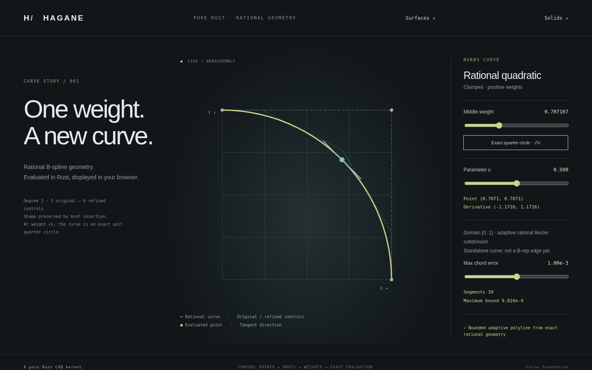

# NURBS curve foundation

`NurbsCurve` is an immutable, validated, positive-weight, clamped, nonperiodic
rational B-spline curve. It supplies geometry to the common `Curve::Nurbs`
variant and [rectangular open NURBS faces](nurbs-face.md), while general solid
integration, curve intersections and arbitrary trims remain unsupported.
[Refinement and bounded display](nurbs-refinement.md) adds shape-preserving
knot insertion, Bezier spans and adaptive curve sampling.

## Input contract

- Degree `p` is 1..16; control point count is `p+1`..65,536.
- There are `control_count + p + 1` finite, nondecreasing knots, and one finite,
  strictly positive weight per control point. Coordinates are finite `f64`.
- The closed domain is `[U[p], U[control_count]]` with a positive finite span.
- Each endpoint appears exactly `p+1` times. All interior knots lie strictly
  inside the domain and have multiplicity at most `p`, preserving C0 continuity.
- Periodic/unclamped curves are explicitly unsupported. Invalid cardinalities,
  degree, knot order, multiplicities, coordinates or weights are input errors.
- Common weight scaling is removed internally. Normalized weights or weighted
  coordinates that underflow to zero are rejected. Nonfinite evaluation or
  derivative arithmetic returns a numerical-range error rather than a point.

Data accessors return shared slices. Mutating knots/weights after validation
is impossible through the public API. Curve lengths use the caller's consistent
length unit. Parameters use the knot domain's units; derivatives are length per
parameter unit. The evaluator does not clamp, extrapolate, or snap parameters
using a geometric tolerance.

## Evaluation

Control points are lifted to homogeneous coordinates `H_i = (w_i P_i, w_i)`.
Local de Boor evaluation on the selected nonzero knot span computes `H(u)`;
the point is `H_xyz / H_w`. The implementation works with only the degree's
local support and preserves exact rational geometry, subject to `f64` rounding.
Uniform weights are ordinary B-splines; a single clamped span is a rational
Bezier curve. A quadratic with controls `(1,0), (1,1), (0,1)` and weights
`1, sqrt(1/2), 1` is an exact unit quarter circle.

The first homogeneous derivative uses control points

`D_i = p (H_(i+1) - H_i) / (U_(i+p+1) - U_(i+1))`

with degree `p-1` and the first/last knots removed. The rational derivative is

`P' = (H'_xyz - P H'_w) / H_w`.

There is no finite-difference approximation in the production derivative.
Tests use independent Bernstein/Cox basis formulas, analytic circle/line
expectations, and finite differences as distinct cross-checks.

## Knot-side semantics

Position evaluation chooses the right-hand span at an interior knot. Since
interior multiplicity is at most the degree, the point is continuous there.
`derivative(u)` rejects an interior knot of multiplicity `p`: differentiability
is not guaranteed. Even when particular controls happen to match tangents,
this conservative API requires an explicit side instead of claiming smoothness.
Use `evaluate_with_derivative(u, KnotSide::Left/Right)` to evaluate both limits.
At endpoints, either side selects the inward limit. Knot comparisons are exact
`f64` comparisons; no tolerance-based snapping hides a knot discontinuity.

## Native and Web demo

```sh
cargo run --locked --example nurbs
cargo run --locked --example nurbs -- 2.0 0.25
cargo run --locked --example nurbs_refinement -- 0.7071067811865476 0.5 0.001
./scripts/build-web.sh
python3 -m http.server 8000 --directory web
```

Open the NURBS curves link from the solid demo. Adjust the middle weight and
parameter, or reset to the exact quarter-circle weight. All sample points,
the selected point, and its derivative are produced by the Rust WASM kernel.
The JavaScript canvas renderer only draws those results and a control polygon.
The browser now uses adaptive sampling with displayed per-segment chord bounds
and explicit error controls; see [refinement](nurbs-refinement.md). The old
`nurbs` CLI fixture still emits 129 uniform parameter samples and claims no
chord-error bound. Native/WASM parity and browser-control tests run in CI.

The bounded browser export is
`hagane_generate_nurbs_bounded(weight, parameter, chord_error) -> status`.
The older `hagane_generate_nurbs(weight, parameter) -> status` remains available.
It shares the existing JSON output buffer: any `hagane_generate*` call replaces
previous bytes, and callers must reacquire/copy the memory view. The fixture is
not a general NURBS serialization or editor API.



## Remaining work

Derivatives of higher order, periodic curves, curve
frames/trims, intersections,
and general integration with closed B-rep solids remain unimplemented. Standalone
NURBS surface evaluation and first partials are implemented separately; see
[nurbs-surface.md](nurbs-surface.md). They must not
be inferred from the presence of a curve evaluator.
