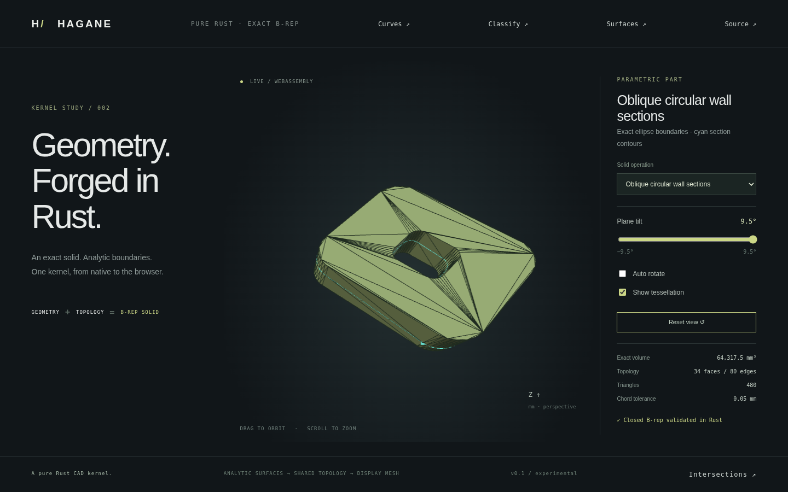

# Oblique plane subdivision of circular walls



`subdivide_extrusion_boundary_by_plane` subdivides a closed extrusion's boundary
along a transverse plane with a caller-selected normal. It supports bounded
circular and skew circular walls, with exact **ellipse arcs** as the new shared
boundaries. Crossed planar side faces receive exact straight section edges.
The result retains the original material and one closed B-rep solid; it does
not introduce internal caps or return two separated solids.

## API and demo

```rust
use hagane::*;
let tolerance = GeometryTolerance::default();
let profile = rounded_rectangle_profile(
    Point3::new(0.0, 0.0, 0.0), 12.0, 10.0, 1.0,
    tolerance.absolute(),
)?;
let solid = extrude_arc_line_region_along(
    &ArcLineRegion { origin: profile.origin, outer: profile.segments, holes: vec![] },
    Vec3::new(3.0, -2.0, 4.0), tolerance.absolute(),
)?;
let split = subdivide_extrusion_boundary_by_plane(
    &solid, Point3::new(1.5, -1.0, 2.0), Vec3::new(0.1, -0.08, 1.0),
    tolerance,
)?;
split.solid.validate(tolerance.absolute())?;
assert!((split.solid.volume()? - solid.volume()?).abs() < 1e-10);
# Ok::<(), hagane::Error>(())
```

`PlaneBoundarySubdivision` contains the new solid, original/appended child face
index pairs, and section edge indices. Section edges form closed boundary loops
through shared vertices, including hole loops; their indices are not an ordered
wire list. Each is shared with opposite traversal by two children. Input
geometry is cloned and remains unchanged on failure.

```sh
cargo run --locked --example oblique_boundary -- 0.13 0
cargo run --locked --example oblique_boundary -- -0.1 0.7
cargo run --locked --example part -- 24
./scripts/build-web.sh
```

Serve `web/` as described in the README and select **Oblique circular wall
sections**, the twenty-fifth solid preset. Move **Plane tilt** to change the
cutting plane. Cyan contours sample the actual B-rep line/ellipse section edges;
enabling tessellation shows their shared face boundaries. The rounded-hole
fixture has 34 faces and 80 edges and retains its original analytic volume.
The tilt control is the X slope angle; the fixture also has a fixed Y slope.

`hagane_oblique_boundary_demo(slope, placement)` uses the existing WASM JSON/error
buffer contract. Mesh and contour output share the native example. Contours are
for display; the kernel stores the analytic ellipse curves.

## Exact intersection geometry

For a wall with orthonormal circle axes `X,Y`, base center `O`, radius `R` and
world generator `g`, geometry is

`S(u,v) = O + R X cos(u) + R Y sin(u) + g v`.

For plane point `P` and normalized normal `n`, let `d = n·g`. A resolved
transverse section has

`v(u) = A + B cos(u) + C sin(u)`

where `A = n·(P-O)/d`, `B = -R n·X/d` and `C = -R n·Y/d`. Its exact curve is

`(O + g A) + (R X + g B) cos(u) + (R Y + g C) sin(u)`.

`Curve::EllipseArc { center, cosine, sine, sweep }` stores that bounded angular
curve. Its axes need not be orthogonal; they represent the affine image of the
unit circle. `PCurve::HeightGraph { offset, cosine, sine, sweep }` uses exactly
the same parameter: `(u,v) = (t, A+B cos(t)+C sin(t))`. Rotation/translation
preserve curve axes, surface frames and shared parameters.

Each wall child retains its supporting surface and an angular domain bounded
above/below by affine constant-height rims or harmonic height graphs. Validation
checks analytical height extrema over the entire angular interval, positive
band separation, generator endpoints, traversal, finite geometry and agreement
of 3D edge evaluation with its surface pcurve. Existing shell edge-use and
vertex-link checks still enforce a closed oriented manifold.

## Metrics and tessellation

The divergence-theorem wall flux integrates band height times
`R + a cos(u) + b sin(u)`. Products of the two harmonic expressions reduce to
analytical integrals of `1`, `sin`, `cos`, their squares and their product.
Tests compare individual face contributions with independent numerical surface
quadrature, in addition to checking total volume conservation. Ellipse bounds
include endpoint and coordinate-stationary angles within the bounded sweep.

For an ellipse `c + a cos(u) + b sin(u)`, `|a|+|b|` bounds the second derivative
norm. Linear interpolation error is at most
`(|a|+|b|) Δu² / 8`. The ruled wall between its two rim curves inherits the
larger rim bound. Opposite-rim sampling counts are propagated across shared edge
components, so refined ellipse sections, wall rims and planar cap samples all
agree. Triangles are generated from this analytic B-rep, with its oriented
normals; a mesh Boolean never participates.

## Current supported domain

- At least one circular wall; all circular walls must be rectangular before
  cutting, with matching bounded arc rims and angular span at most π.
- The plane must cross every circular generator strictly between the complete
  lower and upper rims. Its direction can be oblique to the extrusion.
- Crossed planar neighbors require one straight quadrilateral boundary and two
  generator-edge crossings. Uncrossed caps and their holes remain intact.
- Normal and skew extrusions, either normal sign, curved holes, arbitrary rigid
  placement, level or oblique planes, and nonunit normals are supported.

Plane/generator near-parallelism, rim contact/crossing, existing vertex contact,
unresolved small subedges, insufficient world-coordinate precision, periodic
full-circle rims and repeated cuts of existing harmonic bands return errors.
The cutting plane's height range is checked analytically, including interior
extrema; endpoint-only checks cannot accept a hidden rim crossing. The plane
normal is normalized robustly, including very small/large finite scales.

**Queries on the new harmonic trims are not implemented yet.** Existing
rectangular circular-face intersections, solid point classification and
rectangular generator subdivision reject this trim domain explicitly, including
queries beyond the bounding box. General curved Boolean operations, arbitrary
partial plane sections and creation of capped separated halves remain future
work. Source solids and previous rectangular operations retain their support.

## Verification and provenance

Native tests cover exact plane incidence and shared section loops, curved holes,
signed/normal/skew extrusions, rigid placement, microscopic geometry, scaled
normals, volume/bounds, flux quadrature, conforming closed meshes, winding and
ellipse chord error. Invalid/touching/partial/periodic cuts, malformed pcurves,
world precision loss, transform overflow and unsupported query domains fail
explicitly. WASM compares full meshes and contours with native output, analytic
volume and plane incidence, with invalid inputs and recovery. Browser tests
verify changing tilt changes the actual contours and triangulation, preserves
volume/topology, and exercises all 25 solid presets.

Original implementation is MIT OR Apache-2.0, with no new dependencies or OCCT
source. References: affine unit-circle parametrization of an
[ellipse](https://en.wikipedia.org/wiki/Ellipse), substitution into a Cartesian
plane equation, elementary trigonometric integrals, the
[divergence theorem](https://en.wikipedia.org/wiki/Divergence_theorem), and the
second-derivative bound for linear interpolation. See
[provenance/licenses](references.md), [skew geometry](skew-arc-extrusion.md) and
[bounded generator subdivision](skew-face-subdivision.md).
