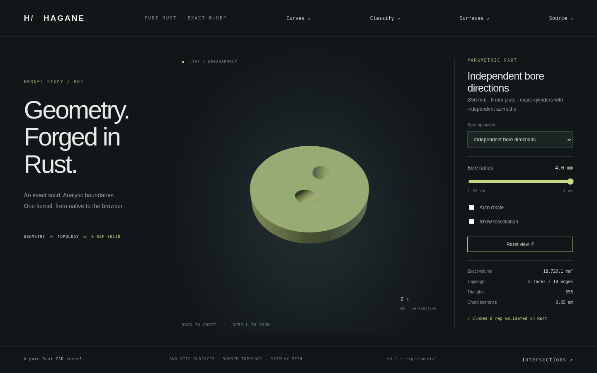

# Independently oriented cylindrical through bores



`oriented_bores_demo_solid(R, H, bores, tolerance)` constructs a circular plate
with up to sixteen disjoint circular cylindrical through bores. `OrientedBore`
specifies radius, XY center, inclination `tilt` from +Z and XY direction
`azimuth` from +X, both in radians. Each bore can have its own inclination,
azimuth and radius. Existing `TiltedBore` APIs delegate to this construction
with zero azimuth, preserving their previous behavior.

## Exact geometry and certified domain

For inclination theta and azimuth phi, the axis is
`(sin(theta)*cos(phi), sin(theta)*sin(phi), cos(theta))`. Its section at z has
center `(cx,cy) + z*tan(theta)*(cos(phi),sin(phi))`, ellipse cosine vector
`r/cos(theta)*(cos(phi),sin(phi))` and sine vector
`r*(-sin(phi),cos(phi))`. These are actual exact B-rep ellipse arcs shared by
planar caps and inward cylindrical walls. The wall uses a checked orthonormal
frame and harmonic height pcurves, not a deformed display mesh. Rotated ellipse
axes retain correct XY pcurves and the same oriented shared topology.

Full-height separation uses the earlier [analytic projection certificate](divergent-tilted-bores.md),
now with both XY center-drift components and independently rotated ellipse
projection radii. A fixed XY projection direction with same-sign guarded
endpoint gaps proves separation at every height. This rejects internally
crossing tools even when their cap holes are disjoint. The finite 64-direction
search is sufficient, not complete; uncertified configurations return errors.
Conservative outer clearance and final cap/topology validation still apply.

Inputs must have finite radii, centers and angles; dimensions exceed ten linear
tolerances and inclinations are in [-pi/3,pi/3]. Azimuth can be any finite angle.
No more than sixteen holes are accepted. General intersecting-cylinder Boolean
operations, partially entering bores and configurations without separation
or outer containment certificates remain unsupported in this oriented-through
API. [Top-entry Z-axis blind bores](blind-bore.md) now have a separate supported
operation; tilted blind cuts remain unsupported. Rigid placement of the
completed solid remains available.

The exact volume is `pi*(R²-sum(r_i²/cos(theta_i)))*H`, independent of azimuth.
With two holes the closed B-rep has eight faces and eighteen shared edges.

## Native and browser demos

```sh
cargo run --example oriented_bores -- 0.4
cargo run --example part -- 28
./scripts/build-web.sh
python3 -m http.server 8000 --directory web
```

Choose **Independent bore directions** in the main browser demo. The plate is
56 mm in diameter and 8 mm high. The bores have inclinations 0.7 and 0.5 radians,
azimuths 0.4 and `0.4+pi/2`, and centers Y=±8 mm. The radius slider controls both
radii from 1.33 to 4 mm; preset 28 accepts controls 8–24 divided by six. Orbit,
zoom and wireframe inspect the actual B-rep-derived mesh.

The native cap-query example uses 3 mm radii and rotates its query direction
with the first hole, at 1 mm transverse offset. Its WASM counterpart is
`hagane_oriented_bores_demo(azimuth, offset)`. Tests verify analytic volume,
independent hole roots, native/WASM geometry parity, small dimensions, invalid
angles, internally crossing tools and error recovery. Browser tests exercise
the new preset and controls; the image above captures that renderer.

The frame/section formulas are independently derived from orthonormal basis
rotation and substitution into a horizontal plane. Supporting radii follow the
maximum of a sine/cosine combination. No dependencies were added and no OCCT
source was used; original code is MIT OR Apache-2.0. See [references](references.md).
