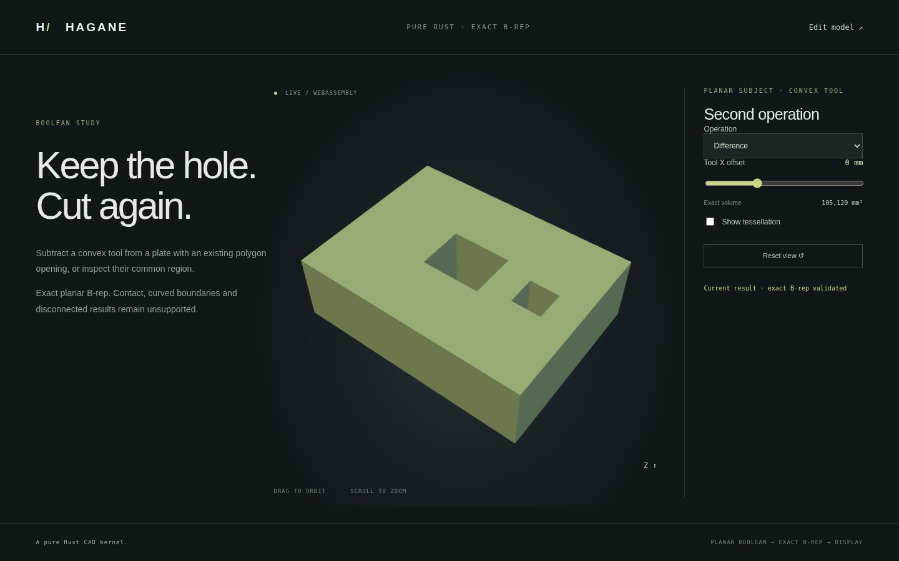

# Planar subject / convex tool Booleans



`subtract_convex_from_planar_solid(subject, tool, tolerance)` and
`intersect_planar_solid_with_convex(subject, tool, tolerance)` accept validated
planar straight-edge subjects with concavity or polygon openings. The tool must
be convex with planar faces, straight edges and no face holes. Each operand is
limited to 128 faces. The older convex-only APIs retain their convex-operand
validation. Inputs are immutable; no mesh operation is used for modeling.

## Construction and explicit scope

The cutter's outward supporting planes define negative half-spaces. The kernel
partitions the subject against these planes, retaining the common interior and
outside pieces. For difference, original subject boundary patches are kept,
and cutter-derived common-region patches are reversed to form new inward walls.
Checked planar sewing reconstructs shared vertices, oriented edges and pcurves.
Exact volume verifies `difference + common = original`; the common volume must
not exceed either operand. Intersection returns the common closed solid.

A nonconvex subject can be disconnected by one plane before other cutter planes
restrict it to a connected region. The new APIs first order supporting planes by
the number of original vertices outside each half-space. When a plane split
specifically reports a disconnected shell, that plane is deferred and another
pending plane is tried. Successful clipping resets the deferral counter. A
complete unsuccessful pass returns an explicit unsupported error. Other
geometry/topology failures are propagated. This schedule is a limited
construction strategy, not a completeness guarantee for arbitrary planar CSG.

Every executed plane cut must clear current vertices by more than ten local
length budgets. Coincident faces, vertex passage, contacts and near contacts
remain unsupported. Both sides of each successful intermediate partition must
be single connected solids; the final retained boundary must be one closed
connected shell. Disconnected outputs, independent internal cavity shells and
curved boundaries/tools are rejected. No error is converted into an unchanged
successful result. Strictly separated tools legitimately give an unchanged
difference and empty intersection; strict containing tools give empty difference.

This extension permits repeated cuts of a suitable concave/holed planar stock.
It does not add union of nonconvex operands or general curved Boolean operations.
The APIs and dedicated demo are separate from the current editable stock-and-bore
JSON document, which does not yet have a general Boolean node or operand graph.

## Run the implementation

```sh
cargo run --locked --example planar_convex_boolean -- 0 0
cargo run --locked --example planar_convex_boolean -- 1 0
./scripts/build-web.sh
python3 -m http.server 8000 --directory web
```

Open `planar-boolean.html` through the local web server. Choose difference or
intersection and move the second tool in X. The stock is an 80 × 60 × 24 mm box
with an existing 20 × 16 mm rectangular through opening. The second tool is a
10 × 10 mm through prism at X = 20..30 mm. At zero offset the original holed
subject volume is 107,520 mm³, the common volume is 2,400 mm³, and the repeated
difference is 105,120 mm³. The two empty holes remain actual inner B-rep boundaries.
At offset 10 mm the tool reaches a stock face and is explicitly rejected;
at offset 60 mm it is separated. Failed edits keep the previous result with an
explicit label. Empty intersection clears the display. Orbit, zoom and
wireframe are display-only operations on the validated B-rep mesh.

## Evidence

Native tests check independent removed/common volumes, concave stock, existing
polygon holes, hole/material/boundary classification, closed opposite mesh-edge
uses, translations and tiny/large geometry. Strict separation, containment,
curved inputs, nonconvex tools, contact and enclosed cavities are checked.
Native/WASM tests compare full reports/meshes, empty/unchanged outcomes and error
recovery. Browser tests exercise both operations, contact rejection with the
previous result retained, empty/unchanged results and camera/wireframe controls.
No new library or source-code dependency was introduced; mathematical provenance
is recorded in [references](references.md).

## Multi-component partition mode

The browser demo now also offers **Plane partition into parts**. This mode uses
`split_solid_by_plane_components`, not the single-shell Boolean APIs above.
A U-shaped stock splits into one negative-side bridge and two positive-side
arms. Choose a displayed side to inspect the separate closed parts and their
combined exact volume. Plane offsets use world Y in this mode. See
[multi-component partition](solid-split-components.md) for contracts and tests.

## Boolean component result vectors

New [component Boolean APIs](component-booleans.md) return multiple closed
results from convex-tool difference/intersection. Use those APIs when a through
slot separates stock or a common region has disconnected pieces. The original
single-result APIs above retain their contract. The browser demo includes both
**Difference into separate parts** and **Intersection into separate parts**.
