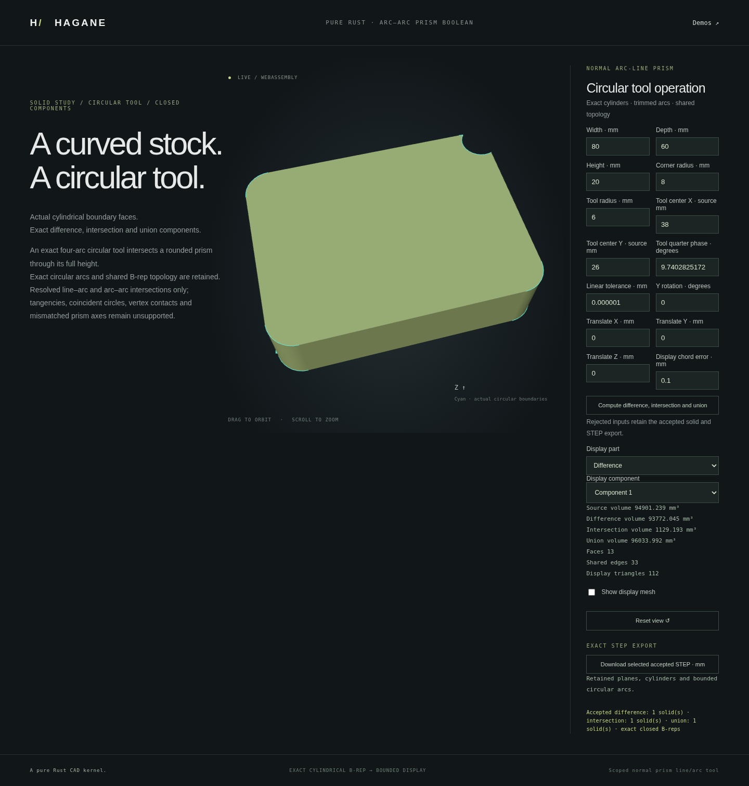

# Exact line/arc prism Booleans



`boolean_normal_arc_line_prisms` returns every connected component of the
source minus tool, source intersect tool, and their union as exact B-rep solids.
It intersects finite lines and signed circular arcs analytically, shares crossing
vertices, follows oriented boundary cycles, and constructs planar caps and exact
cylindrical walls with surface pcurves. Display meshes are tessellated afterward;
no mesh Boolean operation is used.

The default example cuts a radius-6 circular tool across the rounded corner of an
80 × 60 × 20 mm stock with radius-8 corners. Both line/arc and arc/arc crossings
occur. The tool is an exact four-arc extrusion, rather than a periodic single-edge
circle. Select **Difference**, **Intersection**, or **Union** in the browser;
component selectors and STEP downloads describe actual returned bodies. The
verified default common volume is 1129.193251666145 mm³, difference volume
93772.04534492877 mm³, and union volume 96033.99205551343 mm³. Empty
results have no selectable body or fabricated mesh.

```sh
cargo run --example normal_prism_arc_line_boolean
./scripts/build-web.sh
python3 -m http.server 8000 --directory web
# Open /prism-arcs.html in your browser.
```

```rust
use hagane::*;
# fn example(source: &Solid, tool: &Solid) -> Result<()> {
let result = boolean_normal_arc_line_prisms(
    source, tool, Vec3::new(0., 0., 1.), GeometryTolerance::default(),
)?;
for body in result.union() {
    body.validate(GeometryTolerance::default().absolute())?;
}
# Ok(()) }
```

## Supported domain

- Both actual input B-reps must certify as normal prisms sharing one physical
  axis and cap interval. Rigid placement and either axis sign are supported.
- Boundaries contain finite straight segments or circular arcs of at most a
  quarter turn. The source may contain up to 16 holes. The tool has one simple
  outer ring and no holes; it may be nonconvex.
- Strictly resolved transverse crossings, strict containment, and disjoint
  operands are supported. Each result is an array, including zero or multiple
  connected solids. Source holes retain their actual material classification.
- At most 128 input profile segments, 128 crossings, and 128 output segments
  across all three result families are accepted. Unresolved arithmetic,
  excessive coordinate magnitudes, or resource bounds return an error.
- Contacts, tangency, endpoint hits, coincident boundary overlays, unresolved
  near crossings, periodic `Curve::Circle` prisms, tool holes, blind-pocket
  sources, skew extrusion, mismatched caps, and general 3D curved Booleans are
  explicitly unsupported. Equal-center circles with unequal radii support
  strict containment; coincident equal circles are rejected.

The existing `partition_normal_prism_by_convex_tool` API keeps its original
convex, all-line tool domain and two-result budget. This new API is additive.
Exact bounded analytic STEP export/import is checked for returned components;
this does not expand the supported domain of general STEP or arbitrary Booleans.

## Verification and mathematics

Independent native tests compare intersecting radius-8 and radius-6 disks against
the classical two-circle sector-minus-triangle lens formula, and the rounded
corner example against a separate circular-segment integral. They verify all
three volume identities, original finite curve support, dense surface pcurves,
closed oppositely oriented edge incidence, mesh closure and chord bounds, and
bounded STEP round trips. Other cases cover nonconvex tools, disconnected unions,
containment, existing source holes, rigid poses, small dimensions, extreme axis
scales, invalid inputs, and immutable rejection.

Circle intersections use normalized, factored root expressions and physical
conditioning checks. Cap areas use recentered compensated sums and stable
half-angle arc terms. Neither unresolved roots nor nearby event vertices are
silently welded. See [references](references.md) for mathematical sources and
[the roadmap](roadmap.md) for general intersection and sewing work still required.
