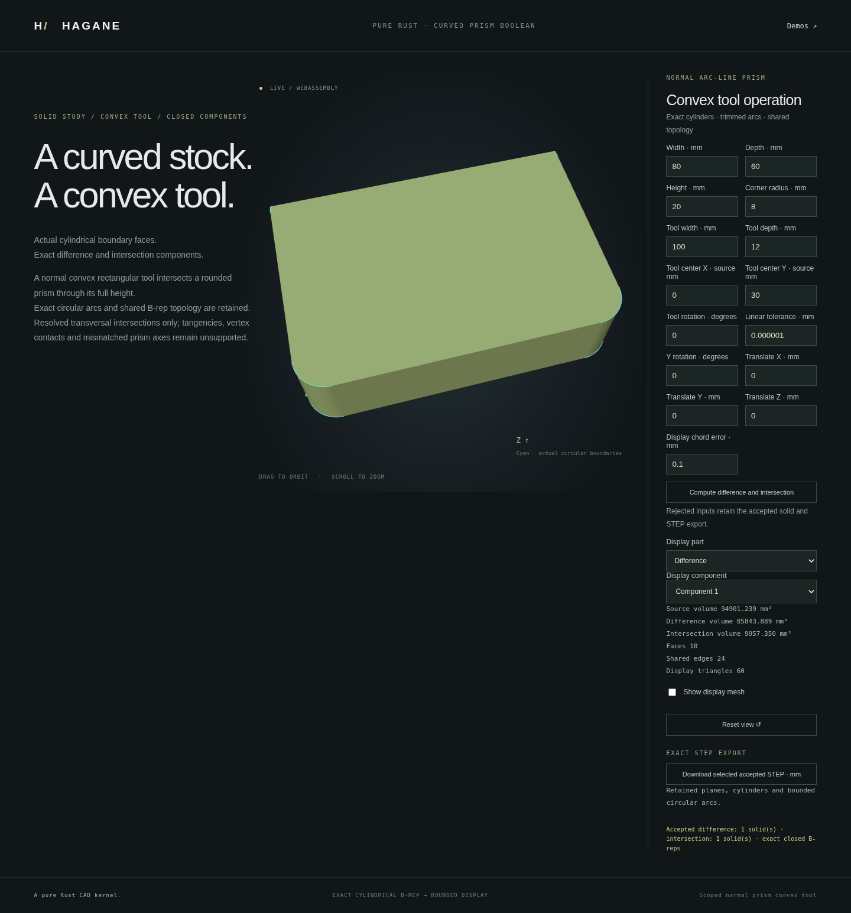

# Exact curved prismatic partition by a convex tool



`partition_normal_prism_by_convex_tool` partitions actual certified normal stock
into its difference from, and intersection with, a convex all-line prism tool.
It returns all connected closed B-rep components for both sets, including empty
sets where appropriate. A rectangular tool can cross the cylindrical corners of
rounded stock: the result retains exact restricted circular boundaries and
cylindrical surfaces, with same-parameter pcurves and shared oriented edges.
Display triangulation follows exact solid construction; no mesh Boolean is used.

```rust
use hagane::*;
# fn partition(source: &Solid, tool: &Solid) -> Result<()> {
let result = partition_normal_prism_by_convex_tool(
    source, tool, Vec3::new(0.0, 0.0, 1.0), GeometryTolerance::default(),
)?;
for component in result.difference().iter().chain(result.intersection()) {
    component.validate(Tolerance::default())?;
}
# Ok(()) }
```

Both operands must have the same physical extrusion axis and cap interval.
The source has supported line/circular-arc cap rings with subquarter/quarter arcs
and optional disjoint initial openings. The tool has one strictly convex all-line
outer ring and no holes. This scoped dimensional reduction is not a general
three-dimensional Boolean for arbitrary surfaces or overlapping cap intervals.

The operation constructs an analytic planar boundary arrangement. Resolved
line/line and line/circle crossings split original directed segments; shared
crossing identities connect selected material-boundary fragments. Directed
cycles and their inner rings define the resulting components. Exact framed
extrusion produces actual B-reps, and closure, analytic curve correspondence and
volume conservation certify the partition. Near contacts, tangent or vertex
crossings, coincident boundaries and unresolved arithmetic return explicit errors.

The demo uses an 80 × 60 × 20 mm rounded box with radius-8 corners and a
100 × 12 × 20 mm rectangular tool centered at `(0,30)`. Its plane cut at `y=24`
crosses both curved upper corners. The exact common volume is:

```text
20 * (384 + 32π - 2√60 - 64 asin(1/4)) mm³
```

The source volume is `90880 + 1280π` mm³; difference plus intersection must equal
it. The common circle-segment formula is an independent test oracle.

Run:

```sh
cargo run --example normal_prism_convex_partition
./scripts/build-web.sh
python3 -m http.server 8000 --directory web
```

Open `/prism-convex.html`, edit tool dimensions/position/angle, inspect source,
tool and each result component, then download its exact AP214 STEP body in mm.
Empty results are shown explicitly. Rejected operations retain the accepted
shape, camera and exports. The native numeric payload is stock W/D/H/radius,
tool W/D/center XY/rotation, shared Y rotation/translation XYZ, linear tolerance
and display chord tolerance; angles are radians.

Limits and conditioning are part of the API: cap-interval mismatch, skew axes,
nonconvex or curved tools, blind source cavities, arbitrary NURBS surfaces,
contacts and unsupported resource/precision conditions are rejected. Combined
input/result profiles and analytic crossing events are bounded to 128 segments
or events. Absolute and relative tolerances and reserved floating-point
reconstruction budgets are applied to the actual physical geometry. This does
not add union, tolerant shape repair, general coplanar overlay or arbitrary
three-dimensional Boolean support. See [mathematical provenance](references.md).

Verification: formatting, strict all-target Clippy, 944 native/doc tests,
release WASM build and the complete WASM regression suite passed. Independent
checks cover analytical circle-segment volumes, disconnected/empty sets, crossed
openings, rotations/scales/extreme signed axes, unchanged rejected operands,
finite curve support, pcurves, closed oriented meshes and actual STEP roundtrips.
Browser checks add component selection, native/STEP semantic parity under edge
renumbering, rejected-operation camera/display/export retention and mobile orbit.
The image above is captured from the actual Rust/WASM implementation.
