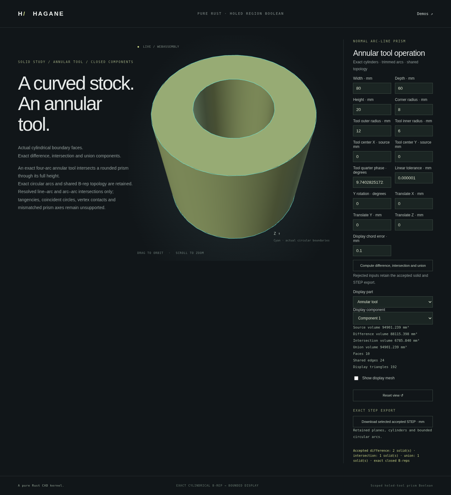

# Exact holed-tool prism Booleans



`boolean_normal_prism_regions` extends finite line/arc prism arrangements to
holes in either operand. Difference, intersection, and union each return every
connected material component as an exact `Solid`. Tools are material regions:
an annulus removes its ring while leaving its central disk. No mesh Boolean or
visual-only hole substitutes for the retained analytic curves, cylindrical
surfaces, shared oriented edges, or surface pcurves.

The default 80 × 60 × 20 mm rounded stock is cut by an annular tool with outer
radius 12 mm and inner radius 6 mm. The difference has two real solids: the
outer part (85853.45175425633 mm³) and central disk (2261.946710584651 mm³).
The common annulus has volume 6785.840131753953 mm³; the union is the original
stock. Choose each component to inspect and download its exact bounded STEP.

```sh
cargo run --example normal_prism_region_boolean
./scripts/build-web.sh
python3 -m http.server 8000 --directory web
# Open /prism-regions.html in your browser.
```

```rust
use hagane::*;
# fn example(source: &Solid, tool: &Solid) -> Result<()> {
let parts = boolean_normal_prism_regions(
    source, tool, Vec3::new(0., 0., 1.), GeometryTolerance::default(),
)?;
for solid in parts.difference() {
    solid.validate(GeometryTolerance::default().absolute())?;
}
# Ok(()) }
```

## Domain and limits

Both actual B-reps must certify as normal extrusions sharing one physical axis
and cap interval. Their outer and inner boundaries contain finite lines or
quarter-turn-or-smaller circular arcs. Each operand may have up to 16 holes.
Rigid placement, either axis sign, nonconvex simple outer loops, strict
containment, transverse crossings, empty sets, disconnected results, and nested
material islands are supported. Tools without holes are also accepted.

Combined limits are 128 input profile segments, 128 crossing events, and 128
output profile segments across the three result families. Ill-conditioned
roots, cap areas, transformations, unresolved proximity, or excessive world
coordinates return explicit errors. Contacts, tangency, vertex hits, coincident
boundary overlays, periodic single-edge circles, blind sources, skew prisms,
mismatched caps, and general 3D curved Booleans remain unsupported.

The earlier `boolean_normal_arc_line_prisms` and
`partition_normal_prism_by_convex_tool` APIs retain their existing no-tool-holes
domains and rejection behavior. See [line/arc tool Booleans](prism-arc-line-booleans.md)
for the shared intersection mathematics, conditioning guards, and bounded STEP
scope. This operation does not expand arbitrary STEP recognition.

## Verification

Native tests use independent disk-lens, annulus and rectangular-frame formulas,
including holes in both operands and islands inside a source opening. They check
all material-set volume identities, correct component topology, original finite
curve support, dense surface pcurves, opposed shared edges, closed tessellation,
chord bounds, and STEP round trips. WASM and browser checks compare native results
and actual STEP geometry, verify annular material membership and empty results,
and retain accepted geometry, camera and export when an input is rejected.

Implementation is original MIT OR Apache-2.0 Rust code with no new dependency.
See [mathematical references](references.md) and [the roadmap](roadmap.md).
