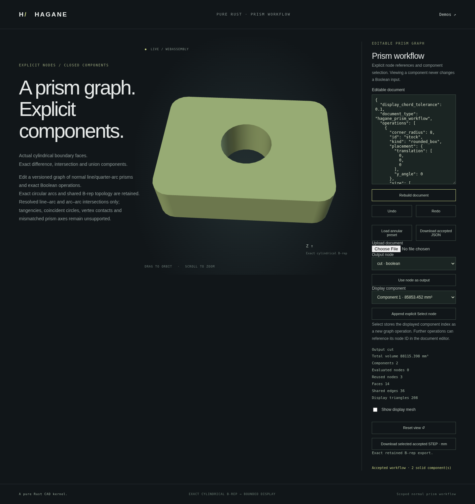

# Editable multi-component prism workflow



The versioned `PrismWorkflowDocument` records exact stock, Boolean operands, and
explicit component selections. Its output can be empty or contain multiple real
B-rep solids. It preserves the separate existing single-solid workflow API;
no largest component or first component is silently substituted for a result.

The bundled [example document](prism-workflow-example.json) cuts an annular tool
from rounded stock. Its result has an outer part and a central island. Select a
component to inspect or download its exact bounded analytic STEP. Display
selection changes the view only. To reuse a part as a Boolean operand, append a
**Select** operation explicitly. Selecting index 1 in the bundled result picks
the central island; indices identify this current output, not persistent topology.

```sh
cargo run --example prism_workflow
./scripts/build-web.sh
python3 -m http.server 8000 --directory web
# Open /prism-workflow.html.
```

```rust
use hagane::*;
# fn example() -> Result<()> {
let document = prism_workflow_example_document()?;
let mut session = PrismWorkflowSession::new();
let report = session.rebuild(&document)
    .map_err(|_| Error::InvalidInput("workflow rejected"))?;
assert_eq!(report.shape.components().len(), 2);
# Ok(()) }
```

## Document contract

Schema 1 uses `document_type: "hagane_prism_workflow"`, units `mm`, an explicit
linear/angular/relative tolerance policy, positive `display_chord_tolerance`,
ordered `operations`, and an `output` node ID. Node kinds are:

- `rounded_box`: centered XY stock, base Z=0, dimensions and corner radius.
- `arc_line_extrusion`: exact finite line/quarter-arc outer and inner rings,
  extruded normally through a positive height.
- `step_stock`: actual bounded analytic STEP text and an explicit axis. Parsed
  geometry must certify in the supported normal-prism domain; filenames or
  modeling recipes are not used to reconstruct a substitute.
- `boolean`: earlier `left` and `right` nodes, `difference`, `intersection`, or
  `union`, and an explicit physical axis.
- `select`: earlier `input` node and a zero-based `component` index.

Stock placements use a Y-axis angle in radians and an XYZ translation in mm.
Every input reference must point backward. Each Boolean operand must contain
exactly one solid; empty or multi-component operands require a supported explicit
selection and are rejected otherwise. Empty terminal results are valid and have
no STEP download or fabricated mesh. All nodes are validated, including nodes
that are not the chosen output.

Node IDs label operations, not stable faces or edges. A changed model may change
component order or count; stale out-of-range selections fail explicitly. Unknown
fields, schema versions, units, node kinds, duplicate IDs, missing or forward
references are rejected. Documents allow at most 16 nodes with ASCII identifiers
of 1..64 characters. Each profile has at most 16 holes and 128 segments; each STEP
stock is at most 1 MiB and total embedded STEP is at most 2 MiB. The JSON/WASM
transport also limits the complete UTF-8 request to 2 MiB, including JSON
escaping; oversize requests fail without changing accepted state.

## Accepted-state transactions

`PrismWorkflowSession` reuses the exact immutable B-rep snapshots of an unchanged
operation prefix. It reports actual `evaluated_nodes` and `reused_nodes`. Changing
only the output or display chord budget reuses geometry; changing a node rebuilds
that node and the following suffix. This is prefix caching, rather than full DAG
invalidation or persistent topology naming.

Default session rebuild, Undo and Redo verify actual selected component meshes
and bounded STEP before accepting an edit. The JSON adapter likewise generates
all displayed B-reps and STEP strings before committing. Geometry, document,
display, import, or export failures preserve the accepted document, node cache
and history. The editor keeps the failed draft separate from the accepted model.
Undo/Redo use accepted documents, keep at most 32 history entries, and a new edit
clears the redo branch. Saving and uploading JSON reconstructs modeling intent;
STEP interchange preserves the supported shape but does not encode its history.

The browser provides JSON editing, document upload/download, output and component
selection, explicit Select nodes, Undo/Redo, orbit/zoom, and per-component STEP
export. It does not currently autosave this separate workflow.

## Limits and verification

Stocks and Boolean operands are normal finite line/quarter-circle prisms.
Booleans share one physical axis and cap interval and inherit the
[region Boolean limits](prism-region-booleans.md). Contact/tangency overlays,
periodic single-edge circles, blind pockets, skew prisms, arbitrary NURBS/STEP,
compound-versus-compound Booleans and general 3D intersections remain unsupported.
The full tolerance policy is checked on actual placed stock.

Independent tests check annular volumes and islands, repeated selected-part
operations, actual STEP import, original geometry and pcurves, closed meshes,
cache Arc identity and real evaluation counts, schema/resource refusals,
transaction rollback, and Undo/Redo. Native/WASM and browser tests compare actual
component geometry and STEP, exercise editing, save/load and rejected drafts,
and preserve camera/export when failure occurs. No superiority or rebuild-speed
claim is made from these tests.
