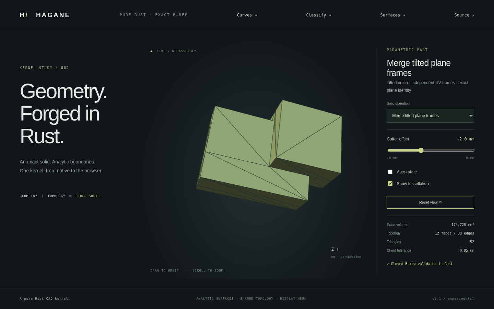

# Independent plane frames and exact 3D orientation



[Coplanar face merging](face-merge.md) now supports checked coincident planes
with different UV bases and origins, including tilted planes. It retains exact
straight boundary geometry and converts affine pcurves into the representative
plane's local frame. Curved surfaces and tolerant healing remain unsupported.

## Exact support certificate

For plane frames `A = (origin, u, v)` and `B = (origin', u', v')`, support identity
requires these three determinants to be exactly zero:

- `(u × v) · u'`
- `(u × v) · v'`
- `(u × v) · (origin' - origin)`

`same_plane_support(&first, &second)` first validates two nondegenerate plane
frames. It then computes these signs using integer representations of the exact
finite binary64 values. The origin subtraction also uses integer arithmetic;
adding basis vectors to huge origins or rounded floating subtraction is avoided.
The normal orientation is checked separately before adjacent faces can merge.

Each finite binary64 value is an integer multiple of `2^-1074`. The existing
signed little-endian integer arithmetic now computes three-factor determinants,
with bounded magnitudes below 198 u32 limbs. It adds no dependency. The public
`orient3d(a, b, c, d)` exposes the exact sign of the tetrahedron determinant
`(b-a) × (c-a) · (d-a)`: `-1`, `0` or `+1`; nonfinite input returns an error.
There is no tolerance snapping and no claim that a rounded distance is exact.

## UV conversion

For each original affine edge pcurve `p(t) = p0 + direction * t`, transform its
origin and direction by the old-to-representative local basis map. Apply the
plane-origin offset only to `p0`. Signed axis permutations use exact coefficients
`0`, `+1` and `-1`, avoiding artificial cross terms from floating dot products.
Reverse the affine parameter when the output edge runs opposite to the original.
The result is checked against unchanged 3D geometry during final validation.

Plane support identity is exact for the *supplied* binary64 frames. Independent
rounding can make two nominally coincident design planes distinct; those faces
remain separate. A UV conversion or boundary graph that is not resolvable under
the model tolerance returns an explicit error. This does not implement healing,
plane fitting, arbitrary curved merging or collinear edge simplification.

## Demo and evidence

```sh
cargo run --locked --example reframed_merge -- -2
cargo run --locked --example part -- 19
cargo test --locked --test predicates --test face_merge
./scripts/build-web.sh
python3 -m http.server 8000 --directory web
```

Select **Merge tilted plane frames**. The convex union fixture is rigidly tilted
around axis `(1, 2, 3)` by `0.7` radians. Alternating face UV frames are independently
rotated by 90 degrees with matching affine pcurves, then coincident faces merge.
At offset `-2`, volume is **174720 mm³**, with **12 faces and 38 edges** rather
than the union's 24 faces and 52 edges. Offset changes geometry and analytic volume.

Native tests cover different tilted bases, shifted tilted origins, exact/near
plane identity, preserved UV/closure, invalid frames and idempotence. The 3D
predicate matches 5000 independent i128 determinants and includes cancellation,
permutations, signed zero, subnormals and overflowing floating differences/products.
WASM compares 1703 cases with an independent JavaScript BigInt oracle, plus
native geometry parity at four fixture offsets and error recovery. Browser tests
exercise all 20 solid presets and capture this actual WASM rendering.
