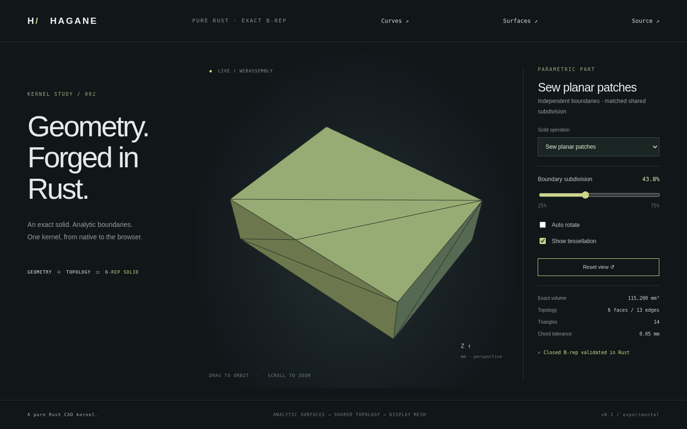

# Exact planar face sewing



`sew_planar_faces(&[PlanarFacePatch], GeometryTolerance)` constructs a single
closed oriented manifold `Solid` from independent plane face boundaries.
`PlanarFacePatch` contains a `Surface::Plane`, signed face `orientation` and
`rings: Vec<Vec<Point3>>`. Rings omit the repeated closing point; in plane UV,
the outer ring is CCW and holes CW, regardless of the face orientation.
`planar_face_patches(&Solid, Tolerance)` extracts patches from a validated solid
whose faces and edges are all planar/straight. Circular and curved inputs
return `Unsupported`.

```rust
use hagane::*;
let policy = GeometryTolerance::default();
let source = make_box(BoxSpec {
    min: Point3::new(0.0, 0.0, 0.0),
    size: Vec3::new(8.0, 6.0, 2.0),
}, policy.absolute())?;
let mut patches = planar_face_patches(&source, policy.absolute())?;
let ring = &mut patches[0].rings[0];
ring.insert(1, (ring[0] + ring[1]) * 0.5);
patches.reverse();
let sewn = sew_planar_faces(&patches, policy)?;
sewn.validate(policy.absolute())?;
assert_eq!(sewn.vertices.len(), 9);
assert_eq!(sewn.edges.len(), 13);
assert!((sewn.volume()? - 96.0).abs() < 1e-10);
```

## Supported domain and failure contract

- 1..512 nonintersecting planar face patches, at most 4096 input corners total.
  Each ring has at least three points. Planes have checked orthonormal bases;
  points and pcurves must agree with their plane within linear tolerance.
- One connected closed shell with compatible face orientation and manifold
  vertex links. Existing solid validation checks trims, shared uses and volume.
  Polygon holes, concavity, skew extrusion boundaries and rigid placement work.
- Exactly equal vertex coordinates merge. Distinct points separated by at most
  linear tolerance return `Unsupported`; vertices are never moved or snapped.
- Exact collinear boundary subdivisions are propagated to every incident face.
  All three projected orientations must be exactly zero. A near-collinear
  junction within linear tolerance is rejected. A rounded midpoint of a tilted
  edge may fail this exact test; tolerant sewing/healing is future work.
- Input edges and resulting subedges must exceed ten linear tolerances.
  Invalid/nonfinite inputs, malformed rings and unsupported surfaces return
  errors. Open shells, duplicate faces, inconsistent winding/orientation,
  nonmanifold junctions and disconnected shells fail validation.
- Patch interiors must not geometrically intersect. This is an exact boundary
  assembler for checked arrangements, not a general import repair or geometric
  self-intersection detector. It does not cut crossing face interiors or resolve
  coplanar overlays. General Boolean operands still need arrangement and
  classification before their retained patches can be assembled.

Each shared edge has one canonical endpoint order and a normalized [0,1] line
parameter. Coedge traversal follows the input ring; each face receives an affine
pcurve computed from the canonical endpoints. The final solid is validated
before return. Failures do not mutate input patches. Tessellation consumes the
sewn B-rep and restores collinear boundary subdivisions, preserving mesh seams.

## Demo and evidence

Run `cargo run --locked --example sewing` or `--example part -- 12`.
**Sew planar patches** extracts six independent box faces, inserts one extra
vertex on a top boundary, reverses face order and sews the patches. The adjacent
side receives the same subdivision. The slider varies that vertex from 25% to
75% of the original edge, while the shape stays 80×60×24 mm and volume stays
115200 mm³. It has 6 faces / 13 edges. Enable tessellation to inspect the seam.

Tests cover permuted patches, multiple subdivisions, polygon holes, concavity,
skew extrusion, rigid placement, tiny dimensions, positive triangle winding,
closed mesh seams, unchanged bounds/volume and rejected near coincidences,
open/duplicate/reversed/disconnected shells. Native/WASM geometry parity and
browser subdivision controls run the same kernel operation.

## Generated Boolean arrangements

The public independent-patch API remains strict. The difference implementation
has a separate internal assembler for its own checked generated arrangements.
It reconciles coordinate coincidences and collinear subdivisions only within
`min(64*EPSILON*local_diagonal, linear/1024)`, followed by full solid and volume
validation. It never exposes model-tolerance snapping for arbitrary patches.
See [convex difference](convex-difference.md) for the construction and limitations.
