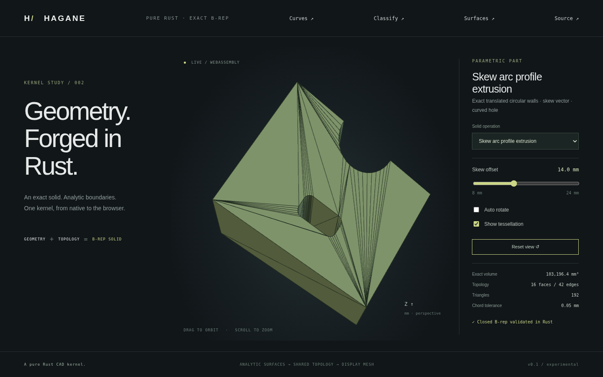

# Exact skew extrusion of circular profiles



Mixed line/arc profiles now support skew extrusion with either normal sign.
`extrude_arc_line_in_frame` and `extrude_arc_line_region_in_frame` accept a
world-space vector in an arbitrary rigid frame. `extrude_arc_line_region_along`
accepts a vector in the XY profile's coordinate system. Curved holes, concavity
and either input winding retain their existing validation contracts.

```rust
use hagane::*;
let t = Tolerance::default();
let frame = Transform::rotation(Vec3::new(1., 2., 3.), 0.7)?;
let profile = rounded_rectangle_profile(Point3::new(0., 0., 0.), 12., 10., 1., t)?;
let solid = extrude_arc_line_in_frame(
    &profile, frame.vector(Vec3::new(3., -2., -4.)), frame, t,
)?;
solid.validate(t)?;
let mesh = solid.tessellate(0.01, t)?;
# Ok::<(), hagane::Error>(())
```

The new `Surface::ExtrudedCircle { frame, radius, height, drift }` represents
an exact circular translation surface. In its rigid frame:

```
S(u,v) = (R cos(u) + drift.x v, R sin(u) + drift.y v, v)
0 <= u <= angular span, 0 <= v <= height
```

`drift` is tangential displacement per unit normal span. The frame includes
the original circular arc's start phase. Cap edges remain circular arcs;
generators are straight shared edges. Rectangular UV trims retain original
edge parameters. Straight profile segments produce exact planar parallelograms
with orthonormal bases and affine pcurves. Negative extrusion shifts the whole
construction base by the requested vector and reverses that vector for building.

Surface evaluation, inverse UV mapping, unit normals, rigid placement and
structural validation support this representation. Exact bounds follow from
the two circular rims and linear generators. Analytic volume uses divergence
integration and equals `profile_area * abs(normal_span)`, independent of skew.
The oriented local area vector is
`R (cos(u), sin(u), -drift.x cos(u) - drift.y sin(u))`; integrating its dot product
with the surface and a local reference gives the wall's analytic contribution.
Normal evaluation scales components before normalization to avoid overflow.

Tessellation shares rim subdivisions with caps. Each wall panel is the translation
of a circular chord along an exact straight generator. At equal axial parameter,
the surface-to-panel displacement is the ordinary circle sagitta, so the existing
chord bound remains valid independently of tangential displacement. No mesh
Boolean operation or polygonized modeling curve is introduced.

The normal span must exceed ten linear tolerances; zero/in-plane spans, nonfinite
inputs, overflow, unresolved geometry, invalid holes and invalid trims return
errors. Framed inputs within `64 * EPSILON * vector_length` of normal retain the
previous rigid-conversion roundoff allowance. Height-only APIs still require
positive finite height.

[Line/skew-surface intersection](extrusion-intersections.md) now supports finite
hits, tangency and generator overlap. The ordinary line/cylinder API keeps its
original domain. [Trimmed face intersection](circular-face-intersections.md)
now selects actual angular faces and preserves boundary parameters.
[Solid classification](skew-classification.md) now supports Euclidean boundary
bands and checked rays on rectangular skew walls. **Current limits:** curved-face
subdivision and general Booleans do not yet support these new skew surfaces.
They return explicit errors rather than treating them as ordinary cylinders.
Normal extrusion still uses the existing cylinder surface and query path.

Run `cargo run --locked --example skew_arc_extrusion -- 14 14 -24` for the
B-rep-derived mesh JSON. Build and serve the web demo, then select **Skew arc
profile extrusion**. The slider changes tangential offset while preserving
analytic volume; orbit and zoom expose the curved hole and translated walls.

Tests cover both signs/windings, tiny and nearly normal displacement, strong
skew, independently expected endpoints/bounds/volumes, rigid placement, UV
round trips, differential normals, closed oriented meshes, sagitta and invalid
inputs. Native/WASM fixtures exercise signed spans and error recovery; browser
checks cover all 23 solids and changes in geometry/normals with the offset.

Original code is MIT OR Apache-2.0. No dependencies were added and no OCCT code
was used. Mathematical references are parametric extrusion, cross-product
surface normals and the divergence theorem (OpenStax *Calculus Volume 3*,
sections 6.6–6.8: https://openstax.org/details/books/calculus-volume-3), and the
circular sagitta formula documented in [mixed profiles](mixed-profiles.md).
