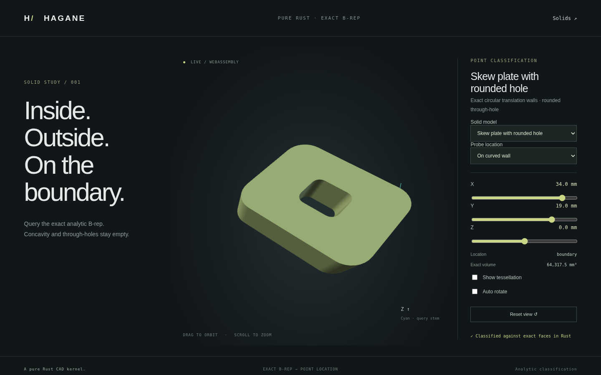

# Skew circular solid point classification



`classify_point_in_solid` supports validated solids with planar line/arc/circle
trims and rectangular circular translation walls (`Surface::ExtrudedCircle`).
It returns `Inside`, `Outside`, or `Boundary` using the actual oriented B-rep.
The boundary band uses Euclidean distance and the existing solid-scale
`GeometryTolerance` budget. Display meshes never participate in queries.

## Use

```rust
use hagane::*;
let tolerance = GeometryTolerance::default();
let profile = rounded_rectangle_profile(
    Point3::new(0.0, 0.0, 0.0), 12.0, 10.0, 1.0,
    tolerance.absolute(),
)?;
let solid = extrude_arc_line_region_along(
    &ArcLineRegion {
        origin: profile.origin,
        outer: profile.segments,
        holes: vec![],
    },
    Vec3::new(3.0, -2.0, 4.0), tolerance.absolute(),
)?;
assert_eq!(
    classify_point_in_solid(&solid, Point3::new(1.5, -1.0, 2.0), tolerance)?,
    PointLocation::Inside,
);
# Ok::<(), hagane::Error>(())
```

The shared native/WASM example has a rounded outer plate and a rounded hole:

```sh
cargo run --locked --example curved_classification -- 5 26 -3 0 # material
cargo run --locked --example curved_classification -- 5 6 -3 0  # empty hole
cargo run --locked --example curved_classification -- 5 34 19 0 # curved wall
cargo run --locked --example curved_classification -- 5 --mesh
./scripts/build-web.sh
```

Serve `web/` as described in the README, open `classification.html`, and select
**Skew plate with rounded hole**. Probe presets cover material, hole, wall,
cap, arc endpoint and exterior; sliders query custom points. Its seventh
classification model shares the kernel and mesh fixture with the native example.

## Euclidean boundary bands

For local wall geometry

`S(u,v) = (R cos(u) + drift.x v, R sin(u) + drift.y v, v)`,

radial residual after inverse shear is not Euclidean distance. Instead, each
angular interval (initially at most a quarter turn) uses the exact generator
and the chord joining its circular endpoints. Sweeping that chord produces a
planar parallelogram. Orthogonal plane projection, checked coordinates, and
closest points on its four edges determine distance to this bounded patch.
The circle sagitta `2 R sin²(Δu / 4)` bounds Hausdorff distance between the
chord patch and the analytic wall patch. Subtracting it gives a lower bound;
points on actual bounded circle generators give upper bounds.

If an upper bound lies inside the tolerance band, the point is `Boundary`.
Intervals with lower bounds outside the band are discarded. Remaining
intervals are bisected. This includes rims, angular endpoints and skew
translations without confusing generator displacement with normal distance.
It is a bounded geometric query; no tessellation is generated or classified.

Calculations include conservative binary64 roundoff allowances for local
coordinates and world/frame subtraction, enlarged for chord/generator angular
conditioning. Uncertain projected rectangle-edge coordinates use plane distance
only as a lower bound. These are arithmetic guards, not
formally outward-rounded interval arithmetic. Insufficient coordinate
precision, ill-conditioned chord projections, an unresolved threshold, or
more than 16,384 patch visits / 48 refinement levels returns an explicit error.
The API does not round an undecidable tolerance-threshold query to success.

## Interior and exterior

After boundary-band decisions, supporting line/wall intersections use the
checked [skew surface solver](extrusion-intersections.md). Angular and height
trims retain only wall crossings. Near trim endpoints, tangencies, overlapping
generators, and closely spaced crossings invalidate that ray. The endpoint
guards include shear conditioning. Accepted crossings use the original line
parameters and outward face orientation; rays must alternate entry and exit.
Two independent resolved ray directions must agree before returning membership.
Rigid placement, negative extrusion vectors and inward curved-hole walls
follow the same path. See [analytic classification](arc-classification.md).

## Verification and limits

Native tests compare thousands of grid probes with independently inverse-sheared
rounded-region membership, before and after rigid placement, for both extrusion
signs. Curved outer/inner wall normal offsets verify the Euclidean band; additional
tests cover caps, all vertices, combined rim distances, microscopic dimensions,
invalid topology, nonfinite input, an unresolved tolerance threshold, and loss
of world-coordinate precision.
WASM tests compare query and mesh fixtures with native output and check error
recovery. Browser tests exercise all seven models and their six probe presets,
rendering, orbit, sliders and responsive layout.

General nonrectangular circular trim loops, geometric self-intersection
detection, arbitrary curved-face subdivision, and general curved Booleans
remain unsupported. [Bounded generator/cap subdivision](skew-face-subdivision.md)
is implemented separately. There is no new general surface-distance API. Difficult
valid inputs can fail explicitly when bounds or ray candidates cannot resolve.

Original implementation: MIT OR Apache-2.0; no added dependencies or OCCT source.
Mathematical references: Euclidean orthogonal projection onto a plane and
segment, convex parallelogram coordinates, circle chord/sagitta identities,
and the Hausdorff-distance inequality
`|distance(p,A) - distance(p,B)| ≤ d_H(A,B)` (triangle inequality).
Surface/root and ray references remain in the linked intersection and
classification documentation; dependency licenses remain in [references](references.md).
