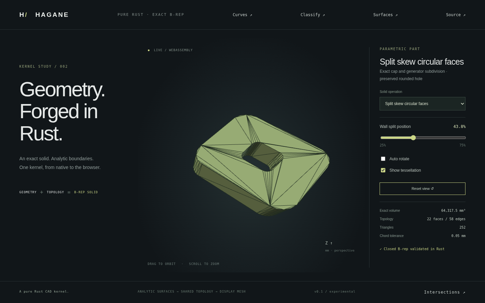

# Bounded skew circular face subdivision



`subdivide_circular_face` splits a rectangular circular wall at one local angular
parameter. It supports bounded-arc `FramedCylinder` and `ExtrudedCircle` faces.
Both rim edges and their planar cap coedges are split, and the two wall children
share an exact straight generator with opposite coedge traversal. The result
is a validated closed B-rep solid with the original analytic volume.

```rust
use hagane::*;
let tolerance = GeometryTolerance::default();
let solid = skew_face_subdivision_demo(0.4, 0.0)?;
let face_index = solid.shell.faces.iter()
    .position(|face| matches!(face.surface, Surface::ExtrudedCircle { .. }))
    .ok_or(Error::Unsupported("no circular wall"))?;
// This fixture's first wall contains angle 0.05 radians.
let result = subdivide_circular_face(&solid, face_index, 0.05, tolerance)?;
result.solid.validate(tolerance.absolute())?;
assert_eq!(result.faces[0], face_index);
assert_eq!(result.solid.edges[result.generator_edge].vertices, result.rim_vertices);
# Ok::<(), hagane::Error>(())
```

The result includes the two child face indices, the shared generator edge
index and its bottom/top rim vertex indices. Angular parameters on each new
child restart at zero; the second child's coordinate frame is rebased at the
cut angle. Coedge parameters follow their owning original/subdivided curve,
independently of face orientation. The operation clones its input and only
returns after topology and volume checks, so errors leave the caller's solid
unchanged.

## Preserving the skew direction

The skew wall has local geometry
`S(u,v) = (R cos(u) + dx v, R sin(u) + dy v, v)`.
Rebasing the circular frame by angle `a` also requires transforming the drift:

`dx' = dx cos(a) + dy sin(a)`

`dy' = -dx sin(a) + dy cos(a)`

The implementation maps the original tangential drift vector into world space
and projects it into the rotated orthonormal frame. Thus child evaluation at
`(u,v)` matches original evaluation at `(u+a,v)`, including top rim endpoints,
generators and normals. Rotating only the circle frame would change the solid;
retaining the world translation vector is necessary.

The existing `split_planar_face` and `subdivide_planar_face` also refine bounded
skew neighboring walls when a cap cut crosses a circular rim. Opposite rims
and cap coedges are refined with the same angle. The cut graph can cross holes
and repeatedly intersect one original arc. This changes topology rather than
removing material or splitting the solid into separate bodies.

## Domain and errors

Input solids are validated before face-index/domain shortcuts. The circular
face must have one four-coedge rectangular trim and two matching bounded arc
rims with the same angular span. The angle must be finite and strictly inside
the trim. The direct wall API rejects cuts whose endpoint chord distance is
within `10 × length_budget × (1 + skew)`; the length budget uses the radius and
physical generator extent. Existing rim refinement also rejects unresolved
small subedges. Failure of rebuilt topology or analytic volume checks is an
explicit error, rather than a partial result.

Full-periodic circle rims are not supported by this new direct wall API. The
existing periodic **normal-cylinder** cap subdivision remains separate.
[Oblique transverse plane subdivision](oblique-boundary.md) is now supported
separately using exact ellipse boundaries and harmonic height trims. Arbitrary
partial wall cuts, general surface/surface splitting and curved Booleans remain
unsupported.
Generator-aligned splitting is an implemented prerequisite for broader curved
B-rep operations.

## Demo and verification

```sh
cargo run --locked --example skew_face_subdivision -- 0.4375 0
cargo run --locked --example skew_face_subdivision -- 0.6 0.7
cargo run --locked --example part -- 23
./scripts/build-web.sh
```

Serve `web/`, then select **Split skew circular faces**. The twenty-fourth solid
preset first splits a rounded plate cap and its skew neighboring walls, then
splits another wall along a generator. It retains the rounded through-hole,
with 22 faces and 58 edges. The slider changes the wall's angular split fraction
from 25% to 75%; enabling tessellation shows the changed face triangulation.
The WASM export `hagane_skew_face_subdivision_demo(fraction, placement)` shares
the native fixture and existing JSON/error buffer contract.

Native tests cover positive/negative extrusion, rigid placement, microscopic
dimensions, repeated subdivision, inward hole walls, repeated rim crossings,
shared opposite generator uses, child UV evaluation and normals, analytic
volume/bounds, unchanged membership, closed triangle connectivity, winding and
circle sagitta. Invalid topology, indices, surface types, angles, absolute/relative near-endpoint
cuts and periodic rims fail without changing inputs. Native/WASM checks compare full
mesh fixtures and metrics, including rotation, errors and recovery. Browser
tests verify the slider changes triangulation while preserving volume and
validated topology; all existing solid presets remain exercised.

Original code is MIT OR Apache-2.0. No added dependency or OCCT source was used.
References: orthonormal change of coordinates, angular addition formulas,
shared opposite B-rep coedge traversal and affine pcurve parameter substitution.
See [frames](frames.md), [face subdivision](face-split.md),
[skew geometry](skew-arc-extrusion.md) and [provenance/licenses](references.md).
