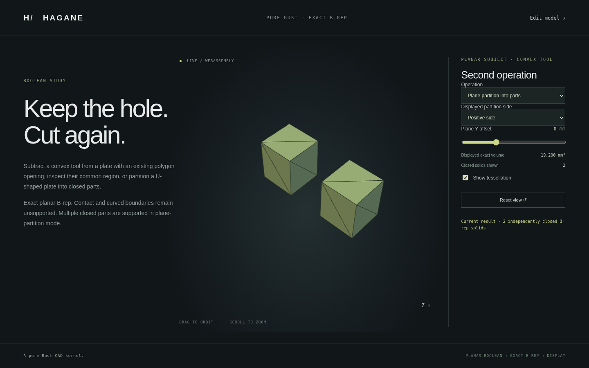

# Multi-component planar plane partition



`split_solid_by_plane_components(solid, plane, tolerance)` returns
`SolidPlaneComponents { negative: Vec<Solid>, positive: Vec<Solid>, section }`.
It extends exact planar straight-edge partition to cuts that separate one side
into several connected solids. Every returned component has its own validated
vertices, shared oriented edges, face pcurves and closed shell. No mesh Boolean
or mesh-connected-component analysis defines the CAD result.

The plane must cross the input, with every original vertex farther than ten
local length budgets. Plane contact, near contact, coincident faces, curved
faces/edges, singular input and unresolved section graphs are rejected. Each
side is limited to 512 total generated patches and 4096 corners. Source input
must be a validated single connected planar straight-edge solid.

## Construction and compatibility

The existing shared edge/plane intersections and directed section cycles build
face patches on both sides. Exact shared source/intersection vertices connect
patches into groups. No near-coincident vertex is snapped or welded, including
between separate groups. Each group is independently sewn and validated: open,
nonmanifold, wrongly oriented or nonpositive-volume shells fail. The sum of
all component volumes must conserve the original analytic volume. Section
patches retain the negative-side outward orientation; corresponding positive
caps are reversed. Component order is deterministic for the same input traversal;
it is not persistent topology naming or stable assembly identity.

The older `split_solid_by_plane` API still requires exactly one component on
each side and retains its disconnected-shell failure when that condition fails.
The current convex/planar Boolean APIs also retain their documented single-shell
limits; they do not yet consume these component vectors. This milestone is a
prerequisite for broader Boolean result sets, not a claim of general compound
Booleans or assembly support. Independent enclosed cavity shells and arbitrary
patch sewing are not introduced by this API.

## Example and browser

```sh
cargo run --locked --example split_components -- 0
./scripts/build-web.sh
python3 -m http.server 8000 --directory web
```

Open `planar-boolean.html`, choose **Plane partition into parts**, and select
all/negative/positive parts. The U-shaped stock has 1900 mm² profile area and
24 mm height, giving 45,600 mm³. At Y=0 the negative bridge has volume
26,400 mm³; each of the two positive arms has volume 9,600 mm³. The notch remains
empty. At Y=1 the positive total is 18,240 mm³. Selecting a side combines its
B-rep-derived meshes only for display; the two underlying CAD solids stay separate.
Rejected offsets retain the previous result with an explicit status message.
Displayed exact volume and solid count refer to the selected side.

## Verification

Native tests verify component counts, independent volumes, positive/negative
classification, gap emptiness, exact total conservation, closed opposite display
edge uses, normal reversal, translation and microscopic/large dimensions.
Contact/near-contact, non-crossing cuts and curved input are rejected. One-part
outputs match the original API. Native/WASM comparisons check every component
mesh and metric; browser tests cover side selection, independent volumes,
contact rejection, correction and switching back to Boolean mode. References
and dependency provenance remain in [references](references.md); no new
library was added.
