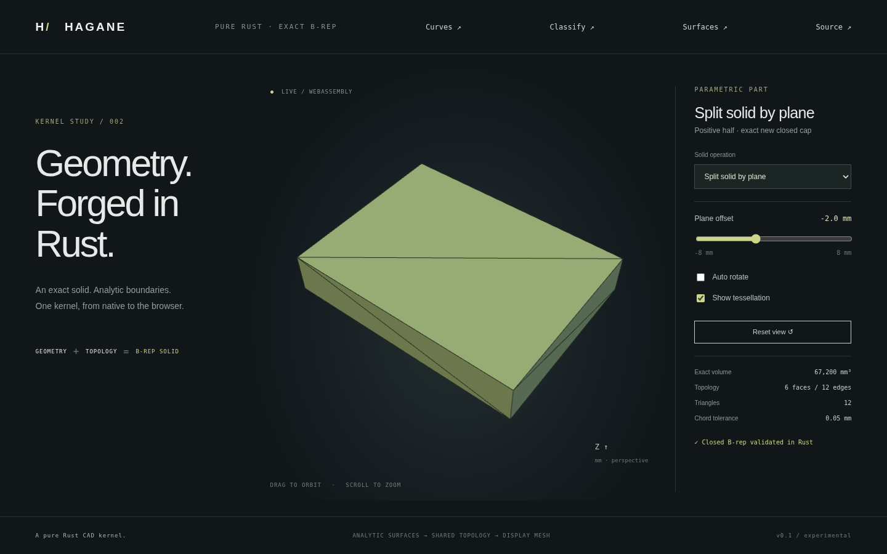

# Solid plane partition



`split_solid_by_plane(&Solid, &Surface::Plane, GeometryTolerance)` returns
`SolidPlaneSplit { negative, positive, section }`. The plane's `u cross v`
normal defines positive/negative material. Both results are independently
closed oriented B-rep solids. `section` contains exact planar polygon patches
oriented along the plane normal, including polygon holes.

```rust
use hagane::*;
let tolerance = GeometryTolerance::default();
let source = make_box(BoxSpec {
    min: Point3::new(-4.0, -3.0, -2.0),
    size: Vec3::new(8.0, 6.0, 4.0),
}, tolerance.absolute())?;
let plane = Surface::Plane {
    origin: Point3::new(0.0, 0.0, 0.5),
    u: Vec3::new(1.0, 0.0, 0.0),
    v: Vec3::new(0.0, 1.0, 0.0),
};
let split = split_solid_by_plane(&source, &plane, tolerance)?;
assert!((split.negative.volume()? - 120.0).abs() < 1e-10);
assert!((split.positive.volume()? - 72.0).abs() < 1e-10);
```

## Supported domain

- A validated, geometrically non-self-intersecting planar straight-edge solid
  with simple polygonal face boundaries and disjoint polygon holes.
- A finite checked orthonormal plane that properly crosses the solid. Every
  original vertex must clear it by more than ten length budgets, where the
  budget is `max(linear, relative * local bounds diagonal)`. This deliberately
  excludes original-vertex cuts, coincident faces, tangent/near-contact cuts
  and boundary overlaps. Existing sewn subedge length guards also apply.
- Both retained sides must form exactly one connected closed manifold solid.
  Disconnected results return an error; multi-solid output is future work.
- Concave profiles, polygon holes, multiple section intervals, skew extrusion,
  oblique cuts, rigid placement and small dimensions work within these limits.
- Curved faces/edges, nonplane cutters, invalid topology and unresolved graph or
  numerical conditions return errors. A disjoint plane returns an error rather
  than an unchanged shape. This is a half-space partition, not general union,
  difference or intersection of arbitrary `Solid` operands.

## Shared arrangement and caps

Each crossed original edge receives one canonical plane-intersection point.
All incident faces share that exact coordinate. Analytic clipping against each
original face gives material intervals and their owning edges. Directed ring
pieces and interval chords trace each side's outer boundaries and hole loops;
normal and face orientation determine the chord direction. Another shared
cycle graph connects these chords across incident faces into section rings.
Signed area and analytic polygon containment assign section holes to their
outer rings. No mesh CSG or sampled boundary drives the model.

Negative material receives a cap oriented along the plane normal; positive
material receives its reversed cap. Exact planar sewing builds canonical shared
edges and affine pcurves, followed by manifold/trim/volume validation. The sum
of both analytic volumes must match the original within 1e-10 relative error.
Input geometry is never mutated. Structural validation is not a general
self-intersection detector for arbitrary imported shells.

## Demo and evidence

Run `cargo run --locked --example solid_split -- -2` for JSON containing both
parts' B-rep-derived display meshes, their exact volumes, section count and
original volume. The same fixture is available as `hagane_partition_demo` in
WASM. `--example part -- 13` and **Split solid by plane** show the positive part
of an 80×60×24 mm box. Its plane offset ranges from -8 to 8 mm, so the displayed
positive volume is `4800*(12-offset)`. At -2 mm the volumes are 48000 and
67200 mm³, summing to 115200 mm³. The newly capped displayed part is a closed
solid, with six faces and twelve edges. The browser displays one returned part;
the native/WASM fixture checks both.

Regression tests cover horizontal and oblique box cuts, reversed plane normals,
concave/hollow/skew sections, exact polygon hole retention, point classification
of retained material, rigid placement, tiny models, bounds, positive mesh winding,
closed seams and volume conservation. Contacts, disjoint planes, curved input,
nonfinite planes and disconnected retained material are rejected. Native/WASM
parity and error recovery validate both outputs; browser tests move the cut and
verify the displayed positive volume.

Retained-face selection for bounded cutters, coplanar overlays, contact graphs,
curved arrangements and general Boolean dispatch remain subsequent work.
