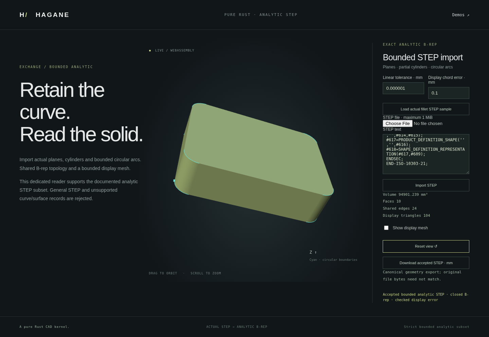
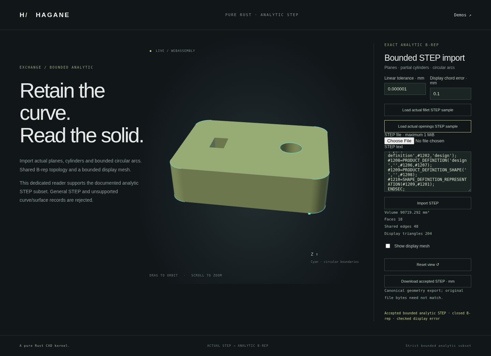

# Bounded analytic STEP import



The dedicated `import_step_bounded_analytic_mm(input, tolerance)` reader imports
actual analytic geometry and oriented shared topology. It retains both surface
pcurves and validates the resulting solid. Display meshes are generated from
that B-rep, without mesh Booleans or substituting a generated primitive.

```sh
cargo run --example step_bounded_import -- part.step
# No argument imports a STEP file generated from the actual fillet operation.
cargo run --example step_bounded_import
./scripts/build-web.sh
python3 -m http.server 8000 --directory web
```

Open `step-bounded.html` in the local development server. The browser supports
text and file input, orbit/zoom, and canonical millimetre STEP downloads.
Rejected input preserves the last accepted body and export. Native and WASM
use the same kernel. The demo fixes linear tolerance at 1e-6 mm and display
chord tolerance at 0.1 mm; larger models may need a larger native tolerance.

```rust
use hagane::{import_step_bounded_analytic_mm, Tolerance};
fn read_part() -> Result<hagane::Solid, Box<dyn std::error::Error>> {
    let input = std::fs::read_to_string("part.step")?;
    let tolerance = Tolerance::new(1e-6)?;
    let solid = import_step_bounded_analytic_mm(&input, tolerance)?;
    solid.validate(tolerance)?;
    Ok(solid)
}
```

## Supported domain

The reader supports admitted planar/full-circular bodies with explicit
SURFACE_CURVE/SEAM_CURVE associations and adds
a line/circular-arc region extruded normally between parallel planar
caps. Arc-bearing caps support one outer wire and up to sixteen disjoint inner
line/arc wires, with at most 128 total segments. Actual
cap translations, entire boundaries, wall geometry and shared incidences must
agree within reserved error budgets. Quarter-circle box fillets are supported
in all three axis families and at resolved rigid placements.

The additional [single blind-cavity certificate](normal-prism-blind-step.md)
admits one resolved flat-bottom quarter-circle pocket in certified normal
stock, including disjoint prior through openings. A proof clone restores
the actual source for recognition and strict pocket construction; whole-cavity
geometry/orientation checks retain the original imported body. The subsequent
[multiple-pocket certificate](normal-prism-blind-bores-step.md) admits 1–16
strictly projection-disjoint cavities using a shared restored-source proof.
Overlapping projected pockets and general nonuniform curved bodies remain
unsupported in this domain.

Canonical circular arcs start at their circle placement's zero-angle vertex
and have positive sweep at most pi. Negative master edge sense, long arcs,
arbitrary phase rebasing, freeform curves/surfaces and general STEP assemblies
are unsupported. Exact half-circles at poorly conditioned placements may be
rejected rather than snapping a negative endpoint phase. Partial-cylinder
trims require resolved zero-origin axial parameters. Existing generic readers
retain their original, narrower domains.

Length units are converted to millimetres, including planar pcurves and
cylindrical axial coordinates; cylindrical angular coordinates remain radians.
Invalid/ambiguous owners, missing pcurves, malformed topology, unsupported units
and unresolved geometric precision return errors. Limits include 1 MiB input,
4096 vertices/edges, 512 faces and 4096 total coedges; arc-prism admission has
stricter structural limits.

Canonical export preserves accepted geometry, not original record numbers,
ordering or file bytes. The JSON report explicitly states this distinction.
Display error bounds describe mesh approximation to analytic supporting
surfaces with conservative arithmetic reserves, not a general symmetric
Hausdorff certificate for arbitrary trimmed solids.

## Validation

Native tests cover actual fillet round trips, placements, units, full circular
bodies, short and near-half-circle arcs, coherent geometry tampering, precision
limits, cyclic boundary-loop start rotations, multiple inner-wire arc prisms
and rejection of outside, nested, touching or unresolved openings. WASM and browser checks
exercise actual input, shared topology, display bounds, export and error recovery.

Native/WASM parity compares structure, topology and nonnumeric STEP tokens
exactly. Floating values allow 32 machine-epsilon units relative to
`max(1, |a|, |b|)` because platform transcendental functions can differ in their
last bits. Independent geometric, volume and chord checks remain separate.
Canonical native and WASM STEP text is therefore not promised byte-identical.

A separate actual full-cylinder smoke check (radius 12 mm, height 20 mm)
retained three faces, three edges and closed topology. Its volume was
`pi * 12² * 20`, full-circle witnesses reached `2*pi`, and the 96-triangle
display's maximum reported surface error was about 0.094624 mm at 0.1 mm.

The final source passes `cargo fmt --check`, strict all-target clippy, all
847 native tests, the wasm32 release build and the complete WASM regression
suite. Its importer checks include twenty actual fillet documents and their
canonical re-exports, independent geometry/closure/chord checks, metre units,
record and cyclic-loop reordering, and malformed-input transport recovery.

The complete browser regression suite also passes on this final build,
including file/text upload, native numerical parity, canonical download,
accepted-body/export/pixel preservation after rejection, recovery, orbit
and mobile layout. The image above was captured from the actual tested demo.

## Through openings in line/arc prisms



The region certificate now checks every outer and inner cap boundary against
a trusted line/arc-region extrusion without replacing imported geometry.
Containment, disjointness and nesting checks precede whole-curve identity,
cap translation, unique wall/vertical-edge incidence and corresponding
outer/inner wire checks on the opposite cap. Inner walls face the voids.

```sh
cargo run --example step_bounded_import -- --sample-openings
```

The browser's openings sample creates actual rounded 80 x 60 x 20 mm stock
with an 8 x 12 mm rectangular opening and a radius-6 mm circular opening.
The circle consists of four exact circular arcs; this is an analytic profile
extrusion, not a general Boolean cut operation. The sample is exported,
imported and displayed through the same reader used for uploaded files.
Its genus-two B-rep has 32 vertices, 48 edges, 18 faces and volume
`20 * (4800 - (4-pi)*64 - 96 - pi*36)`, approximately 90,719.29 mm³.

Circular trim chords can enter shallow void-boundary slivers within the
requested chord tolerance. Rectangle opening exclusion and circular intrusion
bounds are independently checked, alongside supporting-surface error bounds.
Contacting, nested, outside and precision-unresolved openings reject.
Full-circle single-edge boundaries mixed with arc-bearing cap regions remain
unsupported by this certificate; use the supported quarter-arc representation.
General swept solids, blind cavities and arbitrary curved Boolean results are
not admitted by this normal-prism extension.

The complete WASM suite additionally verifies actual genus-two direct/re-export
cases, inward walls,
whole-triangle rectangular exclusion, circular chord intrusion bounds and
coherent outside/nested/contact STEP refusal followed by valid recovery.

The full browser suite passes on the same final build. It exercises the real
openings STEP sample, native numerical parity, genus-two closure, inward walls,
cap exclusion, canonical export and preservation/recovery after all three
coherent invalid fixtures. These fixtures are generated reproducibly from the
native review test, with no dependency on pre-existing temporary files.
