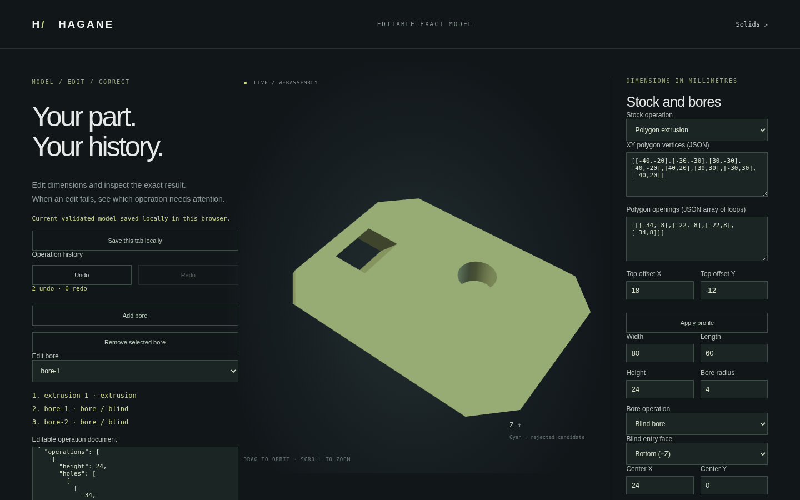

# Exact planar and cylindrical STEP export

The canonical polynomial NURBS graph-solid family has a separate
[scoped exact STEP exporter](nurbs-graph-step.md), including rectangular through
openings. A separate [strict graph importer](nurbs-graph-step-import.md) reads
full, unplaced six-face graphs; the [holed graph importer](nurbs-graph-holed-step-import.md)
adds one rectangular through opening. These APIs do not widen the generic analytic
writer or STEP importer below.

Hagane writes one validated closed solid as an AP214 ISO 10303-21 text file,
preserving analytic lines, complete circles, planes and full cylindrical faces.
Shared vertices/edges, oriented face bounds (including polygon/circular openings),
shell orientation, linear uncertainty and explicit millimetre units are retained.
No display mesh is exported. Native and WASM output is deterministic; the header
timestamp is left empty.

```rust
let step = hagane::export_step_mm(&solid, tolerance)?;
std::fs::write("part.step", step)?;
```

`export_step_planar_mm` remains available as a strict planar/straight-edge API:
it continues to reject every curved input. `export_workflow_step_mm_json` now
uses the extended exporter, supporting existing box/skew-polygon stock with
disjoint Z-axis through and top/bottom blind bores, including opposing blind cuts
with a retained web. Native cylinder/tube primitives and rigidly placed versions
are supported, as are six-face box blind cuts.

## Periodic topology

A full circle is emitted as `CIRCLE` with one shared start/end vertex. A full
cylindrical face has a four-coedge rectangular boundary, including two oppositely
oriented uses of one shared line at its periodic seam. That edge uses
`SEAM_CURVE` with two `PCURVE` entities on the same `CYLINDRICAL_SURFACE`:
one at u=0 and one at u=2π. Each UV line is stored in its own 2D
`DEFINITIONAL_REPRESENTATION`. Cylinder axes and circle placements preserve
right-handed rigid frames; inward bore walls retain reversed face orientation.
Other trims are represented by exact 3D edges and oriented face bounds; explicit
pcurve serialization currently covers periodic seams only.

## Scope and limitations

Coordinates and tolerance are interpreted as millimetres. The exporter does not
infer or convert native coordinate units. It supports at most 4096 vertices,
4096 edges and 512 faces. Every solid passes native validation before writing.
Cylinder trims must cover exactly 2π with rectangular constant-height bands.
Bounded circular arcs, ellipses, oblique bore rims, skew circular extrusion
surfaces, height-graph cylinder trims and invalid topology return errors. No
unsupported geometry is tessellated or replaced by an approximate CAD surface.
[STEP import](step-import.md) supports a narrower planar/cylinder subset:
convex solids, certified polygon prisms with separated normal through/blind bores and resolved
opposing webs, and complete cylinders/concentric tubes
with aligned frames and explicit periodic seam pcurves. General curved import/
export, uncertified nonconvex import, assemblies and rich product metadata remain
future work. This is a supported subset, not general AP214 conformance.

## Native and browser examples

```sh
# Skew stock with a polygon opening:
cargo run --quiet --locked --example step_export > part.step
# Skew stock with through or opposing blind cylindrical cuts:
cargo run --quiet --example step_export -- docs/workflow-skew-bores-example.json > through.step
cargo run --quiet --example step_export -- docs/workflow-opposing-blind-example.json > blind.step
# Analytic primitives (optional second argument is a positive size scale):
cargo run --quiet --example step_analytic -- cylinder > cylinder.step
cargo run --quiet --example step_analytic -- placed-tube 1 > tube.step
```

Run `./scripts/build-web.sh` and start the web demo as described in the README.
In `workflow.html`, load any supported document and choose **Download STEP · exact
geometry**. Rejected edits disable export; export never replaces the accepted
model, session cache or editing history.



## Verification and provenance

Native tests check shared oriented topology, entity references, periodic seam
uses, inward/outward cylinders, circles, tubes, six entry faces, rigid placement,
microscopic/large dimensions, invalid geometry and unsupported arc/ellipse trims.
WASM tests compare full native bytes for planar, through, bottom-blind and
opposing-blind workflows, and verify that failures never replace an accepted
incremental session. Browser tests exercise both planar and cylindrical downloads,
periodic pcurves and invalid-edit/Undo recovery.

Optional independent import validation uses `occt-import-js` 0.0.23:

```sh
npm install --prefix /tmp/hagane-step-validator --no-audit --no-fund occt-import-js@0.0.23
node scripts/validate-step-external.mjs /tmp/hagane-step-validator/node_modules/occt-import-js
```

The check imports actual files and independently verifies face counts, bounds,
reversed profile winding, cylinders/tubes/rigid placement, through/blind/opposing
holes and millimetre/metre conversion. Vertical intersections with the imported
mesh verify the retained blind floors/web and absence of material in a through
hole. The oracle exposes a display mesh, so its signed volume is checked within
an explicit chord-loss bound `2π δ Σ(radius*height)` plus float32 coordinate
roundoff, against analytical expectations. This is interoperability testing,
not a general exact-volume certification of the reader. The validator also
checks an independently hand-authored metre tetrahedron and its native
import/re-export against analytical face count, dimensions and volume.

This tool is an external test oracle only, not a Hagane dependency or shipped
artifact. Its wrapper is LGPL-2.1 according to the package metadata; source and
license: <https://github.com/kovacsv/occt-import-js>. Its bundled Open CASCADE
Technology is LGPL-2.1 with the OCCT exception; see
<https://dev.opencascade.org/resources/licensing>. No OCCT implementation source
was copied or translated into the original Rust writer.

Public format/entity references (specifications, not implementation sources):
- ISO 10303-21 overview: <https://en.wikipedia.org/wiki/ISO_10303-21>
- STEP application protocol overview: <https://www.steptools.com/stds/step/>
- Public EXPRESS documentation for `circle`, `cylindrical_surface`, `seam_curve`,
  `pcurve`, `definitional_representation`, `advanced_face`, `edge_curve`,
  `manifold_solid_brep` and unit contexts: <https://www.steptools.com/stds/stp_aim/html/>
